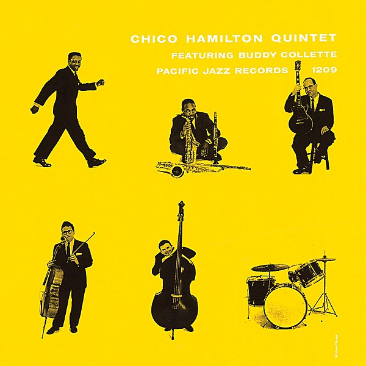

# Blue Lady Quintet

By **The Blue Lady Quintet**

## Album Data

- **Catalog:** Beets
- **Format:** Digital, Album
- **Album:** Blue Lady Quintet
- **Artist:** The Blue Lady Quintet
- **Albumartist:** The Blue Lady Quintet
- **Genre:** Classical
- **MusicBrainz Album Artist ID:** 
- **MusicBrainz Album ID:** 
- **MusicBrainz Release Group ID:** 
- **Year:** 2004
- **Catalog #:** 
- **Label:** 
- **Total Tracks:** 11

## Album Tracks

### Track 01 - Brush Creek

- **Artist:** The Blue Lady Quintet
- **Format:** ALAC
- **Genre:** Classical
- **Length:** 3:09
- **MusicBrainz Track ID:** 
- **Title:** Brush Creek
- **Track:** 01
- **Year:** 2004

### Track 02 - Mr. BigMouth

- **Artist:** The Blue Lady Quintet
- **Format:** ALAC
- **Genre:** Classical
- **Length:** 2:55
- **MusicBrainz Track ID:** 
- **Title:** Mr. BigMouth
- **Track:** 02
- **Year:** 2004

### Track 03 - Tweed Man Blues

- **Artist:** The Blue Lady Quintet
- **Format:** ALAC
- **Genre:** Classical
- **Length:** 4:36
- **MusicBrainz Track ID:** 
- **Title:** Tweed Man Blues
- **Track:** 03
- **Year:** 2004

### Track 04 - Kelly's Song

- **Artist:** The Blue Lady Quintet
- **Format:** ALAC
- **Genre:** Classical
- **Length:** 4:34
- **MusicBrainz Track ID:** 
- **Title:** Kelly's Song
- **Track:** 04
- **Year:** 2004

### Track 05 - Minor Swing

- **Artist:** The Blue Lady Quintet
- **Format:** ALAC
- **Genre:** Classical
- **Length:** 2:58
- **MusicBrainz Track ID:** 
- **Title:** Minor Swing
- **Track:** 05
- **Year:** 2004

### Track 06 - Big Water

- **Artist:** The Blue Lady Quintet
- **Format:** ALAC
- **Genre:** Classical
- **Length:** 3:04
- **MusicBrainz Track ID:** 
- **Title:** Big Water
- **Track:** 06
- **Year:** 2004

### Track 07 - On The Spot

- **Artist:** The Blue Lady Quintet
- **Format:** ALAC
- **Genre:** Classical
- **Length:** 4:24
- **MusicBrainz Track ID:** 
- **Title:** On The Spot
- **Track:** 07
- **Year:** 2004

### Track 08 - River

- **Artist:** The Blue Lady Quintet
- **Format:** ALAC
- **Genre:** Classical
- **Length:** 4:35
- **MusicBrainz Track ID:** 
- **Title:** River
- **Track:** 08
- **Year:** 2004

### Track 09 - On The Mountain Top

- **Artist:** The Blue Lady Quintet
- **Format:** ALAC
- **Genre:** Classical
- **Length:** 3:29
- **MusicBrainz Track ID:** 
- **Title:** On The Mountain Top
- **Track:** 09
- **Year:** 2004

### Track 10 - E-Luvin My Heart

- **Artist:** The Blue Lady Quintet
- **Format:** ALAC
- **Genre:** Classical
- **Length:** 4:04
- **MusicBrainz Track ID:** 
- **Title:** E-Luvin My Heart
- **Track:** 10
- **Year:** 2004

### Track 11 - Porcelain Piano

- **Artist:** The Blue Lady Quintet
- **Format:** ALAC
- **Genre:** Classical
- **Length:** 2:31
- **MusicBrainz Track ID:** 
- **Title:** Porcelain Piano
- **Track:** 11
- **Year:** 2004

