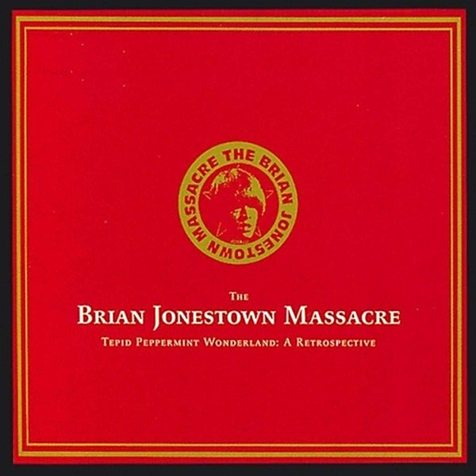

# Tepid Peppermint Wonderland

By **The Brian Jonestown Massacre**

## Album Data

- **Catalog:** Beets
- **Format:** Digital, Album
- **Album:** Tepid Peppermint Wonderland
- **Artist:** The Brian Jonestown Massacre
- **Albumartist:** The Brian Jonestown Massacre
- **Genre:** Shoegaze
- **MusicBrainz Album Artist ID:** 
- **MusicBrainz Album ID:** 
- **MusicBrainz Release Group ID:** 
- **Year:** 1996
- **Catalog #:** 
- **Label:** 
- **Total Tracks:** 22

## Album Tracks

### Track 01 - Nailing Honey To The Bee

- **Artist:** The Brian Jonestown Massacre
- **Format:** ALAC
- **Genre:** Indie Rock
- **Length:** 2:38
- **MusicBrainz Track ID:** 
- **Title:** Nailing Honey To The Bee
- **Track:** 01
- **Year:** 2002

### Track 02 - That Girl Suicide

- **Artist:** The Brian Jonestown Massacre
- **Format:** ALAC
- **Genre:** Shoegaze
- **Length:** 3:39
- **MusicBrainz Track ID:** 
- **Title:** That Girl Suicide
- **Track:** 02
- **Year:** 1995

### Track 03 - Nevertheless

- **Artist:** The Brian Jonestown Massacre
- **Format:** ALAC
- **Genre:** Shoegaze
- **Length:** 3:29
- **MusicBrainz Track ID:** 
- **Title:** Nevertheless
- **Track:** 03
- **Year:** 2001

### Track 04 - Evergreen

- **Artist:** The Brian Jonestown Massacre
- **Format:** ALAC
- **Genre:** Shoegaze
- **Length:** 3:23
- **MusicBrainz Track ID:** 
- **Title:** Evergreen
- **Track:** 04
- **Year:** 1995

### Track 05 - Starcleaner

- **Artist:** The Brian Jonestown Massacre
- **Format:** ALAC
- **Genre:** Neo-Psychedelia
- **Length:** 2:28
- **MusicBrainz Track ID:** 
- **Title:** Starcleaner
- **Track:** 05
- **Year:** 2001

### Track 06 - Let Me Stand Next To Your Flower [Live]

- **Artist:** The Brian Jonestown Massacre
- **Format:** ALAC
- **Genre:** Shoegaze
- **Length:** 3:29
- **MusicBrainz Track ID:** 
- **Title:** Let Me Stand Next To Your Flower [Live]
- **Track:** 06
- **Year:** 2003

### Track 07 - Hide & Seek [Live]

- **Artist:** The Brian Jonestown Massacre
- **Format:** ALAC
- **Genre:** Indie Rock
- **Length:** 4:18
- **MusicBrainz Track ID:** 
- **Title:** Hide & Seek [Live]
- **Track:** 07
- **Year:** 2003

### Track 08 - In My Life

- **Artist:** The Brian Jonestown Massacre
- **Format:** ALAC
- **Genre:** Psychedelic Rock
- **Length:** 2:23
- **MusicBrainz Track ID:** 
- **Title:** In My Life
- **Track:** 08
- **Year:** 1996

### Track 09 - Mary Please

- **Artist:** The Brian Jonestown Massacre
- **Format:** ALAC
- **Genre:** Space Rock
- **Length:** 4:09
- **MusicBrainz Track ID:** 
- **Title:** Mary Please
- **Track:** 09
- **Year:** 1996

### Track 10 - Talk-Action=Shit

- **Artist:** The Brian Jonestown Massacre
- **Format:** ALAC
- **Genre:** Indie Rock
- **Length:** 2:01
- **MusicBrainz Track ID:** 
- **Title:** Talk-Action=Shit
- **Track:** 10
- **Year:** 1996

### Track 11 - Oh Lord

- **Artist:** The Brian Jonestown Massacre
- **Format:** ALAC
- **Genre:** Indie Rock
- **Length:** 3:21
- **MusicBrainz Track ID:** 
- **Title:** Oh Lord
- **Track:** 11
- **Year:** 1996

### Track 12 - This Is Why You Love Me

- **Artist:** The Brian Jonestown Massacre
- **Format:** ALAC
- **Genre:** Shoegaze
- **Length:** 1:53
- **MusicBrainz Track ID:** 
- **Title:** This Is Why You Love Me
- **Track:** 12
- **Year:** 1997

### Track 13 - Not If You Were The Last Dandy On Earth

- **Artist:** The Brian Jonestown Massacre
- **Format:** ALAC
- **Genre:** Indie Rock
- **Length:** 2:46
- **MusicBrainz Track ID:** 
- **Title:** Not If You Were The Last Dandy On Earth
- **Track:** 13
- **Year:** 1997

### Track 14 - Swallowtail [Live]

- **Artist:** The Brian Jonestown Massacre
- **Format:** ALAC
- **Genre:** Shoegaze
- **Length:** 6:26
- **MusicBrainz Track ID:** 
- **Title:** Swallowtail [Live]
- **Track:** 14
- **Year:** 2003

### Track 15 - Feel So Good

- **Artist:** The Brian Jonestown Massacre
- **Format:** ALAC
- **Genre:** Indie Rock
- **Length:** 4:42
- **MusicBrainz Track ID:** 
- **Title:** Feel So Good
- **Track:** 15
- **Year:** 1999

### Track 16 - Fucker

- **Artist:** The Brian Jonestown Massacre
- **Format:** ALAC
- **Genre:** Neo-Psychedelia
- **Length:** 2:14
- **MusicBrainz Track ID:** 
- **Title:** Fucker
- **Track:** 16
- **Year:** 1996

### Track 17 - #1 Hit Jam

- **Artist:** The Brian Jonestown Massacre
- **Format:** ALAC
- **Genre:** Neo-Psychedelia
- **Length:** 4:54
- **MusicBrainz Track ID:** 
- **Title:** #1 Hit Jam
- **Track:** 17
- **Year:** 1997

### Track 18 - Ballad Of Jim Jones

- **Artist:** The Brian Jonestown Massacre
- **Format:** ALAC
- **Genre:** Psychedelic Rock
- **Length:** 2:15
- **MusicBrainz Track ID:** 
- **Title:** Ballad Of Jim Jones
- **Track:** 18
- **Year:** 1996

### Track 19 - Free & Easy Take 2

- **Artist:** The Brian Jonestown Massacre
- **Format:** ALAC
- **Genre:** Indie Rock
- **Length:** 2:30
- **MusicBrainz Track ID:** 
- **Title:** Free & Easy Take 2
- **Track:** 19
- **Year:** 1996

### Track 20 - Stolen

- **Artist:** The Brian Jonestown Massacre
- **Format:** ALAC
- **Genre:** Psychedelic Rock
- **Length:** 1:27
- **MusicBrainz Track ID:** 
- **Title:** Stolen
- **Track:** 20
- **Year:** 2001

### Track 21 - Mansion In The Sky

- **Artist:** The Brian Jonestown Massacre
- **Format:** ALAC
- **Genre:** Indie Rock
- **Length:** 2:19
- **MusicBrainz Track ID:** 
- **Title:** Mansion In The Sky
- **Track:** 21
- **Year:** 1999

### Track 22 - Sue

- **Artist:** The Brian Jonestown Massacre
- **Format:** ALAC
- **Genre:** Neo-Psychedelia
- **Length:** 8:29
- **MusicBrainz Track ID:** 
- **Title:** Sue
- **Track:** 22
- **Year:** 1997

## See also

- [Tepid Peppermint Wonderland](Tepid_Peppermint_Wonderland_2.md)
