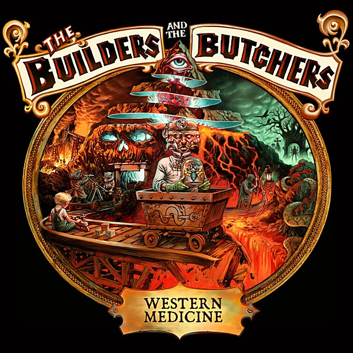

# Western Medicine

By **The Builders, the Butchers**

## Album Data

- **Catalog:** Beets
- **Format:** Digital, Album
- **Album:** Western Medicine
- **Artist:** The Builders, The Butchers
- **Albumartist:** The Builders, the Butchers
- **Genre:** Unknown
- **MusicBrainz Album Artist ID:** [https](https://musicbrainz.org/artist/https)
- **MusicBrainz Album ID:** [https](https://musicbrainz.org/release/https)
- **MusicBrainz Release Group ID:** 
- **Year:** 2013
- **Catalog #:** 
- **Label:** The Builders and the Butchers
- **Total Tracks:** 12

## Album Tracks

### Track 01 - Blood Runs Cold

- **Artist:** The Builders and the Butchers
- **Format:** AAC
- **Genre:** Indie Folk
- **Length:** 4:51
- **MusicBrainz Track ID:** [https](https://musicbrainz.org/recording/https)
- **Title:** Blood Runs Cold
- **Track:** 01
- **Year:** 2013

### Track 02 - Dirt in the Ground

- **Artist:** The Builders and the Butchers
- **Format:** AAC
- **Genre:** Indie Folk
- **Length:** 4:21
- **MusicBrainz Track ID:** [https](https://musicbrainz.org/recording/https)
- **Title:** Dirt in the Ground
- **Track:** 02
- **Year:** 2013

### Track 03 - No Roses

- **Artist:** The Builders and the Butchers
- **Format:** AAC
- **Genre:** Indie Folk
- **Length:** 5:16
- **MusicBrainz Track ID:** [https](https://musicbrainz.org/recording/https)
- **Title:** No Roses
- **Track:** 03
- **Year:** 2013

### Track 04 - Desert is on Fire

- **Artist:** The Builders and the Butchers
- **Format:** AAC
- **Genre:** Indie Folk
- **Length:** 4:56
- **MusicBrainz Track ID:** [https](https://musicbrainz.org/recording/https)
- **Title:** Desert is on Fire
- **Track:** 04
- **Year:** 2013

### Track 05 - Pennies in the Well

- **Artist:** The Builders and the Butchers
- **Format:** AAC
- **Genre:** Indie Folk
- **Length:** 4:13
- **MusicBrainz Track ID:** [https](https://musicbrainz.org/recording/https)
- **Title:** Pennies in the Well
- **Track:** 05
- **Year:** 2013

### Track 06 - Watching the World Burn

- **Artist:** The Builders and the Butchers
- **Format:** AAC
- **Genre:** Indie Folk
- **Length:** 4:42
- **MusicBrainz Track ID:** [https](https://musicbrainz.org/recording/https)
- **Title:** Watching the World Burn
- **Track:** 06
- **Year:** 2013

### Track 07 - Hell Fire Mountain

- **Artist:** The Builders and the Butchers
- **Format:** AAC
- **Genre:** Indie Folk
- **Length:** 6:19
- **MusicBrainz Track ID:** [https](https://musicbrainz.org/recording/https)
- **Title:** Hell Fire Mountain
- **Track:** 07
- **Year:** 2013

### Track 08 - The Snow

- **Artist:** The Builders and the Butchers
- **Format:** AAC
- **Genre:** Indie Folk
- **Length:** 5:51
- **MusicBrainz Track ID:** [https](https://musicbrainz.org/recording/https)
- **Title:** The Snow
- **Track:** 08
- **Year:** 2013

### Track 09 - Poison Water

- **Artist:** The Builders and the Butchers
- **Format:** AAC
- **Genre:** Indie Folk
- **Length:** 6:06
- **MusicBrainz Track ID:** [https](https://musicbrainz.org/recording/https)
- **Title:** Poison Water
- **Track:** 09
- **Year:** 2013

### Track 10 - Redemption Sound

- **Artist:** The Builders and the Butchers
- **Format:** AAC
- **Genre:** Indie Folk
- **Length:** 3:51
- **MusicBrainz Track ID:** [https](https://musicbrainz.org/recording/https)
- **Title:** Redemption Sound
- **Track:** 10
- **Year:** 2013

### Track 11 - Ceceil

- **Artist:** The Builders and the Butchers
- **Format:** AAC
- **Genre:** Indie Folk
- **Length:** 5:17
- **MusicBrainz Track ID:** [https](https://musicbrainz.org/recording/https)
- **Title:** Ceceil
- **Track:** 11
- **Year:** 2013

### Track 12 - Take Me Home

- **Artist:** The Builders and the Butchers
- **Format:** AAC
- **Genre:** Indie Folk
- **Length:** 3:43
- **MusicBrainz Track ID:** [https](https://musicbrainz.org/recording/https)
- **Title:** Take Me Home
- **Track:** 12
- **Year:** 2013

