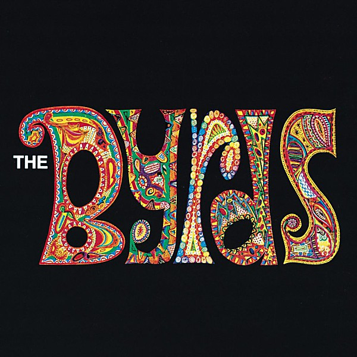

# Byrds

By **The Byrds**

## Album Data

- **Catalog:** Beets
- **Format:** Digital, Album
- **Album:** Byrds
- **Artist:** The Byrds
- **Albumartist:** The Byrds
- **Genre:** Folk Rock
- **MusicBrainz Album Artist ID:** [2819834e-4e08-47b0-a2c4-b7672318e8f0](https://musicbrainz.org/artist/2819834e-4e08-47b0-a2c4-b7672318e8f0)
- **MusicBrainz Album ID:** [e196f607-9083-4d30-a1c2-2a50d9953159](https://musicbrainz.org/release/e196f607-9083-4d30-a1c2-2a50d9953159)
- **MusicBrainz Release Group ID:** [bd02a045-055c-3b42-9898-cd0b697812a3](https://musicbrainz.org/release-group/bd02a045-055c-3b42-9898-cd0b697812a3)
- **Year:** 2004
- **Catalog #:** CK 64846
- **Label:** Columbia
- **Total Tracks:** 18

## Album Tracks

### Track 01 - Turn! Turn! Turn! (To Everything There Is a Season)

- **Artist:** The Byrds
- **Format:** ALAC
- **Genre:** Folk Rock
- **Length:** 3:54
- **MusicBrainz Track ID:** [289366a5-2e8d-4abc-9abe-ea28c9934383](https://musicbrainz.org/recording/289366a5-2e8d-4abc-9abe-ea28c9934383)
- **Title:** Turn! Turn! Turn! (To Everything There Is a Season)
- **Track:** 01
- **Year:** 1996

### Track 02 - It Won’t Be Wrong

- **Artist:** The Byrds
- **Format:** ALAC
- **Genre:** Folk Rock
- **Length:** 2:01
- **MusicBrainz Track ID:** [d0c2896b-8622-4888-a856-7dfefc96c4b7](https://musicbrainz.org/recording/d0c2896b-8622-4888-a856-7dfefc96c4b7)
- **Title:** It Won’t Be Wrong
- **Track:** 02
- **Year:** 1996

### Track 03 - Set You Free This Time

- **Artist:** The Byrds
- **Format:** ALAC
- **Genre:** Folk Rock
- **Length:** 2:52
- **MusicBrainz Track ID:** [e5113664-3267-4cff-a44d-59041d6e62a6](https://musicbrainz.org/recording/e5113664-3267-4cff-a44d-59041d6e62a6)
- **Title:** Set You Free This Time
- **Track:** 03
- **Year:** 1996

### Track 04 - Lay Down Your Weary Tune

- **Artist:** The Byrds
- **Format:** ALAC
- **Genre:** Folk Rock
- **Length:** 3:33
- **MusicBrainz Track ID:** [e6fbdf6b-14e7-4879-9b9a-2ad96526372a](https://musicbrainz.org/recording/e6fbdf6b-14e7-4879-9b9a-2ad96526372a)
- **Title:** Lay Down Your Weary Tune
- **Track:** 04
- **Year:** 1996

### Track 05 - He Was a Friend of Mine

- **Artist:** The Byrds
- **Format:** ALAC
- **Genre:** Folk Rock
- **Length:** 2:34
- **MusicBrainz Track ID:** [9eb57825-68d3-4b01-b2cf-3d6193595f8d](https://musicbrainz.org/recording/9eb57825-68d3-4b01-b2cf-3d6193595f8d)
- **Title:** He Was a Friend of Mine
- **Track:** 05
- **Year:** 1996

### Track 06 - The World Turns All Around Her

- **Artist:** The Byrds
- **Format:** ALAC
- **Genre:** Folk Rock
- **Length:** 2:16
- **MusicBrainz Track ID:** [8ba21e36-c589-4e1b-b153-c4735c512e3f](https://musicbrainz.org/recording/8ba21e36-c589-4e1b-b153-c4735c512e3f)
- **Title:** The World Turns All Around Her
- **Track:** 06
- **Year:** 1996

### Track 07 - Satisfied Mind

- **Artist:** The Byrds
- **Format:** ALAC
- **Genre:** Folk Rock
- **Length:** 2:30
- **MusicBrainz Track ID:** [0ba2e8ac-c169-46ae-ba62-8401f18fcbff](https://musicbrainz.org/recording/0ba2e8ac-c169-46ae-ba62-8401f18fcbff)
- **Title:** Satisfied Mind
- **Track:** 07
- **Year:** 1996

### Track 08 - If You’re Gone

- **Artist:** The Byrds
- **Format:** ALAC
- **Genre:** Folk Rock
- **Length:** 2:49
- **MusicBrainz Track ID:** [41429797-c012-4e27-bbaa-82922568fa16](https://musicbrainz.org/recording/41429797-c012-4e27-bbaa-82922568fa16)
- **Title:** If You’re Gone
- **Track:** 08
- **Year:** 1996

### Track 09 - The Times They Are a-Changin’

- **Artist:** The Byrds
- **Format:** ALAC
- **Genre:** Folk Rock
- **Length:** 2:22
- **MusicBrainz Track ID:** [8d8a191b-e990-47f8-82a3-454cf8648e41](https://musicbrainz.org/recording/8d8a191b-e990-47f8-82a3-454cf8648e41)
- **Title:** The Times They Are a-Changin’
- **Track:** 09
- **Year:** 1996

### Track 10 - Wait and See

- **Artist:** The Byrds
- **Format:** ALAC
- **Genre:** Folk Rock
- **Length:** 2:22
- **MusicBrainz Track ID:** [b1167333-0a31-4fd0-9101-956f20103b5d](https://musicbrainz.org/recording/b1167333-0a31-4fd0-9101-956f20103b5d)
- **Title:** Wait and See
- **Track:** 10
- **Year:** 1996

### Track 11 - Oh! Susannah

- **Artist:** The Byrds
- **Format:** ALAC
- **Genre:** Folk Rock
- **Length:** 3:13
- **MusicBrainz Track ID:** [f2a3ffbf-58a4-434f-b6b2-8078c6f5d725](https://musicbrainz.org/recording/f2a3ffbf-58a4-434f-b6b2-8078c6f5d725)
- **Title:** Oh! Susannah
- **Track:** 11
- **Year:** 1996

### Track 12 - The Day Walk (Never Before)

- **Artist:** The Byrds
- **Format:** ALAC
- **Genre:** Rock
- **Length:** 3:04
- **MusicBrainz Track ID:** [a7799725-c083-4fd0-b8a9-7f3006fa0f54](https://musicbrainz.org/recording/a7799725-c083-4fd0-b8a9-7f3006fa0f54)
- **Title:** The Day Walk (Never Before)
- **Track:** 12
- **Year:** 1996

### Track 13 - She Don’t Care About Time (single version)

- **Artist:** The Byrds
- **Format:** ALAC
- **Genre:** Folk Rock
- **Length:** 2:33
- **MusicBrainz Track ID:** [a5f455c3-eebb-4b4c-8d7e-7e38da4e1b37](https://musicbrainz.org/recording/a5f455c3-eebb-4b4c-8d7e-7e38da4e1b37)
- **Title:** She Don’t Care About Time (single version)
- **Track:** 13
- **Year:** 1996

### Track 14 - The Times They Are a-Changin’ (first version)

- **Artist:** The Byrds
- **Format:** ALAC
- **Genre:** Folk Rock
- **Length:** 1:58
- **MusicBrainz Track ID:** [4ea9bb60-3407-4e9b-a657-929b7d3ee887](https://musicbrainz.org/recording/4ea9bb60-3407-4e9b-a657-929b7d3ee887)
- **Title:** The Times They Are a-Changin’ (first version)
- **Track:** 14
- **Year:** 1996

### Track 15 - It’s All Over Now, Baby Blue (version 1)

- **Artist:** The Byrds
- **Format:** ALAC
- **Genre:** Folk Rock
- **Length:** 3:06
- **MusicBrainz Track ID:** [ac781199-b690-4cc9-992b-bd50ddcb6b64](https://musicbrainz.org/recording/ac781199-b690-4cc9-992b-bd50ddcb6b64)
- **Title:** It’s All Over Now, Baby Blue (version 1)
- **Track:** 15
- **Year:** 1996

### Track 16 - She Don’t Care About Time (version 1)

- **Artist:** The Byrds
- **Format:** ALAC
- **Genre:** Folk Rock
- **Length:** 2:39
- **MusicBrainz Track ID:** [bda91880-5a4d-44c7-af2d-74a91d817ff4](https://musicbrainz.org/recording/bda91880-5a4d-44c7-af2d-74a91d817ff4)
- **Title:** She Don’t Care About Time (version 1)
- **Track:** 16
- **Year:** 1996

### Track 17 - The World Turns All Around Her (alternate mix)

- **Artist:** The Byrds
- **Format:** ALAC
- **Genre:** Rock
- **Length:** 2:16
- **MusicBrainz Track ID:** [33d9fef4-8917-4dbf-b083-916a4af5fdff](https://musicbrainz.org/recording/33d9fef4-8917-4dbf-b083-916a4af5fdff)
- **Title:** The World Turns All Around Her (alternate mix)
- **Track:** 17
- **Year:** 1996

### Track 18 - Stranger in a Strange Land (instrumental)

- **Artist:** The Byrds
- **Format:** ALAC
- **Genre:** Rock
- **Length:** 3:04
- **MusicBrainz Track ID:** [4fd3abb5-fa0b-43f3-bd6a-88fbc75279ff](https://musicbrainz.org/recording/4fd3abb5-fa0b-43f3-bd6a-88fbc75279ff)
- **Title:** Stranger in a Strange Land (instrumental)
- **Track:** 18
- **Year:** 1996

## See also

- [Mr. Tambourine Man](Mr_Tambourine_Man.md)
- [On the Wyng - Early Studio Demos](On_the_Wyng_-_Early_Studio_Demos.md)
- [The Byrds' Greatest Hits](The_Byrds_Greatest_Hits.md)
- [The Notorious Byrd Brothers](The_Notorious_Byrd_Brothers.md)
- [Turn! Turn! Turn!](Turn!_Turn!_Turn!.md)
- [Younger Than Yesterday](Younger_Than_Yesterday.md)
- [Roon: 20 Essential Tracks From The Box Set](../../Roon/The_Byrds/20_Essential_Tracks_From_The_Box_Set-_1965-1990.md)
- [Roon: Fifth Dimension](../../Roon/The_Byrds/Fifth_Dimension.md)
- [Roon: Greatest Hits](../../Roon/The_Byrds/Greatest_Hits.md)
- [Roon: Mr. Tambourine Man](../../Roon/The_Byrds/Mr_Tambourine_Man.md)
- [Roon: Sweetheart Of The Rodeo (Legacy Edition)](../../Roon/The_Byrds/Sweetheart_Of_The_Rodeo_Legacy_Edition.md)
- [Roon: The Byrds](../../Roon/The_Byrds/The_Byrds.md)
- [Roon: The Notorious Byrd Brothers](../../Roon/The_Byrds/The_Notorious_Byrd_Brothers.md)
- [Roon: Turn! Turn! Turn!](../../Roon/The_Byrds/Turn!_Turn!_Turn!.md)
- [Roon: Younger Than Yesterday](../../Roon/The_Byrds/Younger_Than_Yesterday.md)
