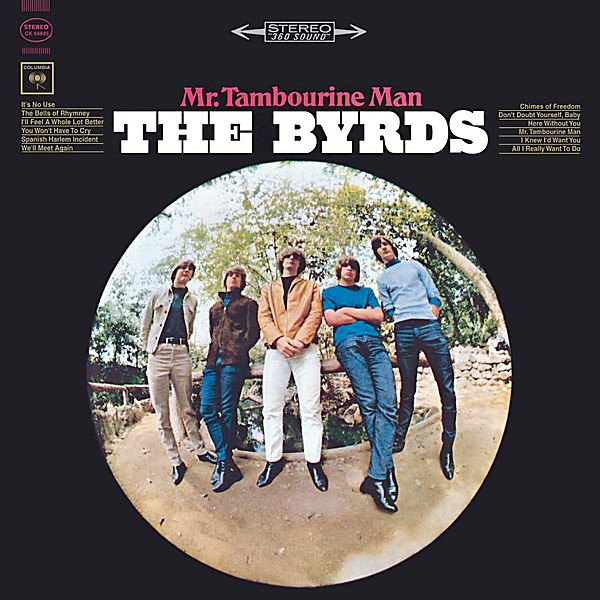

# Mr. Tambourine Man

By **The Byrds**

## Album Data

- **Catalog:** Beets
- **Format:** Digital, Album
- **Album:** Mr. Tambourine Man
- **Artist:** The Byrds
- **Albumartist:** The Byrds
- **Genre:** Psychedelic Rock
- **MusicBrainz Album Artist ID:** 
- **MusicBrainz Album ID:** 
- **MusicBrainz Release Group ID:** 
- **Year:** 1965
- **Catalog #:** 
- **Label:** 
- **Total Tracks:** 00

## Album Tracks

### Track 01 - Track 1

- **Artist:** The Byrds
- **Format:** MP3
- **Genre:** Psychedelic Rock
- **Length:** 2:24
- **MusicBrainz Track ID:** 
- **Title:** Track 1
- **Track:** 01
- **Year:** 1966

### Track 02 - Track 2

- **Artist:** The Byrds
- **Format:** MP3
- **Genre:** Psychedelic Rock
- **Length:** 0:59
- **MusicBrainz Track ID:** 
- **Title:** Track 2
- **Track:** 02
- **Year:** 1966

### Track 03 - Track 3

- **Artist:** The Byrds
- **Format:** MP3
- **Genre:** Psychedelic Rock
- **Length:** 2:39
- **MusicBrainz Track ID:** 
- **Title:** Track 3
- **Track:** 03
- **Year:** 1966

### Track 04 - track 4

- **Artist:** The Byrds
- **Format:** MP3
- **Genre:** Psychedelic Rock
- **Length:** 4:05
- **MusicBrainz Track ID:** 
- **Title:** track 4
- **Track:** 04
- **Year:** 1966

### Track 05 - Track 5

- **Artist:** The Byrds
- **Format:** MP3
- **Genre:** Psychedelic Rock
- **Length:** 3:10
- **MusicBrainz Track ID:** 
- **Title:** Track 5
- **Track:** 05
- **Year:** 1966

### Track 06 - Track 6

- **Artist:** The Byrds
- **Format:** MP3
- **Genre:** Psychedelic Rock
- **Length:** 3:22
- **MusicBrainz Track ID:** 
- **Title:** Track 6
- **Track:** 06
- **Year:** 1966

### Track 07 - Track 7

- **Artist:** The Byrds
- **Format:** MP3
- **Genre:** Psychedelic Rock
- **Length:** 2:43
- **MusicBrainz Track ID:** 
- **Title:** Track 7
- **Track:** 07
- **Year:** 1966

### Track 08 - Track 8

- **Artist:** The Byrds
- **Format:** MP3
- **Genre:** Psychedelic Rock
- **Length:** 2:57
- **MusicBrainz Track ID:** 
- **Title:** Track 8
- **Track:** 08
- **Year:** 1966

### Track 09 - Track 9

- **Artist:** The Byrds
- **Format:** MP3
- **Genre:** Psychedelic Rock
- **Length:** 5:05
- **MusicBrainz Track ID:** 
- **Title:** Track 9
- **Track:** 09
- **Year:** 1966

### Track 10 - Track 10

- **Artist:** The Byrds
- **Format:** MP3
- **Genre:** Psychedelic Rock
- **Length:** 2:25
- **MusicBrainz Track ID:** 
- **Title:** Track 10
- **Track:** 10
- **Year:** 1966

### Track 11 - Track 11

- **Artist:** The Byrds
- **Format:** MP3
- **Genre:** Psychedelic Rock
- **Length:** 2:45
- **MusicBrainz Track ID:** 
- **Title:** Track 11
- **Track:** 11
- **Year:** 1966

### Track 12 - Track 12

- **Artist:** The Byrds
- **Format:** MP3
- **Genre:** Psychedelic Rock
- **Length:** 2:53
- **MusicBrainz Track ID:** 
- **Title:** Track 12
- **Track:** 12
- **Year:** 1966

### Track 13 - Track 13

- **Artist:** The Byrds
- **Format:** MP3
- **Genre:** Psychedelic Rock
- **Length:** 3:02
- **MusicBrainz Track ID:** 
- **Title:** Track 13
- **Track:** 13
- **Year:** 1966

### Track 14 - Track 14

- **Artist:** The Byrds
- **Format:** MP3
- **Genre:** Psychedelic Rock
- **Length:** 2:44
- **MusicBrainz Track ID:** 
- **Title:** Track 14
- **Track:** 14
- **Year:** 1966

### Track 15 - Track 15

- **Artist:** The Byrds
- **Format:** MP3
- **Genre:** Psychedelic Rock
- **Length:** 2:54
- **MusicBrainz Track ID:** 
- **Title:** Track 15
- **Track:** 15
- **Year:** 1966

### Track 16 - Track 16

- **Artist:** The Byrds
- **Format:** MP3
- **Genre:** Psychedelic Rock
- **Length:** 0:25
- **MusicBrainz Track ID:** 
- **Title:** Track 16
- **Track:** 16
- **Year:** 1966

### Track 17 - Track 17

- **Artist:** The Byrds
- **Format:** MP3
- **Genre:** Psychedelic Rock
- **Length:** 3:04
- **MusicBrainz Track ID:** 
- **Title:** Track 17
- **Track:** 17
- **Year:** 1966

## See also

- [Byrds](Byrds.md)
- [On the Wyng - Early Studio Demos](On_the_Wyng_-_Early_Studio_Demos.md)
- [The Byrds' Greatest Hits](The_Byrds_Greatest_Hits.md)
- [The Notorious Byrd Brothers](The_Notorious_Byrd_Brothers.md)
- [Turn! Turn! Turn!](Turn!_Turn!_Turn!.md)
- [Younger Than Yesterday](Younger_Than_Yesterday.md)
- [Roon: 20 Essential Tracks From The Box Set](../../Roon/The_Byrds/20_Essential_Tracks_From_The_Box_Set-_1965-1990.md)
- [Roon: Fifth Dimension](../../Roon/The_Byrds/Fifth_Dimension.md)
- [Roon: Greatest Hits](../../Roon/The_Byrds/Greatest_Hits.md)
- [Roon: Mr. Tambourine Man](../../Roon/The_Byrds/Mr_Tambourine_Man.md)
- [Roon: Sweetheart Of The Rodeo (Legacy Edition)](../../Roon/The_Byrds/Sweetheart_Of_The_Rodeo_Legacy_Edition.md)
- [Roon: The Byrds](../../Roon/The_Byrds/The_Byrds.md)
- [Roon: The Notorious Byrd Brothers](../../Roon/The_Byrds/The_Notorious_Byrd_Brothers.md)
- [Roon: Turn! Turn! Turn!](../../Roon/The_Byrds/Turn!_Turn!_Turn!.md)
- [Roon: Younger Than Yesterday](../../Roon/The_Byrds/Younger_Than_Yesterday.md)
