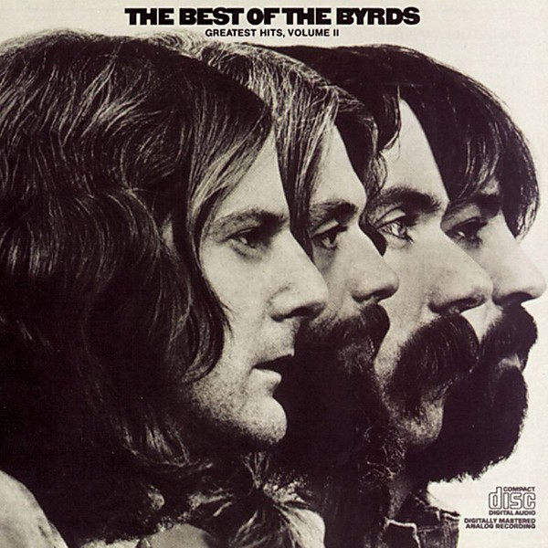

# The Byrds' Greatest Hits

By **The Byrds**

## Album Data

- **Catalog:** Beets
- **Format:** Digital, Album
- **Album:** The Byrds' Greatest Hits
- **Artist:** The Byrds
- **Albumartist:** The Byrds
- **Genre:** Psychedelic Rock
- **MusicBrainz Album Artist ID:** 
- **MusicBrainz Album ID:** 
- **MusicBrainz Release Group ID:** 
- **Year:** 1967
- **Catalog #:** 
- **Label:** 
- **Total Tracks:** 17

## Album Tracks

### Track 01 - Artificial Energy

- **Artist:** The Byrds
- **Format:** ALAC
- **Genre:** Acid Rock
- **Length:** 2:19
- **MusicBrainz Track ID:** 
- **Title:** Artificial Energy
- **Track:** 01
- **Year:** 1968

### Track 02 - Goin' Back

- **Artist:** The Byrds
- **Format:** ALAC
- **Genre:** Folk Rock
- **Length:** 3:25
- **MusicBrainz Track ID:** 
- **Title:** Goin' Back
- **Track:** 02
- **Year:** 1968

### Track 03 - Natural Harmony

- **Artist:** The Byrds
- **Format:** ALAC
- **Genre:** Psychedelic Rock
- **Length:** 2:11
- **MusicBrainz Track ID:** 
- **Title:** Natural Harmony
- **Track:** 03
- **Year:** 1968

### Track 04 - Draft Morning

- **Artist:** The Byrds
- **Format:** ALAC
- **Genre:** Sunshine Pop
- **Length:** 2:42
- **MusicBrainz Track ID:** 
- **Title:** Draft Morning
- **Track:** 04
- **Year:** 1968

### Track 05 - Wasn't Born To Follow

- **Artist:** The Byrds
- **Format:** ALAC
- **Genre:** Folk Rock
- **Length:** 2:03
- **MusicBrainz Track ID:** 
- **Title:** Wasn't Born To Follow
- **Track:** 05
- **Year:** 1968

### Track 06 - Get To You

- **Artist:** The Byrds
- **Format:** ALAC
- **Genre:** Psychedelic Rock
- **Length:** 2:39
- **MusicBrainz Track ID:** 
- **Title:** Get To You
- **Track:** 06
- **Year:** 1968

### Track 07 - Change Is Now

- **Artist:** The Byrds
- **Format:** ALAC
- **Genre:** Space Rock
- **Length:** 3:21
- **MusicBrainz Track ID:** 
- **Title:** Change Is Now
- **Track:** 07
- **Year:** 1968

### Track 08 - Old John Robertson

- **Artist:** The Byrds
- **Format:** ALAC
- **Genre:** Psychedelic Rock
- **Length:** 1:48
- **MusicBrainz Track ID:** 
- **Title:** Old John Robertson
- **Track:** 08
- **Year:** 1968

### Track 09 - Tribal Gathering

- **Artist:** The Byrds
- **Format:** ALAC
- **Genre:** Acid Rock
- **Length:** 2:02
- **MusicBrainz Track ID:** 
- **Title:** Tribal Gathering
- **Track:** 09
- **Year:** 1968

### Track 10 - Dolphin's Smile

- **Artist:** The Byrds
- **Format:** ALAC
- **Genre:** Acid Rock
- **Length:** 2:00
- **MusicBrainz Track ID:** 
- **Title:** Dolphin's Smile
- **Track:** 10
- **Year:** 1968

### Track 11 - Space Odyssey

- **Artist:** The Byrds
- **Format:** ALAC
- **Genre:** Space Rock
- **Length:** 4:02
- **MusicBrainz Track ID:** 
- **Title:** Space Odyssey
- **Track:** 11
- **Year:** 1968

### Track 12 - Moog Raga [Instrumental]

- **Artist:** The Byrds
- **Format:** ALAC
- **Genre:** Psychedelic Rock
- **Length:** 3:27
- **MusicBrainz Track ID:** 
- **Title:** Moog Raga [Instrumental]
- **Track:** 12
- **Year:** 1968

### Track 13 - Bound To Fall [Instrumental]

- **Artist:** The Byrds
- **Format:** ALAC
- **Genre:** Psychedelic Rock
- **Length:** 2:11
- **MusicBrainz Track ID:** 
- **Title:** Bound To Fall [Instrumental]
- **Track:** 13
- **Year:** 1968

### Track 14 - Triad

- **Artist:** The Byrds
- **Format:** ALAC
- **Genre:** Rock
- **Length:** 3:31
- **MusicBrainz Track ID:** 
- **Title:** Triad
- **Track:** 14
- **Year:** 1968

### Track 15 - Goin' Back [Version One]

- **Artist:** The Byrds
- **Format:** ALAC
- **Genre:** Psychedelic Rock
- **Length:** 3:58
- **MusicBrainz Track ID:** 
- **Title:** Goin' Back [Version One]
- **Track:** 15
- **Year:** 1968

### Track 16 - Draft Morning [Alternate End]

- **Artist:** The Byrds
- **Format:** ALAC
- **Genre:** Psychedelic Rock
- **Length:** 2:58
- **MusicBrainz Track ID:** 
- **Title:** Draft Morning [Alternate End]
- **Track:** 16
- **Year:** 1968

### Track 17 - Universal Mind Decoder [Instrumental]

- **Artist:** The Byrds
- **Format:** ALAC
- **Genre:** Psychedelic Rock
- **Length:** 13:44
- **MusicBrainz Track ID:** 
- **Title:** Universal Mind Decoder [Instrumental]
- **Track:** 17
- **Year:** 1968

