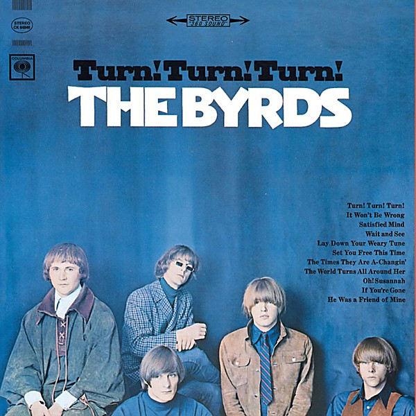

# Turn! Turn! Turn!

By **The Byrds**

## Album Data

- **Catalog:** Beets
- **Format:** Digital, Album
- **Album:** Turn! Turn! Turn!
- **Artist:** The Byrds
- **Albumartist:** The Byrds
- **Genre:** Folk Rock
- **MusicBrainz Album Artist ID:** [2819834e-4e08-47b0-a2c4-b7672318e8f0](https://musicbrainz.org/artist/2819834e-4e08-47b0-a2c4-b7672318e8f0)
- **MusicBrainz Album ID:** [c199e3fc-97ce-3019-a4af-b57bdcc46a80](https://musicbrainz.org/release/c199e3fc-97ce-3019-a4af-b57bdcc46a80)
- **MusicBrainz Release Group ID:** [309d7e2e-d5a4-30ce-8b44-a3db97266cfc](https://musicbrainz.org/release-group/309d7e2e-d5a4-30ce-8b44-a3db97266cfc)
- **Year:** 1996
- **Catalog #:** 483708 2
- **Label:** Legacy
- **Total Tracks:** 17

## Album Tracks

### Track 01 - So You Want to Be a Rock 'n' Roll Star

- **Artist:** The Byrds
- **Format:** ALAC
- **Genre:** Folk Rock
- **Length:** 2:09
- **MusicBrainz Track ID:** [c386ed16-6f25-47e1-a57a-b5c46fde0cc5](https://musicbrainz.org/recording/c386ed16-6f25-47e1-a57a-b5c46fde0cc5)
- **Title:** So You Want to Be a Rock 'n' Roll Star
- **Track:** 01
- **Year:** 1996

### Track 02 - Have You Seen Her Face

- **Artist:** The Byrds
- **Format:** ALAC
- **Genre:** Psychedelic Rock
- **Length:** 2:43
- **MusicBrainz Track ID:** [2805c74c-6569-4601-b6f9-7a1c4b9fe2c0](https://musicbrainz.org/recording/2805c74c-6569-4601-b6f9-7a1c4b9fe2c0)
- **Title:** Have You Seen Her Face
- **Track:** 02
- **Year:** 1996

### Track 03 - C.T.A.-102

- **Artist:** The Byrds
- **Format:** ALAC
- **Genre:** Rock
- **Length:** 2:31
- **MusicBrainz Track ID:** [b3abf683-4f3b-4f88-9d04-dbd60b7fdd25](https://musicbrainz.org/recording/b3abf683-4f3b-4f88-9d04-dbd60b7fdd25)
- **Title:** C.T.A.-102
- **Track:** 03
- **Year:** 1996

### Track 04 - Renaissance Fair

- **Artist:** The Byrds
- **Format:** ALAC
- **Genre:** Psychedelic Rock
- **Length:** 1:55
- **MusicBrainz Track ID:** [6a8bbfce-8105-4ace-a5fd-2fa74607bebc](https://musicbrainz.org/recording/6a8bbfce-8105-4ace-a5fd-2fa74607bebc)
- **Title:** Renaissance Fair
- **Track:** 04
- **Year:** 1996

### Track 05 - Time Between

- **Artist:** The Byrds
- **Format:** ALAC
- **Genre:** Surf Rock
- **Length:** 1:57
- **MusicBrainz Track ID:** [398bfaed-0ca2-4242-a359-04f0c9b70f21](https://musicbrainz.org/recording/398bfaed-0ca2-4242-a359-04f0c9b70f21)
- **Title:** Time Between
- **Track:** 05
- **Year:** 1996

### Track 06 - Everybody's Been Burned

- **Artist:** The Byrds
- **Format:** ALAC
- **Genre:** Soft Rock
- **Length:** 3:09
- **MusicBrainz Track ID:** [55111fa8-7288-4e7d-abb1-a7f090140f90](https://musicbrainz.org/recording/55111fa8-7288-4e7d-abb1-a7f090140f90)
- **Title:** Everybody's Been Burned
- **Track:** 06
- **Year:** 1996

### Track 07 - Thoughts and Words

- **Artist:** The Byrds
- **Format:** ALAC
- **Genre:** Raga Rock
- **Length:** 3:00
- **MusicBrainz Track ID:** [f4487b8b-23fa-46eb-9185-fc85e63d22cf](https://musicbrainz.org/recording/f4487b8b-23fa-46eb-9185-fc85e63d22cf)
- **Title:** Thoughts and Words
- **Track:** 07
- **Year:** 1996

### Track 08 - Mind Gardens

- **Artist:** The Byrds
- **Format:** ALAC
- **Genre:** Space Rock
- **Length:** 3:49
- **MusicBrainz Track ID:** [6f2769f4-b823-4662-b7ce-f3e5c5fcdc1b](https://musicbrainz.org/recording/6f2769f4-b823-4662-b7ce-f3e5c5fcdc1b)
- **Title:** Mind Gardens
- **Track:** 08
- **Year:** 1996

### Track 09 - My Back Pages

- **Artist:** The Byrds
- **Format:** ALAC
- **Genre:** Folk Rock
- **Length:** 3:11
- **MusicBrainz Track ID:** [3738c227-c3f7-4132-b38b-c6c19ee9a3c1](https://musicbrainz.org/recording/3738c227-c3f7-4132-b38b-c6c19ee9a3c1)
- **Title:** My Back Pages
- **Track:** 09
- **Year:** 1996

### Track 10 - The Girl With No Name

- **Artist:** The Byrds
- **Format:** ALAC
- **Genre:** Folk Rock
- **Length:** 1:54
- **MusicBrainz Track ID:** [5d1e6ea5-3685-417f-98c5-a35b2dc0615b](https://musicbrainz.org/recording/5d1e6ea5-3685-417f-98c5-a35b2dc0615b)
- **Title:** The Girl With No Name
- **Track:** 10
- **Year:** 1996

### Track 11 - Why

- **Artist:** The Byrds
- **Format:** ALAC
- **Genre:** Psychedelic Rock
- **Length:** 2:55
- **MusicBrainz Track ID:** [b11e6b6b-07d3-4457-be4d-1b00d4e57217](https://musicbrainz.org/recording/b11e6b6b-07d3-4457-be4d-1b00d4e57217)
- **Title:** Why
- **Track:** 11
- **Year:** 1996

### Track 12 - It Happens Each Day

- **Artist:** The Byrds
- **Format:** ALAC
- **Genre:** Psychedelic Rock
- **Length:** 2:48
- **MusicBrainz Track ID:** [9e545ca1-8cf6-4f9e-8cc4-81773cb7665d](https://musicbrainz.org/recording/9e545ca1-8cf6-4f9e-8cc4-81773cb7665d)
- **Title:** It Happens Each Day
- **Track:** 12
- **Year:** 1996

### Track 13 - Don't Make Waves

- **Artist:** The Byrds
- **Format:** ALAC
- **Genre:** Psychedelic Rock
- **Length:** 1:40
- **MusicBrainz Track ID:** [b7200576-e8b1-4ae2-88d0-f1c84125eb69](https://musicbrainz.org/recording/b7200576-e8b1-4ae2-88d0-f1c84125eb69)
- **Title:** Don't Make Waves
- **Track:** 13
- **Year:** 1996

### Track 14 - My Back Pages (alternate version)

- **Artist:** The Byrds
- **Format:** ALAC
- **Genre:** Psychedelic Rock
- **Length:** 2:46
- **MusicBrainz Track ID:** [ee82c57a-b7f3-436e-af08-9464313a0dc4](https://musicbrainz.org/recording/ee82c57a-b7f3-436e-af08-9464313a0dc4)
- **Title:** My Back Pages (alternate version)
- **Track:** 14
- **Year:** 1996

### Track 15 - Mind Gardens (alternate version)

- **Artist:** The Byrds
- **Format:** ALAC
- **Genre:** Psychedelic Rock
- **Length:** 3:21
- **MusicBrainz Track ID:** [455059cf-23c7-492b-bad5-cff5749b5f03](https://musicbrainz.org/recording/455059cf-23c7-492b-bad5-cff5749b5f03)
- **Title:** Mind Gardens (alternate version)
- **Track:** 15
- **Year:** 1996

### Track 16 - Lady Friend

- **Artist:** The Byrds
- **Format:** ALAC
- **Genre:** Dream Pop
- **Length:** 2:34
- **MusicBrainz Track ID:** [f9907da3-af34-4fd8-8ca7-9f5028427652](https://musicbrainz.org/recording/f9907da3-af34-4fd8-8ca7-9f5028427652)
- **Title:** Lady Friend
- **Track:** 16
- **Year:** 1996

### Track 17 - Old John Robertson (single version)

- **Artist:** The Byrds
- **Format:** ALAC
- **Genre:** Country Rock
- **Length:** 5:05
- **MusicBrainz Track ID:** [ce9a13cb-2298-4798-8017-f849c2a0c0d3](https://musicbrainz.org/recording/ce9a13cb-2298-4798-8017-f849c2a0c0d3)
- **Title:** Old John Robertson (single version)
- **Track:** 17
- **Year:** 1996

## See also

- [Byrds](Byrds.md)
- [Mr. Tambourine Man](Mr_Tambourine_Man.md)
- [On the Wyng - Early Studio Demos](On_the_Wyng_-_Early_Studio_Demos.md)
- [The Byrds' Greatest Hits](The_Byrds_Greatest_Hits.md)
- [The Notorious Byrd Brothers](The_Notorious_Byrd_Brothers.md)
- [Younger Than Yesterday](Younger_Than_Yesterday.md)
- [Roon: 20 Essential Tracks From The Box Set](../../Roon/The_Byrds/20_Essential_Tracks_From_The_Box_Set-_1965-1990.md)
- [Roon: Fifth Dimension](../../Roon/The_Byrds/Fifth_Dimension.md)
- [Roon: Greatest Hits](../../Roon/The_Byrds/Greatest_Hits.md)
- [Roon: Mr. Tambourine Man](../../Roon/The_Byrds/Mr_Tambourine_Man.md)
- [Roon: Sweetheart Of The Rodeo (Legacy Edition)](../../Roon/The_Byrds/Sweetheart_Of_The_Rodeo_Legacy_Edition.md)
- [Roon: The Byrds](../../Roon/The_Byrds/The_Byrds.md)
- [Roon: The Notorious Byrd Brothers](../../Roon/The_Byrds/The_Notorious_Byrd_Brothers.md)
- [Roon: Turn! Turn! Turn!](../../Roon/The_Byrds/Turn!_Turn!_Turn!.md)
- [Roon: Younger Than Yesterday](../../Roon/The_Byrds/Younger_Than_Yesterday.md)
