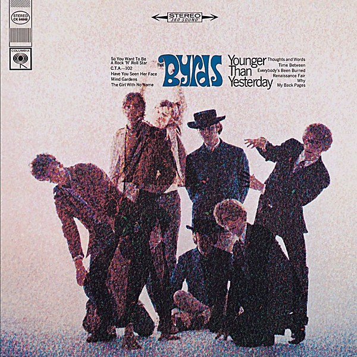

# Younger Than Yesterday

By **The Byrds**

## Album Data

- **Catalog:** Beets
- **Format:** Digital, Album
- **Album:** Younger Than Yesterday
- **Artist:** The Byrds
- **Albumartist:** The Byrds
- **Genre:** Raga Rock
- **MusicBrainz Album Artist ID:** [2819834e-4e08-47b0-a2c4-b7672318e8f0](https://musicbrainz.org/artist/2819834e-4e08-47b0-a2c4-b7672318e8f0)
- **MusicBrainz Album ID:** [e81be1f6-dc08-3cfb-86bb-81c7639c3559](https://musicbrainz.org/release/e81be1f6-dc08-3cfb-86bb-81c7639c3559)
- **MusicBrainz Release Group ID:** [4e4c1014-7c7b-397a-9c80-35b115a034fe](https://musicbrainz.org/release-group/4e4c1014-7c7b-397a-9c80-35b115a034fe)
- **Year:** 1996
- **Catalog #:** 
- **Label:** 
- **Total Tracks:** 18

## Album Tracks

### Track 01 - Mr. Tambourine Man

- **Artist:** The Byrds
- **Format:** ALAC
- **Genre:** Psychedelic Rock
- **Length:** 2:34
- **MusicBrainz Track ID:** 
- **Title:** Mr. Tambourine Man
- **Track:** 01
- **Year:** 1965

### Track 02 - I'll Feel A Whole Lot Better

- **Artist:** The Byrds
- **Format:** ALAC
- **Genre:** Folk Rock
- **Length:** 2:35
- **MusicBrainz Track ID:** 
- **Title:** I'll Feel A Whole Lot Better
- **Track:** 02
- **Year:** 1965

### Track 03 - Spanish Harlem Incident

- **Artist:** The Byrds
- **Format:** ALAC
- **Genre:** Folk Rock
- **Length:** 2:01
- **MusicBrainz Track ID:** 
- **Title:** Spanish Harlem Incident
- **Track:** 03
- **Year:** 1965

### Track 04 - You Won't Have To Cry

- **Artist:** The Byrds
- **Format:** ALAC
- **Genre:** Glam Rock
- **Length:** 2:11
- **MusicBrainz Track ID:** 
- **Title:** You Won't Have To Cry
- **Track:** 04
- **Year:** 1965

### Track 05 - Here Without You

- **Artist:** The Byrds
- **Format:** ALAC
- **Genre:** Folk Rock
- **Length:** 2:40
- **MusicBrainz Track ID:** 
- **Title:** Here Without You
- **Track:** 05
- **Year:** 1965

### Track 06 - The Bells Of Rhymney

- **Artist:** The Byrds
- **Format:** ALAC
- **Genre:** Folk Rock
- **Length:** 3:34
- **MusicBrainz Track ID:** 
- **Title:** The Bells Of Rhymney
- **Track:** 06
- **Year:** 1965

### Track 07 - All I Really Want To Do

- **Artist:** The Byrds
- **Format:** ALAC
- **Genre:** Folk Rock
- **Length:** 2:07
- **MusicBrainz Track ID:** 
- **Title:** All I Really Want To Do
- **Track:** 07
- **Year:** 1965

### Track 08 - I Knew I'd Want You

- **Artist:** The Byrds
- **Format:** ALAC
- **Genre:** Folk Rock
- **Length:** 2:18
- **MusicBrainz Track ID:** 
- **Title:** I Knew I'd Want You
- **Track:** 08
- **Year:** 1965

### Track 09 - It's No Use

- **Artist:** The Byrds
- **Format:** ALAC
- **Genre:** Glam Rock
- **Length:** 2:27
- **MusicBrainz Track ID:** 
- **Title:** It's No Use
- **Track:** 09
- **Year:** 1965

### Track 10 - Don't Doubt Yourself, Babe

- **Artist:** The Byrds
- **Format:** ALAC
- **Genre:** Britpop
- **Length:** 2:58
- **MusicBrainz Track ID:** 
- **Title:** Don't Doubt Yourself, Babe
- **Track:** 10
- **Year:** 1965

### Track 11 - Chimes Of Freedom

- **Artist:** The Byrds
- **Format:** ALAC
- **Genre:** Folk Rock
- **Length:** 3:55
- **MusicBrainz Track ID:** 
- **Title:** Chimes Of Freedom
- **Track:** 11
- **Year:** 1965

### Track 12 - We'll Meet Again

- **Artist:** The Byrds
- **Format:** ALAC
- **Genre:** Glam Rock
- **Length:** 2:17
- **MusicBrainz Track ID:** 
- **Title:** We'll Meet Again
- **Track:** 12
- **Year:** 1965

### Track 13 - She Has A Way

- **Artist:** The Byrds
- **Format:** ALAC
- **Genre:** Indie Folk
- **Length:** 2:29
- **MusicBrainz Track ID:** 
- **Title:** She Has A Way
- **Track:** 13
- **Year:** 1965

### Track 14 - I'll Feel A Whole Lot Better [Alternate Version]

- **Artist:** The Byrds
- **Format:** ALAC
- **Genre:** Psychedelic Rock
- **Length:** 2:31
- **MusicBrainz Track ID:** 
- **Title:** I'll Feel A Whole Lot Better [Alternate Version]
- **Track:** 14
- **Year:** 1965

### Track 15 - It's No Use [Alternate Version]

- **Artist:** The Byrds
- **Format:** ALAC
- **Genre:** Rock
- **Length:** 2:27
- **MusicBrainz Track ID:** 
- **Title:** It's No Use [Alternate Version]
- **Track:** 15
- **Year:** 1965

### Track 16 - You Won't Have To Cry [Alternate Version]

- **Artist:** The Byrds
- **Format:** ALAC
- **Genre:** Psychedelic Rock
- **Length:** 2:11
- **MusicBrainz Track ID:** 
- **Title:** You Won't Have To Cry [Alternate Version]
- **Track:** 16
- **Year:** 1965

### Track 17 - All I Really Want To Do [Single Version]

- **Artist:** The Byrds
- **Format:** ALAC
- **Genre:** Psychedelic Rock
- **Length:** 2:06
- **MusicBrainz Track ID:** 
- **Title:** All I Really Want To Do [Single Version]
- **Track:** 17
- **Year:** 1965

### Track 18 - You And Me [Instrumental]

- **Artist:** The Byrds
- **Format:** ALAC
- **Genre:** Folk Rock
- **Length:** 2:11
- **MusicBrainz Track ID:** 
- **Title:** You And Me [Instrumental]
- **Track:** 18
- **Year:** 1965

## See also

- [Byrds](Byrds.md)
- [Mr. Tambourine Man](Mr_Tambourine_Man.md)
- [On the Wyng - Early Studio Demos](On_the_Wyng_-_Early_Studio_Demos.md)
- [The Byrds' Greatest Hits](The_Byrds_Greatest_Hits.md)
- [The Notorious Byrd Brothers](The_Notorious_Byrd_Brothers.md)
- [Turn! Turn! Turn!](Turn!_Turn!_Turn!.md)
- [Roon: 20 Essential Tracks From The Box Set](../../Roon/The_Byrds/20_Essential_Tracks_From_The_Box_Set-_1965-1990.md)
- [Roon: Fifth Dimension](../../Roon/The_Byrds/Fifth_Dimension.md)
- [Roon: Greatest Hits](../../Roon/The_Byrds/Greatest_Hits.md)
- [Roon: Mr. Tambourine Man](../../Roon/The_Byrds/Mr_Tambourine_Man.md)
- [Roon: Sweetheart Of The Rodeo (Legacy Edition)](../../Roon/The_Byrds/Sweetheart_Of_The_Rodeo_Legacy_Edition.md)
- [Roon: The Byrds](../../Roon/The_Byrds/The_Byrds.md)
- [Roon: The Notorious Byrd Brothers](../../Roon/The_Byrds/The_Notorious_Byrd_Brothers.md)
- [Roon: Turn! Turn! Turn!](../../Roon/The_Byrds/Turn!_Turn!_Turn!.md)
- [Roon: Younger Than Yesterday](../../Roon/The_Byrds/Younger_Than_Yesterday.md)
