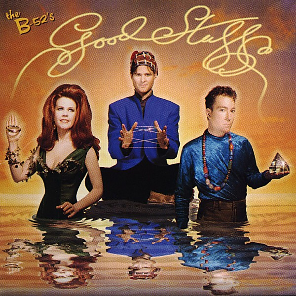

# Good Stuff

By **The B‐52s**

## Album Data

- **Catalog:** Beets
- **Format:** Digital, Album
- **Album:** Good Stuff
- **Artist:** The B‐52s
- **Albumartist:** The B‐52s
- **Genre:** Post-Punk
- **MusicBrainz Album Artist ID:** [127f591a-7e27-4435-92db-0780f219f3a1](https://musicbrainz.org/artist/127f591a-7e27-4435-92db-0780f219f3a1)
- **MusicBrainz Album ID:** [13a36c31-7def-3b04-89ca-abd5a862a0fb](https://musicbrainz.org/release/13a36c31-7def-3b04-89ca-abd5a862a0fb)
- **MusicBrainz Release Group ID:** [1beb455d-140e-3384-8822-7204c7720408](https://musicbrainz.org/release-group/1beb455d-140e-3384-8822-7204c7720408)
- **Year:** 1992
- **Catalog #:** WPCP-5065
- **Label:** Reprise Records
- **Total Tracks:** 10

## Album Tracks

### Track 01 - Tell It Like It T-I-Is

- **Artist:** The B‐52s
- **Format:** AAC
- **Genre:** New Wave
- **Length:** 5:14
- **MusicBrainz Track ID:** [68257c14-6d95-4b58-8368-3e14b5fb6df5](https://musicbrainz.org/recording/68257c14-6d95-4b58-8368-3e14b5fb6df5)
- **Title:** Tell It Like It T-I-Is
- **Track:** 01
- **Year:** 1992

### Track 02 - Hot Pants Explosion

- **Artist:** The B‐52s
- **Format:** AAC
- **Genre:** New Wave
- **Length:** 4:55
- **MusicBrainz Track ID:** [ac12e18d-8ac0-4329-a19b-f2a9223f8fd3](https://musicbrainz.org/recording/ac12e18d-8ac0-4329-a19b-f2a9223f8fd3)
- **Title:** Hot Pants Explosion
- **Track:** 02
- **Year:** 1992

### Track 03 - Good Stuff

- **Artist:** The B‐52s
- **Format:** AAC
- **Genre:** New Wave
- **Length:** 5:58
- **MusicBrainz Track ID:** [73c69e18-5fa7-45c4-9102-cf0526765dc3](https://musicbrainz.org/recording/73c69e18-5fa7-45c4-9102-cf0526765dc3)
- **Title:** Good Stuff
- **Track:** 03
- **Year:** 1992

### Track 04 - Revolution Earth

- **Artist:** The B‐52s
- **Format:** AAC
- **Genre:** New Wave
- **Length:** 5:48
- **MusicBrainz Track ID:** [e325fc37-4b9b-4da7-90e0-8bc12c40df02](https://musicbrainz.org/recording/e325fc37-4b9b-4da7-90e0-8bc12c40df02)
- **Title:** Revolution Earth
- **Track:** 04
- **Year:** 1992

### Track 05 - Dreamland

- **Artist:** The B‐52s
- **Format:** AAC
- **Genre:** New Wave
- **Length:** 7:35
- **MusicBrainz Track ID:** [fa0a5321-57cf-496c-a21d-b7e6f0a05793](https://musicbrainz.org/recording/fa0a5321-57cf-496c-a21d-b7e6f0a05793)
- **Title:** Dreamland
- **Track:** 05
- **Year:** 1992

### Track 06 - Is That You Mo-Dean?

- **Artist:** The B‐52s
- **Format:** AAC
- **Genre:** New Wave
- **Length:** 5:32
- **MusicBrainz Track ID:** [fbd9c9a4-8c96-4e05-99bd-305ee9bd9e40](https://musicbrainz.org/recording/fbd9c9a4-8c96-4e05-99bd-305ee9bd9e40)
- **Title:** Is That You Mo-Dean?
- **Track:** 06
- **Year:** 1992

### Track 07 - The World's Green Laughter

- **Artist:** The B‐52s
- **Format:** AAC
- **Genre:** New Wave
- **Length:** 4:04
- **MusicBrainz Track ID:** [00c48d4e-a1d9-438b-8567-2eeb4c0a0f31](https://musicbrainz.org/recording/00c48d4e-a1d9-438b-8567-2eeb4c0a0f31)
- **Title:** The World's Green Laughter
- **Track:** 07
- **Year:** 1992

### Track 08 - Vision of a Kiss

- **Artist:** The B‐52s
- **Format:** AAC
- **Genre:** New Wave
- **Length:** 5:57
- **MusicBrainz Track ID:** [72d5702c-bbcf-4e40-8355-65f2608980ff](https://musicbrainz.org/recording/72d5702c-bbcf-4e40-8355-65f2608980ff)
- **Title:** Vision of a Kiss
- **Track:** 08
- **Year:** 1992

### Track 09 - Breezin'

- **Artist:** The B‐52s
- **Format:** AAC
- **Genre:** New Wave
- **Length:** 5:21
- **MusicBrainz Track ID:** [57b5c212-dfe4-41b4-bc69-71baa651ce30](https://musicbrainz.org/recording/57b5c212-dfe4-41b4-bc69-71baa651ce30)
- **Title:** Breezin'
- **Track:** 09
- **Year:** 1992

### Track 10 - Bad Influence

- **Artist:** The B‐52s
- **Format:** AAC
- **Genre:** New Wave
- **Length:** 5:41
- **MusicBrainz Track ID:** [515ee055-e4ef-44bf-9802-440f2086be4f](https://musicbrainz.org/recording/515ee055-e4ef-44bf-9802-440f2086be4f)
- **Title:** Bad Influence
- **Track:** 10
- **Year:** 1992

## See also

- [Cosmic Thing](Cosmic_Thing.md)
- [Roon: Cosmic Thing](../../Roon/The_B‐52s/Cosmic_Thing.md)
