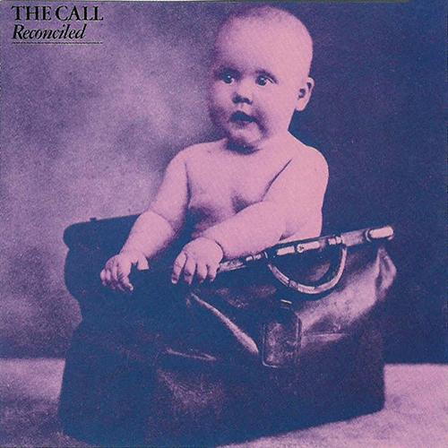

# Reconciled

By **The Call**

## Album Data

- **Catalog:** Beets
- **Format:** Digital, Album
- **Album:** Reconciled
- **Artist:** The Call
- **Albumartist:** The Call
- **Genre:** Post-Punk
- **MusicBrainz Album Artist ID:** [38633e0c-1296-49f5-bacc-2e80ae1e18c4](https://musicbrainz.org/artist/38633e0c-1296-49f5-bacc-2e80ae1e18c4)
- **MusicBrainz Album ID:** [cfa1e769-10d6-4c40-894a-57c28bfadf1d](https://musicbrainz.org/release/cfa1e769-10d6-4c40-894a-57c28bfadf1d)
- **MusicBrainz Release Group ID:** [1de21c5d-cc0b-3778-bacf-5863e78a7b5b](https://musicbrainz.org/release-group/1de21c5d-cc0b-3778-bacf-5863e78a7b5b)
- **Year:** 1986
- **Catalog #:** 60440-2
- **Label:** Elektra
- **Total Tracks:** 09

## Album Tracks

### Track 01 - Everywhere I Go

- **Artist:** The Call
- **Format:** AAC
- **Genre:** Post-Punk
- **Length:** 4:26
- **MusicBrainz Track ID:** [0872d524-8f91-4b0d-9a61-69fd85459a24](https://musicbrainz.org/recording/0872d524-8f91-4b0d-9a61-69fd85459a24)
- **Title:** Everywhere I Go
- **Track:** 01
- **Year:** 1986

### Track 02 - I Still Believe (Great Design)

- **Artist:** The Call
- **Format:** AAC
- **Genre:** Alternative Rock
- **Length:** 5:39
- **MusicBrainz Track ID:** [fad700e9-509d-4d72-9618-7ced775286e4](https://musicbrainz.org/recording/fad700e9-509d-4d72-9618-7ced775286e4)
- **Title:** I Still Believe (Great Design)
- **Track:** 02
- **Year:** 1986

### Track 03 - Blood Red (America)

- **Artist:** The Call
- **Format:** AAC
- **Genre:** Post-Punk
- **Length:** 3:49
- **MusicBrainz Track ID:** [6c15ccb3-217e-4f84-b041-7750dd9d1121](https://musicbrainz.org/recording/6c15ccb3-217e-4f84-b041-7750dd9d1121)
- **Title:** Blood Red (America)
- **Track:** 03
- **Year:** 1986

### Track 04 - The Morning

- **Artist:** The Call
- **Format:** AAC
- **Genre:** Post-Punk
- **Length:** 4:48
- **MusicBrainz Track ID:** [9d85652f-cb4f-4558-82f5-27aa2711c2ce](https://musicbrainz.org/recording/9d85652f-cb4f-4558-82f5-27aa2711c2ce)
- **Title:** The Morning
- **Track:** 04
- **Year:** 1986

### Track 05 - Oklahoma

- **Artist:** The Call
- **Format:** AAC
- **Genre:** Post-Punk
- **Length:** 4:27
- **MusicBrainz Track ID:** [9e622956-c298-4b66-9cab-1d8c29adeb1c](https://musicbrainz.org/recording/9e622956-c298-4b66-9cab-1d8c29adeb1c)
- **Title:** Oklahoma
- **Track:** 05
- **Year:** 1986

### Track 06 - With or Without Reason

- **Artist:** The Call
- **Format:** AAC
- **Genre:** Post-Punk
- **Length:** 4:08
- **MusicBrainz Track ID:** [bb5b17ed-5bb6-495c-93ad-ae5425bc88be](https://musicbrainz.org/recording/bb5b17ed-5bb6-495c-93ad-ae5425bc88be)
- **Title:** With or Without Reason
- **Track:** 06
- **Year:** 1986

### Track 07 - Sanctuary

- **Artist:** The Call
- **Format:** AAC
- **Genre:** Post-Punk
- **Length:** 4:06
- **MusicBrainz Track ID:** [7c380f34-61a6-4d7e-9344-af79c32750e3](https://musicbrainz.org/recording/7c380f34-61a6-4d7e-9344-af79c32750e3)
- **Title:** Sanctuary
- **Track:** 07
- **Year:** 1986

### Track 08 - Tore the Old Place Down

- **Artist:** The Call
- **Format:** AAC
- **Genre:** Post-Punk
- **Length:** 4:20
- **MusicBrainz Track ID:** [fc0aacc8-e8e1-43d0-af10-f7bd3a08e0bc](https://musicbrainz.org/recording/fc0aacc8-e8e1-43d0-af10-f7bd3a08e0bc)
- **Title:** Tore the Old Place Down
- **Track:** 08
- **Year:** 1986

### Track 09 - Even Now

- **Artist:** The Call
- **Format:** AAC
- **Genre:** Post-Punk
- **Length:** 4:45
- **MusicBrainz Track ID:** [95f7cd53-5d5b-4945-901f-f7f255a21464](https://musicbrainz.org/recording/95f7cd53-5d5b-4945-901f-f7f255a21464)
- **Title:** Even Now
- **Track:** 09
- **Year:** 1986

## See also

- [Roon: Into the Woods](../../Roon/The_Call/Into_the_Woods.md)
- [Roon: Let The Day Begin](../../Roon/The_Call/Let_The_Day_Begin.md)
- [Vinyl: Everywhere I Go](../../Vinyl/The_Call/Everywhere_I_Go.md)
- [Vinyl: ](../../Vinyl/The_Call/The_Call.md)
