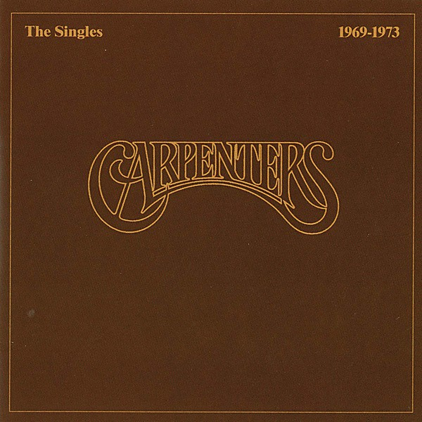

# The Singles 1969-1973

By **The Carpenters**

## Album Data

- **Catalog:** Beets
- **Format:** Digital, Album
- **Album:** The Singles 1969-1973
- **Artist:** The Carpenters
- **Albumartist:** The Carpenters
- **Genre:** Pop
- **MusicBrainz Album Artist ID:** 
- **MusicBrainz Album ID:** 
- **MusicBrainz Release Group ID:** 
- **Year:** 1973
- **Catalog #:** 
- **Label:** 
- **Total Tracks:** 00

## Album Tracks

### Track 12 - (They Long to Be) Close to You

- **Artist:** The Carpenters
- **Format:** AAC
- **Genre:** Soft Rock
- **Length:** 3:41
- **MusicBrainz Track ID:** 
- **Title:** (They Long to Be) Close to You
- **Track:** 12
- **Year:** 1973

## See also

- [Singles 1969-1981](Singles_1969-1981.md)
