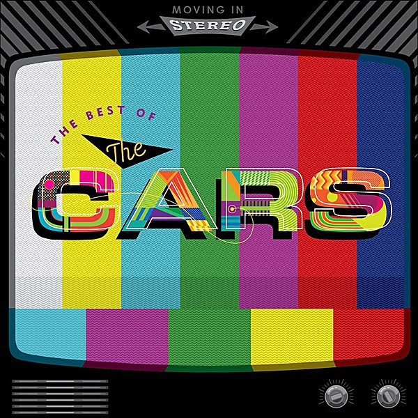

# Moving in Stereo

By **The Cars**

## Album Data

- **Catalog:** Beets
- **Format:** Digital, Album
- **Album:** Moving in Stereo
- **Artist:** The Cars
- **Albumartist:** The Cars
- **Genre:** New Wave
- **MusicBrainz Album Artist ID:** [092b603f-eb4c-4958-b10e-02420de5885b](https://musicbrainz.org/artist/092b603f-eb4c-4958-b10e-02420de5885b)
- **MusicBrainz Album ID:** [c68591aa-ae5d-41f8-b08b-00091a2988fe](https://musicbrainz.org/release/c68591aa-ae5d-41f8-b08b-00091a2988fe)
- **MusicBrainz Release Group ID:** [300d9051-757f-4ef8-bc7a-98c57c3eac4a](https://musicbrainz.org/release-group/300d9051-757f-4ef8-bc7a-98c57c3eac4a)
- **Year:** 2016
- **Catalog #:** 
- **Label:** Elektra
- **Total Tracks:** 18

## Album Tracks

### Track 01 - Just What I Needed

- **Artist:** The Cars
- **Format:** ALAC
- **Genre:** Power Pop
- **Length:** 3:43
- **MusicBrainz Track ID:** [377add36-d24f-4482-96e4-48676c5b98cd](https://musicbrainz.org/recording/377add36-d24f-4482-96e4-48676c5b98cd)
- **Title:** Just What I Needed
- **Track:** 01
- **Year:** 2016

### Track 02 - Since You’re Gone

- **Artist:** The Cars
- **Format:** ALAC
- **Genre:** New Wave
- **Length:** 3:31
- **MusicBrainz Track ID:** [e4871f7a-3597-4a06-b06c-30d13f3c8f1a](https://musicbrainz.org/recording/e4871f7a-3597-4a06-b06c-30d13f3c8f1a)
- **Title:** Since You’re Gone
- **Track:** 02
- **Year:** 2016

### Track 03 - Let’s Go

- **Artist:** The Cars
- **Format:** ALAC
- **Genre:** Rock
- **Length:** 3:33
- **MusicBrainz Track ID:** [de1182b0-36cb-47ae-864c-0ba9ad30f6f7](https://musicbrainz.org/recording/de1182b0-36cb-47ae-864c-0ba9ad30f6f7)
- **Title:** Let’s Go
- **Track:** 03
- **Year:** 2016

### Track 04 - You Might Think

- **Artist:** The Cars
- **Format:** ALAC
- **Genre:** New Wave
- **Length:** 3:05
- **MusicBrainz Track ID:** [eed3d984-0bcf-4236-b986-d31da43edb99](https://musicbrainz.org/recording/eed3d984-0bcf-4236-b986-d31da43edb99)
- **Title:** You Might Think
- **Track:** 04
- **Year:** 2016

### Track 05 - Shake It Up

- **Artist:** The Cars
- **Format:** ALAC
- **Genre:** New Wave
- **Length:** 3:34
- **MusicBrainz Track ID:** [2800c85e-8792-4137-9bde-a55232d215ec](https://musicbrainz.org/recording/2800c85e-8792-4137-9bde-a55232d215ec)
- **Title:** Shake It Up
- **Track:** 05
- **Year:** 2016

### Track 06 - Drive

- **Artist:** The Cars
- **Format:** ALAC
- **Genre:** New Wave
- **Length:** 3:55
- **MusicBrainz Track ID:** [1bd3e09a-beba-4d76-bb92-2d9c4a21d70c](https://musicbrainz.org/recording/1bd3e09a-beba-4d76-bb92-2d9c4a21d70c)
- **Title:** Drive
- **Track:** 06
- **Year:** 2016

### Track 07 - Tonight She Comes

- **Artist:** The Cars
- **Format:** ALAC
- **Genre:** Pop Rock
- **Length:** 3:53
- **MusicBrainz Track ID:** [cf39c38e-6970-47d8-81b0-2a6161d02f99](https://musicbrainz.org/recording/cf39c38e-6970-47d8-81b0-2a6161d02f99)
- **Title:** Tonight She Comes
- **Track:** 07
- **Year:** 2016

### Track 08 - My Best Friend’s Girl

- **Artist:** The Cars
- **Format:** ALAC
- **Genre:** New Wave
- **Length:** 3:44
- **MusicBrainz Track ID:** [4de26582-44a9-4a18-bd30-dfa15a1bc381](https://musicbrainz.org/recording/4de26582-44a9-4a18-bd30-dfa15a1bc381)
- **Title:** My Best Friend’s Girl
- **Track:** 08
- **Year:** 2016

### Track 09 - Don’t Tell Me No

- **Artist:** The Cars
- **Format:** ALAC
- **Genre:** New Wave
- **Length:** 4:01
- **MusicBrainz Track ID:** [7353adcd-df41-4e16-ae4c-b4b6318eb608](https://musicbrainz.org/recording/7353adcd-df41-4e16-ae4c-b4b6318eb608)
- **Title:** Don’t Tell Me No
- **Track:** 09
- **Year:** 2016

### Track 10 - You’re All I’ve Got Tonight

- **Artist:** The Cars
- **Format:** ALAC
- **Genre:** New Wave
- **Length:** 4:14
- **MusicBrainz Track ID:** [ee72dcbe-cf7d-42ea-b5ec-81d40ccf2c70](https://musicbrainz.org/recording/ee72dcbe-cf7d-42ea-b5ec-81d40ccf2c70)
- **Title:** You’re All I’ve Got Tonight
- **Track:** 10
- **Year:** 2016

### Track 11 - I’m Not the One (single mix)

- **Artist:** The Cars
- **Format:** ALAC
- **Genre:** New Wave
- **Length:** 4:08
- **MusicBrainz Track ID:** [9cb5f980-3592-4596-bed2-205eb4535735](https://musicbrainz.org/recording/9cb5f980-3592-4596-bed2-205eb4535735)
- **Title:** I’m Not the One (single mix)
- **Track:** 11
- **Year:** 2016

### Track 12 - Candy‐O

- **Artist:** The Cars
- **Format:** ALAC
- **Genre:** Power Pop
- **Length:** 2:37
- **MusicBrainz Track ID:** [dfb75b13-0719-406d-83f5-31e554db6bfa](https://musicbrainz.org/recording/dfb75b13-0719-406d-83f5-31e554db6bfa)
- **Title:** Candy‐O
- **Track:** 12
- **Year:** 2016

### Track 13 - Heartbeat City

- **Artist:** The Cars
- **Format:** ALAC
- **Genre:** New Wave
- **Length:** 4:27
- **MusicBrainz Track ID:** [18a3704f-4f81-4241-8dec-365602aedd2a](https://musicbrainz.org/recording/18a3704f-4f81-4241-8dec-365602aedd2a)
- **Title:** Heartbeat City
- **Track:** 13
- **Year:** 2016

### Track 14 - Touch and Go

- **Artist:** The Cars
- **Format:** ALAC
- **Genre:** New Wave
- **Length:** 4:55
- **MusicBrainz Track ID:** [7a10bc6b-98dd-4262-8b8a-4fdef54898ce](https://musicbrainz.org/recording/7a10bc6b-98dd-4262-8b8a-4fdef54898ce)
- **Title:** Touch and Go
- **Track:** 14
- **Year:** 2016

### Track 15 - Moving in Stereo

- **Artist:** The Cars
- **Format:** ALAC
- **Genre:** New Wave
- **Length:** 4:40
- **MusicBrainz Track ID:** [6b0e8927-c5fb-4046-93aa-263dc5e4d8fc](https://musicbrainz.org/recording/6b0e8927-c5fb-4046-93aa-263dc5e4d8fc)
- **Title:** Moving in Stereo
- **Track:** 15
- **Year:** 2016

### Track 16 - Dangerous Type

- **Artist:** The Cars
- **Format:** ALAC
- **Genre:** Power Pop
- **Length:** 4:29
- **MusicBrainz Track ID:** [a786d3ad-4b9d-4bb4-bd28-f0986143a3db](https://musicbrainz.org/recording/a786d3ad-4b9d-4bb4-bd28-f0986143a3db)
- **Title:** Dangerous Type
- **Track:** 16
- **Year:** 2016

### Track 17 - Sad Song (Zdar mix)

- **Artist:** The Cars
- **Format:** ALAC
- **Genre:** New Wave
- **Length:** 3:38
- **MusicBrainz Track ID:** [db3560b6-7600-4e68-906f-393e479697cd](https://musicbrainz.org/recording/db3560b6-7600-4e68-906f-393e479697cd)
- **Title:** Sad Song (Zdar mix)
- **Track:** 17
- **Year:** 2016

### Track 18 - Everything You Say (live)

- **Artist:** The Cars
- **Format:** ALAC
- **Genre:** New Wave
- **Length:** 5:18
- **MusicBrainz Track ID:** [f1e04ed1-3c26-408e-b9be-23fd99cbd868](https://musicbrainz.org/recording/f1e04ed1-3c26-408e-b9be-23fd99cbd868)
- **Title:** Everything You Say (live)
- **Track:** 18
- **Year:** 2016

## See also

- [Roon: The Cars](../../Roon/The_Cars/The_Cars.md)
- [Vinyl: Just What I Needed](../../Vinyl/The_Cars/Just_What_I_Needed.md)
- [Vinyl: My Best Friend's Girl](../../Vinyl/The_Cars/My_Best_Friends_Girl.md)
- [Vinyl: ](../../Vinyl/The_Cars/The_Cars.md)
