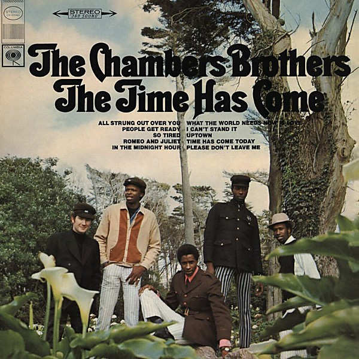

# The Time Has Come

By **The Chambers Brothers**

## Album Data

- **Catalog:** Beets
- **Format:** Digital, Album
- **Album:** The Time Has Come
- **Artist:** The Chambers Brothers
- **Albumartist:** The Chambers Brothers
- **Genre:** Soul
- **MusicBrainz Album Artist ID:** [5c51de66-d15e-48ed-9402-0f17ba2dfc52](https://musicbrainz.org/artist/5c51de66-d15e-48ed-9402-0f17ba2dfc52)
- **MusicBrainz Album ID:** [27e9e600-cddd-45c4-aeef-882794411a44](https://musicbrainz.org/release/27e9e600-cddd-45c4-aeef-882794411a44)
- **MusicBrainz Release Group ID:** [17d9275b-727d-393d-8b8d-18114004f430](https://musicbrainz.org/release-group/17d9275b-727d-393d-8b8d-18114004f430)
- **Year:** 2000
- **Catalog #:** CK 9522
- **Label:** Columbia
- **Total Tracks:** 10

## Album Tracks

### Track 01 - All Strung Out Over You

- **Artist:** The Chambers Brothers
- **Format:** MP3
- **Genre:** Uk Garage
- **Length:** 2:28
- **MusicBrainz Track ID:** [132dbf73-13f9-4647-a723-86c14fca4025](https://musicbrainz.org/recording/132dbf73-13f9-4647-a723-86c14fca4025)
- **Title:** All Strung Out Over You
- **Track:** 01
- **Year:** 2000

### Track 02 - People Get Ready

- **Artist:** The Chambers Brothers
- **Format:** MP3
- **Genre:** Soul
- **Length:** 3:54
- **MusicBrainz Track ID:** [c05d2436-6705-412a-8a0c-5ed258952fd9](https://musicbrainz.org/recording/c05d2436-6705-412a-8a0c-5ed258952fd9)
- **Title:** People Get Ready
- **Track:** 02
- **Year:** 2000

### Track 03 - I Can't Stand It

- **Artist:** The Chambers Brothers
- **Format:** MP3
- **Genre:** Soul
- **Length:** 2:40
- **MusicBrainz Track ID:** [34a83548-347d-459a-bd5b-9513bb9e7680](https://musicbrainz.org/recording/34a83548-347d-459a-bd5b-9513bb9e7680)
- **Title:** I Can't Stand It
- **Track:** 03
- **Year:** 2000

### Track 04 - Romeo and Juliet

- **Artist:** The Chambers Brothers
- **Format:** MP3
- **Genre:** Soul
- **Length:** 4:25
- **MusicBrainz Track ID:** [fa4796d5-8be6-411b-ae16-62c5021e50bd](https://musicbrainz.org/recording/fa4796d5-8be6-411b-ae16-62c5021e50bd)
- **Title:** Romeo and Juliet
- **Track:** 04
- **Year:** 2000

### Track 05 - In the Midnight Hour

- **Artist:** The Chambers Brothers
- **Format:** MP3
- **Genre:** Soul
- **Length:** 5:33
- **MusicBrainz Track ID:** [703a01e5-e42c-489c-bd24-116e7d1a9fbd](https://musicbrainz.org/recording/703a01e5-e42c-489c-bd24-116e7d1a9fbd)
- **Title:** In the Midnight Hour
- **Track:** 05
- **Year:** 2000

### Track 06 - So Tired

- **Artist:** The Chambers Brothers
- **Format:** MP3
- **Genre:** Soul
- **Length:** 4:06
- **MusicBrainz Track ID:** [858d9e0c-0ff9-462c-9751-4d35d720b52a](https://musicbrainz.org/recording/858d9e0c-0ff9-462c-9751-4d35d720b52a)
- **Title:** So Tired
- **Track:** 06
- **Year:** 2000

### Track 07 - Uptown

- **Artist:** The Chambers Brothers
- **Format:** MP3
- **Genre:** Soul
- **Length:** 2:56
- **MusicBrainz Track ID:** [853e9086-b91a-401a-a7c9-a596f2f0c185](https://musicbrainz.org/recording/853e9086-b91a-401a-a7c9-a596f2f0c185)
- **Title:** Uptown
- **Track:** 07
- **Year:** 2000

### Track 08 - Please Don't Leave Me

- **Artist:** The Chambers Brothers
- **Format:** MP3
- **Genre:** Soul
- **Length:** 3:01
- **MusicBrainz Track ID:** [c893cc18-1254-4d93-9a09-c10b01d36832](https://musicbrainz.org/recording/c893cc18-1254-4d93-9a09-c10b01d36832)
- **Title:** Please Don't Leave Me
- **Track:** 08
- **Year:** 2000

### Track 09 - What the World Needs Now Is Love

- **Artist:** The Chambers Brothers
- **Format:** MP3
- **Genre:** Soul
- **Length:** 3:19
- **MusicBrainz Track ID:** [d635c6b9-8b87-498b-b33e-050a302079fd](https://musicbrainz.org/recording/d635c6b9-8b87-498b-b33e-050a302079fd)
- **Title:** What the World Needs Now Is Love
- **Track:** 09
- **Year:** 2000

### Track 10 - Time Has Come Today

- **Artist:** The Chambers Brothers
- **Format:** MP3
- **Genre:** Soul
- **Length:** 11:04
- **MusicBrainz Track ID:** [cf2244e7-b31a-4318-9b41-7ce4580dc180](https://musicbrainz.org/recording/cf2244e7-b31a-4318-9b41-7ce4580dc180)
- **Title:** Time Has Come Today
- **Track:** 10
- **Year:** 2000

## See also

- [Vinyl: ](../../Vinyl/The_Chambers_Brothers/The_Chambers_Brothers.md)
- [Vinyl: The Time Has Come](../../Vinyl/The_Chambers_Brothers/The_Time_Has_Come.md)
