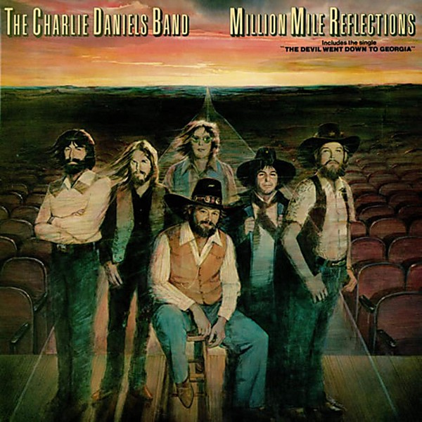

# Million Mile Reflections [UK]

By **The Charlie Daniels Band**

## Album Data

- **Catalog:** Beets
- **Format:** Digital, Album
- **Album:** Million Mile Reflections [UK]
- **Artist:** The Charlie Daniels Band
- **Albumartist:** The Charlie Daniels Band
- **Genre:** Southern Rock
- **MusicBrainz Album Artist ID:** 
- **MusicBrainz Album ID:** 
- **MusicBrainz Release Group ID:** 
- **Year:** 1999
- **Catalog #:** 
- **Label:** 
- **Total Tracks:** 00

## Album Tracks

### Track 06 - The Devil Went Down to Georgia

- **Artist:** Charlie Daniels Band
- **Format:** AAC
- **Genre:** Southern Rock
- **Length:** 3:34
- **MusicBrainz Track ID:** 
- **Title:** The Devil Went Down to Georgia
- **Track:** 06
- **Year:** 1999

