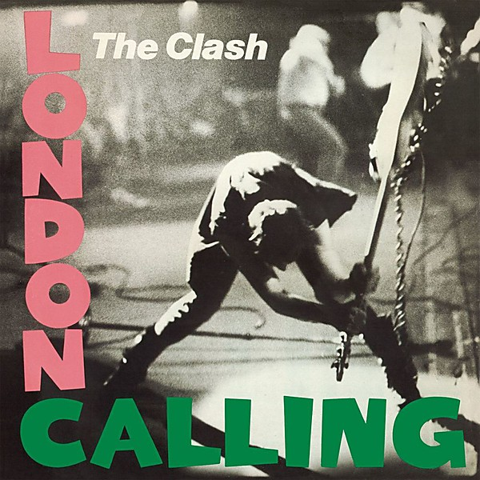

# London Calling

By **The Clash**

## Album Data

- **Catalog:** Beets
- **Format:** Digital, Album
- **Album:** London Calling
- **Artist:** The Clash
- **Albumartist:** The Clash
- **Genre:** Punk Rock
- **MusicBrainz Album Artist ID:** 
- **MusicBrainz Album ID:** 
- **MusicBrainz Release Group ID:** 
- **Year:** 0000
- **Catalog #:** 
- **Label:** 
- **Total Tracks:** 00

## Album Tracks

### Track 00 - 01-London Calling

- **Artist:** The Clash
- **Format:** ALAC
- **Genre:** Punk Rock
- **Length:** 3:20
- **MusicBrainz Track ID:** 
- **Title:** 01-London Calling
- **Track:** 00
- **Year:** 0000

### Track 00 - 02-Brand New Cadillac

- **Artist:** The Clash
- **Format:** ALAC
- **Genre:** Rockabilly
- **Length:** 2:08
- **MusicBrainz Track ID:** 
- **Title:** 02-Brand New Cadillac
- **Track:** 00
- **Year:** 0000

### Track 00 - 03-Jimmy Jazz

- **Artist:** The Clash
- **Format:** ALAC
- **Genre:** Punk Rock
- **Length:** 3:54
- **MusicBrainz Track ID:** 
- **Title:** 03-Jimmy Jazz
- **Track:** 00
- **Year:** 0000

### Track 00 - 04-Hateful

- **Artist:** The Clash
- **Format:** ALAC
- **Genre:** Punk Rock
- **Length:** 2:44
- **MusicBrainz Track ID:** 
- **Title:** 04-Hateful
- **Track:** 00
- **Year:** 0000

### Track 00 - 05-Rudie Can't Fail

- **Artist:** The Clash
- **Format:** ALAC
- **Genre:** Punk Rock
- **Length:** 3:29
- **MusicBrainz Track ID:** 
- **Title:** 05-Rudie Can't Fail
- **Track:** 00
- **Year:** 0000

### Track 00 - 06-Spanish Bombs

- **Artist:** The Clash
- **Format:** ALAC
- **Genre:** Punk Rock
- **Length:** 3:18
- **MusicBrainz Track ID:** 
- **Title:** 06-Spanish Bombs
- **Track:** 00
- **Year:** 0000

### Track 00 - 07-The Right Profile

- **Artist:** The Clash
- **Format:** ALAC
- **Genre:** Punk Rock
- **Length:** 3:54
- **MusicBrainz Track ID:** 
- **Title:** 07-The Right Profile
- **Track:** 00
- **Year:** 0000

### Track 00 - 08-Lost in the Supermarket

- **Artist:** The Clash
- **Format:** ALAC
- **Genre:** Punk Rock
- **Length:** 3:47
- **MusicBrainz Track ID:** 
- **Title:** 08-Lost in the Supermarket
- **Track:** 00
- **Year:** 0000

### Track 00 - 09-Clampdown

- **Artist:** The Clash
- **Format:** ALAC
- **Genre:** Punk Rock
- **Length:** 3:49
- **MusicBrainz Track ID:** 
- **Title:** 09-Clampdown
- **Track:** 00
- **Year:** 0000

### Track 00 - 10-The Guns of Brixton

- **Artist:** The Clash
- **Format:** ALAC
- **Genre:** Ska
- **Length:** 3:09
- **MusicBrainz Track ID:** 
- **Title:** 10-The Guns of Brixton
- **Track:** 00
- **Year:** 0000

### Track 00 - 11-Wrong 'Em Boyo

- **Artist:** The Clash
- **Format:** ALAC
- **Genre:** Punk Rock
- **Length:** 3:10
- **MusicBrainz Track ID:** 
- **Title:** 11-Wrong 'Em Boyo
- **Track:** 00
- **Year:** 0000

### Track 00 - 12-Death or Glory

- **Artist:** The Clash
- **Format:** ALAC
- **Genre:** Punk Rock
- **Length:** 3:55
- **MusicBrainz Track ID:** 
- **Title:** 12-Death or Glory
- **Track:** 00
- **Year:** 0000

### Track 00 - 13-Koka Kola

- **Artist:** The Clash
- **Format:** ALAC
- **Genre:** Punk Rock
- **Length:** 1:47
- **MusicBrainz Track ID:** 
- **Title:** 13-Koka Kola
- **Track:** 00
- **Year:** 0000

### Track 00 - 14-The Card Cheat

- **Artist:** The Clash
- **Format:** ALAC
- **Genre:** Punk Rock
- **Length:** 3:49
- **MusicBrainz Track ID:** 
- **Title:** 14-The Card Cheat
- **Track:** 00
- **Year:** 0000

### Track 00 - 15-Lover's Rock

- **Artist:** The Clash
- **Format:** ALAC
- **Genre:** Punk Rock
- **Length:** 4:03
- **MusicBrainz Track ID:** 
- **Title:** 15-Lover's Rock
- **Track:** 00
- **Year:** 0000

### Track 00 - 16-Four Horsemen

- **Artist:** The Clash
- **Format:** ALAC
- **Genre:** Punk Rock
- **Length:** 2:55
- **MusicBrainz Track ID:** 
- **Title:** 16-Four Horsemen
- **Track:** 00
- **Year:** 0000

### Track 00 - 17-I'm Not Down

- **Artist:** The Clash
- **Format:** ALAC
- **Genre:** Punk Rock
- **Length:** 3:06
- **MusicBrainz Track ID:** 
- **Title:** 17-I'm Not Down
- **Track:** 00
- **Year:** 0000

### Track 00 - 18-Revolution Rock

- **Artist:** The Clash
- **Format:** ALAC
- **Genre:** Ska Punk
- **Length:** 5:33
- **MusicBrainz Track ID:** 
- **Title:** 18-Revolution Rock
- **Track:** 00
- **Year:** 0000

### Track 00 - 19-Train in Vain

- **Artist:** The Clash
- **Format:** ALAC
- **Genre:** Punk Rock
- **Length:** 3:09
- **MusicBrainz Track ID:** 
- **Title:** 19-Train in Vain
- **Track:** 00
- **Year:** 0000

### Track 01 - London Calling

- **Artist:** The Clash
- **Format:** AAC
- **Genre:** Punk Rock
- **Length:** 3:18
- **MusicBrainz Track ID:** 
- **Title:** London Calling
- **Track:** 01
- **Year:** 1999

### Track 02 - Brand New Cadillac

- **Artist:** The Clash
- **Format:** AAC
- **Genre:** Rockabilly
- **Length:** 2:08
- **MusicBrainz Track ID:** 
- **Title:** Brand New Cadillac
- **Track:** 02
- **Year:** 1999

### Track 03 - Jimmy Jazz

- **Artist:** The Clash
- **Format:** AAC
- **Genre:** Punk Rock
- **Length:** 3:54
- **MusicBrainz Track ID:** 
- **Title:** Jimmy Jazz
- **Track:** 03
- **Year:** 1999

### Track 04 - Hateful

- **Artist:** The Clash
- **Format:** AAC
- **Genre:** Punk Rock
- **Length:** 2:44
- **MusicBrainz Track ID:** 
- **Title:** Hateful
- **Track:** 04
- **Year:** 1999

### Track 05 - Rudie Can't Fail

- **Artist:** The Clash
- **Format:** AAC
- **Genre:** Ska Punk
- **Length:** 3:29
- **MusicBrainz Track ID:** 
- **Title:** Rudie Can't Fail
- **Track:** 05
- **Year:** 1999

### Track 06 - Spanish Bombs

- **Artist:** The Clash
- **Format:** AAC
- **Genre:** Punk Rock
- **Length:** 3:18
- **MusicBrainz Track ID:** 
- **Title:** Spanish Bombs
- **Track:** 06
- **Year:** 1999

### Track 07 - The Right Profile

- **Artist:** The Clash
- **Format:** AAC
- **Genre:** Ska
- **Length:** 3:54
- **MusicBrainz Track ID:** 
- **Title:** The Right Profile
- **Track:** 07
- **Year:** 1999

### Track 08 - Lost In The Supermarket

- **Artist:** The Clash
- **Format:** AAC
- **Genre:** Punk Rock
- **Length:** 3:47
- **MusicBrainz Track ID:** 
- **Title:** Lost In The Supermarket
- **Track:** 08
- **Year:** 1999

### Track 09 - Clampdown

- **Artist:** The Clash
- **Format:** AAC
- **Genre:** Punk Rock
- **Length:** 3:48
- **MusicBrainz Track ID:** 
- **Title:** Clampdown
- **Track:** 09
- **Year:** 1999

### Track 10 - The Guns Of Brixton

- **Artist:** The Clash
- **Format:** AAC
- **Genre:** Ska
- **Length:** 3:09
- **MusicBrainz Track ID:** 
- **Title:** The Guns Of Brixton
- **Track:** 10
- **Year:** 1999

### Track 11 - Wrong 'Em Boyo

- **Artist:** The Clash
- **Format:** AAC
- **Genre:** Ska
- **Length:** 3:10
- **MusicBrainz Track ID:** 
- **Title:** Wrong 'Em Boyo
- **Track:** 11
- **Year:** 1999

### Track 12 - Death Or Glory

- **Artist:** The Clash
- **Format:** AAC
- **Genre:** Punk Rock
- **Length:** 3:55
- **MusicBrainz Track ID:** 
- **Title:** Death Or Glory
- **Track:** 12
- **Year:** 1999

### Track 13 - Koka Kola

- **Artist:** The Clash
- **Format:** AAC
- **Genre:** Punk Rock
- **Length:** 1:47
- **MusicBrainz Track ID:** 
- **Title:** Koka Kola
- **Track:** 13
- **Year:** 1999

### Track 14 - The Card Cheat

- **Artist:** The Clash
- **Format:** AAC
- **Genre:** Punk Rock
- **Length:** 3:49
- **MusicBrainz Track ID:** 
- **Title:** The Card Cheat
- **Track:** 14
- **Year:** 1999

### Track 15 - Lover's Rock

- **Artist:** The Clash
- **Format:** AAC
- **Genre:** Punk Rock
- **Length:** 4:03
- **MusicBrainz Track ID:** 
- **Title:** Lover's Rock
- **Track:** 15
- **Year:** 1999

### Track 16 - Four Horsemen

- **Artist:** The Clash
- **Format:** AAC
- **Genre:** Punk Rock
- **Length:** 2:55
- **MusicBrainz Track ID:** 
- **Title:** Four Horsemen
- **Track:** 16
- **Year:** 1999

### Track 17 - I'm Not Down

- **Artist:** The Clash
- **Format:** AAC
- **Genre:** Punk Rock
- **Length:** 3:06
- **MusicBrainz Track ID:** 
- **Title:** I'm Not Down
- **Track:** 17
- **Year:** 1999

### Track 18 - Revolution Rock

- **Artist:** The Clash
- **Format:** AAC
- **Genre:** Ska Punk
- **Length:** 5:33
- **MusicBrainz Track ID:** 
- **Title:** Revolution Rock
- **Track:** 18
- **Year:** 1999

### Track 19 - Train In Vain

- **Artist:** The Clash
- **Format:** AAC
- **Genre:** Punk Rock
- **Length:** 3:09
- **MusicBrainz Track ID:** 
- **Title:** Train In Vain
- **Track:** 19
- **Year:** 1999

## See also

- [The Clash](The_Clash.md)
- [Roon: London Calling (Remastered)](../../Roon/The_Clash/London_Calling_Remastered.md)
- [Vinyl: Gates Of The West](../../Vinyl/The_Clash/Gates_Of_The_West.md)
- [Vinyl: ](../../Vinyl/The_Clash/The_Clash.md)
