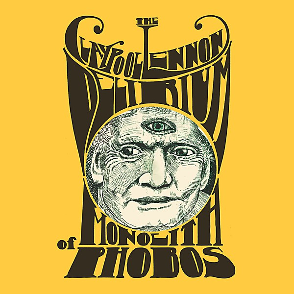

# Monolith of Phobos

By **The Claypool Lennon Delirium**

## Album Data

- **Catalog:** Beets
- **Format:** Digital, Album
- **Album:** Monolith of Phobos
- **Artist:** The Claypool Lennon Delirium
- **Albumartist:** The Claypool Lennon Delirium
- **Genre:** Psychedelic Rock
- **MusicBrainz Album Artist ID:** [https](https://musicbrainz.org/artist/https)
- **MusicBrainz Album ID:** [https](https://musicbrainz.org/release/https)
- **MusicBrainz Release Group ID:** 
- **Year:** 2016
- **Catalog #:** 
- **Label:** ATO
- **Total Tracks:** 11

## Album Tracks

### Track 01 - The Monolith of Phobos

- **Artist:** The Claypool Lennon Delirium
- **Format:** ALAC
- **Genre:** Space Rock
- **Length:** 4:40
- **MusicBrainz Track ID:** [https](https://musicbrainz.org/recording/https)
- **Title:** The Monolith of Phobos
- **Track:** 01
- **Year:** 2016

### Track 02 - Cricket And The Genie (Movement I, The Delirium)

- **Artist:** The Claypool Lennon Delirium
- **Format:** ALAC
- **Genre:** Psychedelic Rock
- **Length:** 3:52
- **MusicBrainz Track ID:** [https](https://musicbrainz.org/recording/https)
- **Title:** Cricket And The Genie (Movement I, The Delirium)
- **Track:** 02
- **Year:** 2016

### Track 03 - Cricket And The Genie (Movement II, Oratorio Di Cricket)

- **Artist:** The Claypool Lennon Delirium
- **Format:** ALAC
- **Genre:** Oratorio
- **Length:** 4:16
- **MusicBrainz Track ID:** [https](https://musicbrainz.org/recording/https)
- **Title:** Cricket And The Genie (Movement II, Oratorio Di Cricket)
- **Track:** 03
- **Year:** 2016

### Track 04 - Mr. Wright

- **Artist:** The Claypool Lennon Delirium
- **Format:** ALAC
- **Genre:** Psychedelic Rock
- **Length:** 4:21
- **MusicBrainz Track ID:** [https](https://musicbrainz.org/recording/https)
- **Title:** Mr. Wright
- **Track:** 04
- **Year:** 2016

### Track 05 - Boomerang Baby

- **Artist:** The Claypool Lennon Delirium
- **Format:** ALAC
- **Genre:** Psychedelic Rock
- **Length:** 5:48
- **MusicBrainz Track ID:** [https](https://musicbrainz.org/recording/https)
- **Title:** Boomerang Baby
- **Track:** 05
- **Year:** 2016

### Track 06 - Breath of a Salesman

- **Artist:** The Claypool Lennon Delirium
- **Format:** ALAC
- **Genre:** Psychedelic Rock
- **Length:** 3:27
- **MusicBrainz Track ID:** [https](https://musicbrainz.org/recording/https)
- **Title:** Breath of a Salesman
- **Track:** 06
- **Year:** 2016

### Track 07 - Captain Lariat

- **Artist:** The Claypool Lennon Delirium
- **Format:** ALAC
- **Genre:** Psychedelic Rock
- **Length:** 6:00
- **MusicBrainz Track ID:** [https](https://musicbrainz.org/recording/https)
- **Title:** Captain Lariat
- **Track:** 07
- **Year:** 2016

### Track 08 - Ohmerica

- **Artist:** The Claypool Lennon Delirium
- **Format:** ALAC
- **Genre:** Psychedelic Rock
- **Length:** 5:08
- **MusicBrainz Track ID:** [https](https://musicbrainz.org/recording/https)
- **Title:** Ohmerica
- **Track:** 08
- **Year:** 2016

### Track 09 - Oxycontin Girl

- **Artist:** The Claypool Lennon Delirium
- **Format:** ALAC
- **Genre:** Psychedelic Rock
- **Length:** 5:03
- **MusicBrainz Track ID:** [https](https://musicbrainz.org/recording/https)
- **Title:** Oxycontin Girl
- **Track:** 09
- **Year:** 2016

### Track 10 - Bubbles Burst

- **Artist:** The Claypool Lennon Delirium
- **Format:** ALAC
- **Genre:** Psychedelic Rock
- **Length:** 4:10
- **MusicBrainz Track ID:** [https](https://musicbrainz.org/recording/https)
- **Title:** Bubbles Burst
- **Track:** 10
- **Year:** 2016

### Track 11 - There's No Underwear In Space

- **Artist:** The Claypool Lennon Delirium
- **Format:** ALAC
- **Genre:** Psychedelic Rock
- **Length:** 3:27
- **MusicBrainz Track ID:** [https](https://musicbrainz.org/recording/https)
- **Title:** There's No Underwear In Space
- **Track:** 11
- **Year:** 2016

## See also

- [Lime and Limpid Green](Lime_and_Limpid_Green.md)
- [CD: ](../../CD/The_Claypool_Lennon_Delirium/The_Claypool_Lennon_Delirium.md)
- [CD: The Monolith of Phobos](../../CD/The_Claypool_Lennon_Delirium/The_Monolith_of_Phobos.md)
- [Vinyl: Lime And Limpid Green](../../Vinyl/The_Claypool_Lennon_Delirium/Lime_And_Limpid_Green.md)
- [Vinyl: ](../../Vinyl/The_Claypool_Lennon_Delirium/The_Claypool_Lennon_Delirium.md)
