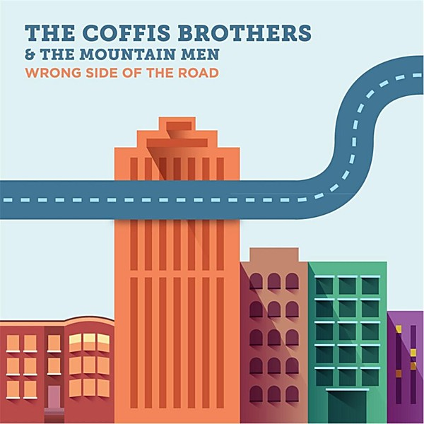

# Wrong Side of the Road

By **The Coffis Brothers**

## Album Data

- **Catalog:** Beets
- **Format:** Digital, Album
- **Album:** Wrong Side of the Road
- **Artist:** The Coffis Brothers
- **Albumartist:** The Coffis Brothers
- **Genre:** Unknown
- **MusicBrainz Album Artist ID:** [https](https://musicbrainz.org/artist/https)
- **MusicBrainz Album ID:** [https](https://musicbrainz.org/release/https)
- **MusicBrainz Release Group ID:** 
- **Year:** 2014
- **Catalog #:** 
- **Label:** The Coffis Brothers
- **Total Tracks:** 13

## Album Tracks

### Track 01 - Gonna Find You

- **Artist:** The Coffis Brothers
- **Format:** ALAC
- **Genre:** Unknown
- **Length:** 4:13
- **MusicBrainz Track ID:** [https](https://musicbrainz.org/recording/https)
- **Title:** Gonna Find You
- **Track:** 01
- **Year:** 2014

### Track 02 - Trouble Town

- **Artist:** The Coffis Brothers
- **Format:** ALAC
- **Genre:** Unknown
- **Length:** 3:19
- **MusicBrainz Track ID:** [https](https://musicbrainz.org/recording/https)
- **Title:** Trouble Town
- **Track:** 02
- **Year:** 2014

### Track 03 - The Hardest Thing

- **Artist:** The Coffis Brothers
- **Format:** ALAC
- **Genre:** Unknown
- **Length:** 3:50
- **MusicBrainz Track ID:** [https](https://musicbrainz.org/recording/https)
- **Title:** The Hardest Thing
- **Track:** 03
- **Year:** 2014

### Track 04 - Love of Mine

- **Artist:** The Coffis Brothers
- **Format:** ALAC
- **Genre:** Unknown
- **Length:** 3:37
- **MusicBrainz Track ID:** [https](https://musicbrainz.org/recording/https)
- **Title:** Love of Mine
- **Track:** 04
- **Year:** 2014

### Track 05 - Rollin

- **Artist:** The Coffis Brothers
- **Format:** ALAC
- **Genre:** Unknown
- **Length:** 4:46
- **MusicBrainz Track ID:** [https](https://musicbrainz.org/recording/https)
- **Title:** Rollin
- **Track:** 05
- **Year:** 2014

### Track 06 - I'd Do Anything

- **Artist:** The Coffis Brothers
- **Format:** ALAC
- **Genre:** Unknown
- **Length:** 3:18
- **MusicBrainz Track ID:** [https](https://musicbrainz.org/recording/https)
- **Title:** I'd Do Anything
- **Track:** 06
- **Year:** 2014

### Track 08 - Runaways

- **Artist:** The Coffis Brothers
- **Format:** ALAC
- **Genre:** Unknown
- **Length:** 4:22
- **MusicBrainz Track ID:** [https](https://musicbrainz.org/recording/https)
- **Title:** Runaways
- **Track:** 08
- **Year:** 2014

### Track 09 - Give it to Me

- **Artist:** The Coffis Brothers
- **Format:** ALAC
- **Genre:** Unknown
- **Length:** 4:17
- **MusicBrainz Track ID:** [https](https://musicbrainz.org/recording/https)
- **Title:** Give it to Me
- **Track:** 09
- **Year:** 2014

### Track 10 - If You're Going With Me

- **Artist:** The Coffis Brothers
- **Format:** ALAC
- **Genre:** Unknown
- **Length:** 3:43
- **MusicBrainz Track ID:** [https](https://musicbrainz.org/recording/https)
- **Title:** If You're Going With Me
- **Track:** 10
- **Year:** 2014

### Track 11 - Big Time

- **Artist:** The Coffis Brothers
- **Format:** ALAC
- **Genre:** Unknown
- **Length:** 5:07
- **MusicBrainz Track ID:** [https](https://musicbrainz.org/recording/https)
- **Title:** Big Time
- **Track:** 11
- **Year:** 2014

### Track 12 - I Ain't Leavin

- **Artist:** The Coffis Brothers
- **Format:** ALAC
- **Genre:** Unknown
- **Length:** 5:41
- **MusicBrainz Track ID:** [https](https://musicbrainz.org/recording/https)
- **Title:** I Ain't Leavin
- **Track:** 12
- **Year:** 2014

### Track 13 - Wrong Side of the Road

- **Artist:** The Coffis Brothers Featuring Jim Lewin, Andy Zenczak and Ryan Avellone
- **Format:** ALAC
- **Genre:** Unknown
- **Length:** 4:43
- **MusicBrainz Track ID:** [https](https://musicbrainz.org/recording/https)
- **Title:** Wrong Side of the Road
- **Track:** 13
- **Year:** 2014

### Track 07 - Before and After

- **Artist:** The Coffis Brothers Featuring Tammi Brown
- **Format:** ALAC
- **Genre:** Unknown
- **Length:** 5:35
- **MusicBrainz Track ID:** [https](https://musicbrainz.org/recording/https)
- **Title:** Before and After
- **Track:** 07
- **Year:** 2014

