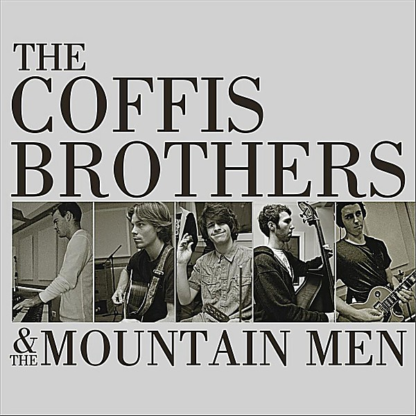

# The Coffis Brothers & The Mountain Men

By **The Coffis Brothers & The Mountain Men**

## Album Data

- **Catalog:** Beets
- **Format:** Digital, Album
- **Album:** The Coffis Brothers & The Mountain Men
- **Artist:** The Coffis Brothers & The Mountain Men
- **Albumartist:** The Coffis Brothers & The Mountain Men
- **Genre:** Rock
- **MusicBrainz Album Artist ID:** 
- **MusicBrainz Album ID:** 
- **MusicBrainz Release Group ID:** 
- **Year:** 2011
- **Catalog #:** 
- **Label:** 
- **Total Tracks:** 10

## Album Tracks

### Track 01 - Shape I'm In

- **Artist:** The Coffis Brothers & The Mountain Men
- **Format:** ALAC
- **Genre:** Rock
- **Length:** 3:43
- **MusicBrainz Track ID:** 
- **Title:** Shape I'm In
- **Track:** 01
- **Year:** 2011

### Track 02 - Down to the Wire

- **Artist:** The Coffis Brothers & The Mountain Men
- **Format:** ALAC
- **Genre:** Rock
- **Length:** 3:08
- **MusicBrainz Track ID:** 
- **Title:** Down to the Wire
- **Track:** 02
- **Year:** 2011

### Track 03 - Love on My Side

- **Artist:** The Coffis Brothers & The Mountain Men
- **Format:** ALAC
- **Genre:** Rock
- **Length:** 4:15
- **MusicBrainz Track ID:** 
- **Title:** Love on My Side
- **Track:** 03
- **Year:** 2011

### Track 04 - Gimme More

- **Artist:** The Coffis Brothers & The Mountain Men
- **Format:** ALAC
- **Genre:** Rock
- **Length:** 4:19
- **MusicBrainz Track ID:** 
- **Title:** Gimme More
- **Track:** 04
- **Year:** 2011

### Track 05 - 'Round Here

- **Artist:** The Coffis Brothers & The Mountain Men
- **Format:** ALAC
- **Genre:** Rock
- **Length:** 5:50
- **MusicBrainz Track ID:** 
- **Title:** 'Round Here
- **Track:** 05
- **Year:** 2011

### Track 06 - All I Need

- **Artist:** The Coffis Brothers & The Mountain Men
- **Format:** ALAC
- **Genre:** Rock
- **Length:** 4:46
- **MusicBrainz Track ID:** 
- **Title:** All I Need
- **Track:** 06
- **Year:** 2011

### Track 07 - Down on You

- **Artist:** The Coffis Brothers & The Mountain Men
- **Format:** ALAC
- **Genre:** Rock
- **Length:** 2:54
- **MusicBrainz Track ID:** 
- **Title:** Down on You
- **Track:** 07
- **Year:** 2011

### Track 08 - You Can Run

- **Artist:** The Coffis Brothers & The Mountain Men
- **Format:** ALAC
- **Genre:** Rock
- **Length:** 4:06
- **MusicBrainz Track ID:** 
- **Title:** You Can Run
- **Track:** 08
- **Year:** 2011

### Track 09 - Think Twice

- **Artist:** The Coffis Brothers & The Mountain Men
- **Format:** ALAC
- **Genre:** Rock
- **Length:** 4:50
- **MusicBrainz Track ID:** 
- **Title:** Think Twice
- **Track:** 09
- **Year:** 2011

### Track 10 - In My Dreams

- **Artist:** The Coffis Brothers & The Mountain Men
- **Format:** ALAC
- **Genre:** Rock
- **Length:** 5:16
- **MusicBrainz Track ID:** 
- **Title:** In My Dreams
- **Track:** 10
- **Year:** 2011

