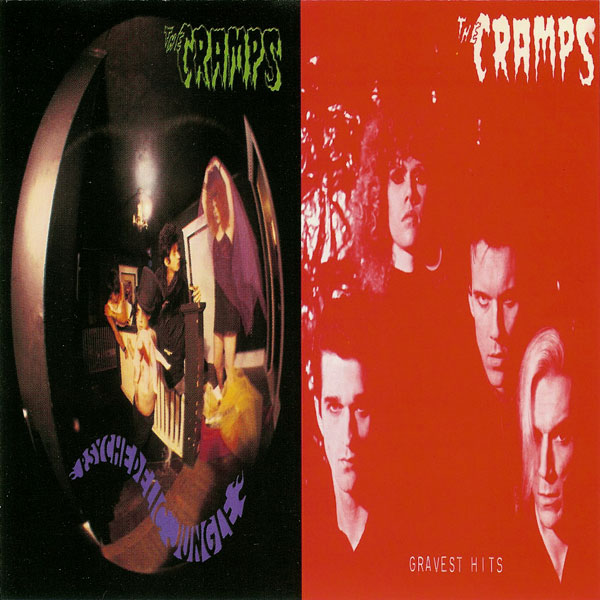

# Psychedelic Jungle / Gravest Hits

By **The Cramps**

## Album Data

- **Catalog:** Beets
- **Format:** Digital, Album
- **Album:** Psychedelic Jungle / Gravest Hits
- **Artist:** The Cramps
- **Albumartist:** The Cramps
- **Genre:** Psychobilly
- **MusicBrainz Album Artist ID:** [96c1edac-1011-4cb8-882c-27248de35071](https://musicbrainz.org/artist/96c1edac-1011-4cb8-882c-27248de35071)
- **MusicBrainz Album ID:** [8ddd818d-809e-466c-b882-d2c49419ef59](https://musicbrainz.org/release/8ddd818d-809e-466c-b882-d2c49419ef59)
- **MusicBrainz Release Group ID:** [75e06008-6b0b-3549-b77c-4bcaf6b1fad1](https://musicbrainz.org/release-group/75e06008-6b0b-3549-b77c-4bcaf6b1fad1)
- **Year:** 1989
- **Catalog #:** CD 70058
- **Label:** I.R.S. Records
- **Total Tracks:** 19

## Album Tracks

### Track 01 - Green Fuz

- **Artist:** The Cramps
- **Format:** ALAC
- **Genre:** Psychobilly
- **Length:** 2:08
- **MusicBrainz Track ID:** [fb034677-495e-417f-b77e-8bade03fe692](https://musicbrainz.org/recording/fb034677-495e-417f-b77e-8bade03fe692)
- **Title:** Green Fuz
- **Track:** 01
- **Year:** 1989

### Track 02 - Goo Goo Muck

- **Artist:** The Cramps
- **Format:** ALAC
- **Genre:** Psychobilly
- **Length:** 3:06
- **MusicBrainz Track ID:** [26e32275-34c7-4389-b654-bd5c9b4861dd](https://musicbrainz.org/recording/26e32275-34c7-4389-b654-bd5c9b4861dd)
- **Title:** Goo Goo Muck
- **Track:** 02
- **Year:** 1989

### Track 03 - Rockin' Bones

- **Artist:** The Cramps
- **Format:** ALAC
- **Genre:** Psychobilly
- **Length:** 2:48
- **MusicBrainz Track ID:** [37f2c592-c421-4bb7-a09b-4841ab3fe63d](https://musicbrainz.org/recording/37f2c592-c421-4bb7-a09b-4841ab3fe63d)
- **Title:** Rockin' Bones
- **Track:** 03
- **Year:** 1989

### Track 04 - Voodoo Idol

- **Artist:** The Cramps
- **Format:** ALAC
- **Genre:** Psychobilly
- **Length:** 3:39
- **MusicBrainz Track ID:** [5c1b8323-a080-43f7-bcb1-e31fe50bee23](https://musicbrainz.org/recording/5c1b8323-a080-43f7-bcb1-e31fe50bee23)
- **Title:** Voodoo Idol
- **Track:** 04
- **Year:** 1989

### Track 05 - Primitive

- **Artist:** The Cramps
- **Format:** ALAC
- **Genre:** Psychobilly
- **Length:** 3:31
- **MusicBrainz Track ID:** [27d0a446-9a6e-4d9c-9b4c-2f5175850b99](https://musicbrainz.org/recording/27d0a446-9a6e-4d9c-9b4c-2f5175850b99)
- **Title:** Primitive
- **Track:** 05
- **Year:** 1989

### Track 06 - Caveman

- **Artist:** The Cramps
- **Format:** ALAC
- **Genre:** Psychobilly
- **Length:** 3:51
- **MusicBrainz Track ID:** [0a42072b-0823-48ad-9dd5-2442def31390](https://musicbrainz.org/recording/0a42072b-0823-48ad-9dd5-2442def31390)
- **Title:** Caveman
- **Track:** 06
- **Year:** 1989

### Track 07 - The Crusher

- **Artist:** The Cramps
- **Format:** ALAC
- **Genre:** Psychobilly
- **Length:** 1:47
- **MusicBrainz Track ID:** [055af031-82d3-4d0a-9749-1b4c8f1e6956](https://musicbrainz.org/recording/055af031-82d3-4d0a-9749-1b4c8f1e6956)
- **Title:** The Crusher
- **Track:** 07
- **Year:** 1989

### Track 08 - Don't Eat Stuff Off The Sidewalk

- **Artist:** The Cramps
- **Format:** ALAC
- **Genre:** Psychobilly
- **Length:** 2:04
- **MusicBrainz Track ID:** [789f8f8a-1827-4d81-95ac-718ebe7a5b11](https://musicbrainz.org/recording/789f8f8a-1827-4d81-95ac-718ebe7a5b11)
- **Title:** Don't Eat Stuff Off The Sidewalk
- **Track:** 08
- **Year:** 1989

### Track 09 - Can't Find My Mind

- **Artist:** The Cramps
- **Format:** ALAC
- **Genre:** Psychobilly
- **Length:** 3:01
- **MusicBrainz Track ID:** [24fc3383-4537-4ca1-a09c-500dde1aed9c](https://musicbrainz.org/recording/24fc3383-4537-4ca1-a09c-500dde1aed9c)
- **Title:** Can't Find My Mind
- **Track:** 09
- **Year:** 1989

### Track 10 - Jungle Hop

- **Artist:** The Cramps
- **Format:** ALAC
- **Genre:** Psychobilly
- **Length:** 2:07
- **MusicBrainz Track ID:** [b42a7799-dfb5-4c26-92a3-afecc0188216](https://musicbrainz.org/recording/b42a7799-dfb5-4c26-92a3-afecc0188216)
- **Title:** Jungle Hop
- **Track:** 10
- **Year:** 1989

### Track 11 - The Natives Are Restless

- **Artist:** The Cramps
- **Format:** ALAC
- **Genre:** Psychobilly
- **Length:** 3:00
- **MusicBrainz Track ID:** [103cc5e9-75d3-4cb6-8623-be55b185dd2d](https://musicbrainz.org/recording/103cc5e9-75d3-4cb6-8623-be55b185dd2d)
- **Title:** The Natives Are Restless
- **Track:** 11
- **Year:** 1989

### Track 12 - Under The Wires

- **Artist:** The Cramps
- **Format:** ALAC
- **Genre:** Psychobilly
- **Length:** 2:44
- **MusicBrainz Track ID:** [3736ec4e-09de-4e13-801c-d99bde14f296](https://musicbrainz.org/recording/3736ec4e-09de-4e13-801c-d99bde14f296)
- **Title:** Under The Wires
- **Track:** 12
- **Year:** 1989

### Track 13 - Beautiful Gardens

- **Artist:** The Cramps
- **Format:** ALAC
- **Genre:** Psychobilly
- **Length:** 3:59
- **MusicBrainz Track ID:** [9361cfc6-cb7f-4c68-862f-62d2c7b5bc0b](https://musicbrainz.org/recording/9361cfc6-cb7f-4c68-862f-62d2c7b5bc0b)
- **Title:** Beautiful Gardens
- **Track:** 13
- **Year:** 1989

### Track 14 - Green Door

- **Artist:** The Cramps
- **Format:** ALAC
- **Genre:** Psychobilly
- **Length:** 2:37
- **MusicBrainz Track ID:** [621c018f-2438-49a4-8dd0-885c702f387f](https://musicbrainz.org/recording/621c018f-2438-49a4-8dd0-885c702f387f)
- **Title:** Green Door
- **Track:** 14
- **Year:** 1989

### Track 15 - Human Fly

- **Artist:** The Cramps
- **Format:** ALAC
- **Genre:** Psychobilly
- **Length:** 2:15
- **MusicBrainz Track ID:** [9af6e5a1-16fb-454e-b289-14a325dec2c7](https://musicbrainz.org/recording/9af6e5a1-16fb-454e-b289-14a325dec2c7)
- **Title:** Human Fly
- **Track:** 15
- **Year:** 1989

### Track 16 - The Way I Walk

- **Artist:** The Cramps
- **Format:** ALAC
- **Genre:** Psychobilly
- **Length:** 2:43
- **MusicBrainz Track ID:** [4ff92f56-0885-4647-937b-41a5ca99e941](https://musicbrainz.org/recording/4ff92f56-0885-4647-937b-41a5ca99e941)
- **Title:** The Way I Walk
- **Track:** 16
- **Year:** 1989

### Track 17 - Domino

- **Artist:** The Cramps
- **Format:** ALAC
- **Genre:** Psychobilly
- **Length:** 3:08
- **MusicBrainz Track ID:** [2010e397-ce6b-4f3b-ba5f-244b4dd5e162](https://musicbrainz.org/recording/2010e397-ce6b-4f3b-ba5f-244b4dd5e162)
- **Title:** Domino
- **Track:** 17
- **Year:** 1989

### Track 18 - Surfin' Bird

- **Artist:** The Cramps
- **Format:** ALAC
- **Genre:** Psychobilly
- **Length:** 5:08
- **MusicBrainz Track ID:** [d6e82144-5704-4cfd-9f34-ec3527f2377e](https://musicbrainz.org/recording/d6e82144-5704-4cfd-9f34-ec3527f2377e)
- **Title:** Surfin' Bird
- **Track:** 18
- **Year:** 1989

### Track 19 - Lonesome Town

- **Artist:** The Cramps
- **Format:** ALAC
- **Genre:** Psychobilly
- **Length:** 3:15
- **MusicBrainz Track ID:** [d8090877-eade-4381-acf5-44bf384e3b8e](https://musicbrainz.org/recording/d8090877-eade-4381-acf5-44bf384e3b8e)
- **Title:** Lonesome Town
- **Track:** 19
- **Year:** 1989

