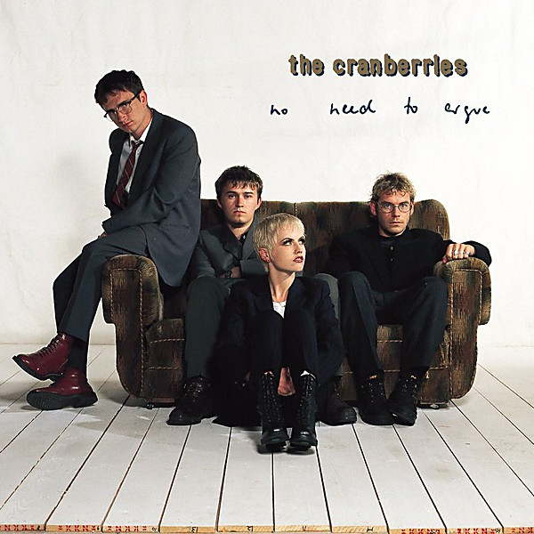

# No Need to Argue

By **The Cranberries**

## Album Data

- **Catalog:** Beets
- **Format:** Digital, Album
- **Album:** No Need to Argue
- **Artist:** The Cranberries
- **Albumartist:** The Cranberries
- **Genre:** Indie Rock
- **MusicBrainz Album Artist ID:** [c98d40fd-f6cf-4b26-883e-eaa515ee2851](https://musicbrainz.org/artist/c98d40fd-f6cf-4b26-883e-eaa515ee2851)
- **MusicBrainz Album ID:** [69a25775-3f41-44cf-9ced-c10d5221556f](https://musicbrainz.org/release/69a25775-3f41-44cf-9ced-c10d5221556f)
- **MusicBrainz Release Group ID:** [5ece0c50-bb0b-3cdf-90e2-287a60136d69](https://musicbrainz.org/release-group/5ece0c50-bb0b-3cdf-90e2-287a60136d69)
- **Year:** 1994
- **Catalog #:** 314-524 050-2
- **Label:** Island
- **Total Tracks:** 13

## Album Tracks

### Track 01 - Ode to My Family

- **Artist:** The Cranberries
- **Format:** ALAC
- **Genre:** Alternative Rock
- **Length:** 4:30
- **MusicBrainz Track ID:** [00bd8820-f19e-4459-a3e6-0390ada318cc](https://musicbrainz.org/recording/00bd8820-f19e-4459-a3e6-0390ada318cc)
- **Title:** Ode to My Family
- **Track:** 01
- **Year:** 1994

### Track 02 - I Can’t Be With You

- **Artist:** The Cranberries
- **Format:** ALAC
- **Genre:** Indie Rock
- **Length:** 3:07
- **MusicBrainz Track ID:** [f82237a4-43c6-4400-8954-fe59a907d4f4](https://musicbrainz.org/recording/f82237a4-43c6-4400-8954-fe59a907d4f4)
- **Title:** I Can’t Be With You
- **Track:** 02
- **Year:** 1994

### Track 03 - Twenty One

- **Artist:** The Cranberries
- **Format:** ALAC
- **Genre:** Britpop
- **Length:** 3:07
- **MusicBrainz Track ID:** [b69b2713-2d6a-4a8c-9a16-530c951b625b](https://musicbrainz.org/recording/b69b2713-2d6a-4a8c-9a16-530c951b625b)
- **Title:** Twenty One
- **Track:** 03
- **Year:** 1994

### Track 04 - Zombie

- **Artist:** The Cranberries
- **Format:** ALAC
- **Genre:** Alternative Rock
- **Length:** 5:06
- **MusicBrainz Track ID:** [3bbeb4e3-ab6d-460d-bfc5-de49e4251061](https://musicbrainz.org/recording/3bbeb4e3-ab6d-460d-bfc5-de49e4251061)
- **Title:** Zombie
- **Track:** 04
- **Year:** 1994

### Track 05 - Empty

- **Artist:** The Cranberries
- **Format:** ALAC
- **Genre:** Alternative Rock
- **Length:** 3:26
- **MusicBrainz Track ID:** [2ef92327-1d03-4e99-a63c-55f656ff57a1](https://musicbrainz.org/recording/2ef92327-1d03-4e99-a63c-55f656ff57a1)
- **Title:** Empty
- **Track:** 05
- **Year:** 1994

### Track 06 - Everything I Said

- **Artist:** The Cranberries
- **Format:** ALAC
- **Genre:** Soft Rock
- **Length:** 3:52
- **MusicBrainz Track ID:** [697cf250-c7ed-4f02-8db5-d09545d2ab1a](https://musicbrainz.org/recording/697cf250-c7ed-4f02-8db5-d09545d2ab1a)
- **Title:** Everything I Said
- **Track:** 06
- **Year:** 1994

### Track 07 - The Icicle Melts

- **Artist:** The Cranberries
- **Format:** ALAC
- **Genre:** Soft Rock
- **Length:** 2:54
- **MusicBrainz Track ID:** [655e53ba-3d25-4793-840a-a5d7a56ab985](https://musicbrainz.org/recording/655e53ba-3d25-4793-840a-a5d7a56ab985)
- **Title:** The Icicle Melts
- **Track:** 07
- **Year:** 1994

### Track 08 - Disappointment

- **Artist:** The Cranberries
- **Format:** ALAC
- **Genre:** Indie Rock
- **Length:** 4:14
- **MusicBrainz Track ID:** [a07b0392-f1ae-42bb-bfa2-b32525cd390c](https://musicbrainz.org/recording/a07b0392-f1ae-42bb-bfa2-b32525cd390c)
- **Title:** Disappointment
- **Track:** 08
- **Year:** 1994

### Track 09 - Ridiculous Thoughts

- **Artist:** The Cranberries
- **Format:** ALAC
- **Genre:** Soft Rock
- **Length:** 4:31
- **MusicBrainz Track ID:** [6206deea-ae91-46fe-aa23-e1ad7f25e274](https://musicbrainz.org/recording/6206deea-ae91-46fe-aa23-e1ad7f25e274)
- **Title:** Ridiculous Thoughts
- **Track:** 09
- **Year:** 1994

### Track 10 - Dreaming My Dreams

- **Artist:** The Cranberries
- **Format:** ALAC
- **Genre:** Soft Rock
- **Length:** 3:37
- **MusicBrainz Track ID:** [69bc8b68-5249-4cb1-800d-97e483656a3b](https://musicbrainz.org/recording/69bc8b68-5249-4cb1-800d-97e483656a3b)
- **Title:** Dreaming My Dreams
- **Track:** 10
- **Year:** 1994

### Track 11 - Yeat’s Grave

- **Artist:** The Cranberries
- **Format:** ALAC
- **Genre:** Indie Rock
- **Length:** 2:59
- **MusicBrainz Track ID:** [6c0c4e51-8930-41af-af60-7a9a3c6c7319](https://musicbrainz.org/recording/6c0c4e51-8930-41af-af60-7a9a3c6c7319)
- **Title:** Yeat’s Grave
- **Track:** 11
- **Year:** 1994

### Track 12 - Daffodil Lament

- **Artist:** The Cranberries
- **Format:** ALAC
- **Genre:** Alternative Rock
- **Length:** 6:14
- **MusicBrainz Track ID:** [d40446a1-d2dd-4fc9-9d83-e883b05552c1](https://musicbrainz.org/recording/d40446a1-d2dd-4fc9-9d83-e883b05552c1)
- **Title:** Daffodil Lament
- **Track:** 12
- **Year:** 1994

### Track 13 - No Need to Argue

- **Artist:** The Cranberries
- **Format:** ALAC
- **Genre:** Alternative Rock
- **Length:** 2:54
- **MusicBrainz Track ID:** [e72cd2f3-e9c1-43c2-8379-d63079c7602b](https://musicbrainz.org/recording/e72cd2f3-e9c1-43c2-8379-d63079c7602b)
- **Title:** No Need to Argue
- **Track:** 13
- **Year:** 1994

## See also

- [Roon: Everybody Else Is Doing It, So Why Can't We? (Super Deluxe)](../../Roon/The_Cranberries/Everybody_Else_Is_Doing_It__So_Why_Cant_We_Super_Deluxe.md)
- [Roon: No Need To Argue (Deluxe)](../../Roon/The_Cranberries/No_Need_To_Argue_Deluxe.md)
- [Roon: Roses (Deluxe Edition)](../../Roon/The_Cranberries/Roses_Deluxe_Edition.md)
- [Roon: Something Else](../../Roon/The_Cranberries/Something_Else.md)
- [Roon: To The Faithful Departed](../../Roon/The_Cranberries/To_The_Faithful_Departed.md)
- [Roon: Wake Up And Smell The Coffee](../../Roon/The_Cranberries/Wake_Up_And_Smell_The_Coffee.md)
