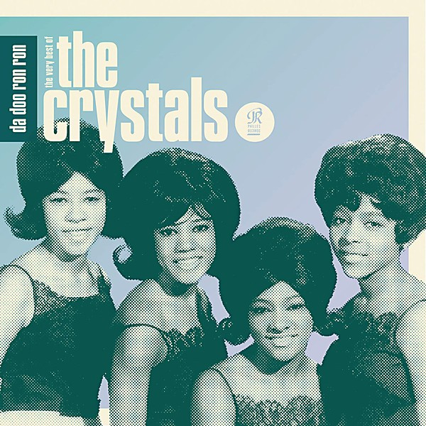

# He's a Rebel

By **The Crystals**

## Album Data

- **Catalog:** Beets
- **Format:** Digital, Album
- **Album:** He's a Rebel
- **Artist:** The Crystals
- **Albumartist:** The Crystals
- **Genre:** Soul
- **MusicBrainz Album Artist ID:** [c68ea4b4-85ae-481e-8345-959f6cfc1fdc](https://musicbrainz.org/artist/c68ea4b4-85ae-481e-8345-959f6cfc1fdc)
- **MusicBrainz Album ID:** [29b6bd75-7bfa-411f-a79b-464bb3037262](https://musicbrainz.org/release/29b6bd75-7bfa-411f-a79b-464bb3037262)
- **MusicBrainz Release Group ID:** [93e47e09-af68-30f2-8867-2b6b85047e62](https://musicbrainz.org/release-group/93e47e09-af68-30f2-8867-2b6b85047e62)
- **Year:** 1963
- **Catalog #:** PHLP-4001
- **Label:** Philles Records
- **Total Tracks:** 12

## Album Tracks

### Track 01 - He's a Rebel

- **Artist:** The Crystals
- **Format:** MP3
- **Genre:** Soul
- **Length:** 2:31
- **MusicBrainz Track ID:** [b859db87-2b1c-4c86-a075-4ed42c9be97c](https://musicbrainz.org/recording/b859db87-2b1c-4c86-a075-4ed42c9be97c)
- **Title:** He's a Rebel
- **Track:** 01
- **Year:** 1963

### Track 02 - Uptown

- **Artist:** The Crystals
- **Format:** MP3
- **Genre:** Soul
- **Length:** 2:21
- **MusicBrainz Track ID:** [929a5d9c-bcbe-4d0f-bbc6-c8f6fb78ce8e](https://musicbrainz.org/recording/929a5d9c-bcbe-4d0f-bbc6-c8f6fb78ce8e)
- **Title:** Uptown
- **Track:** 02
- **Year:** 1963

### Track 03 - Another Country-Another Town

- **Artist:** The Crystals
- **Format:** MP3
- **Genre:** Soul
- **Length:** 3:03
- **MusicBrainz Track ID:** [acdb0cdb-113e-405f-8efa-4e8ee1b4770e](https://musicbrainz.org/recording/acdb0cdb-113e-405f-8efa-4e8ee1b4770e)
- **Title:** Another Country-Another Town
- **Track:** 03
- **Year:** 1963

### Track 04 - Frankenstein Twist

- **Artist:** The Crystals
- **Format:** MP3
- **Genre:** Soul
- **Length:** 2:59
- **MusicBrainz Track ID:** [3501adf6-4da5-48a1-9f8f-b20285572808](https://musicbrainz.org/recording/3501adf6-4da5-48a1-9f8f-b20285572808)
- **Title:** Frankenstein Twist
- **Track:** 04
- **Year:** 1963

### Track 05 - Oh Yeah Maybe Baby

- **Artist:** The Crystals
- **Format:** MP3
- **Genre:** Soul
- **Length:** 2:26
- **MusicBrainz Track ID:** [dc28a8f1-629b-4fd5-9e63-50db38c9dc93](https://musicbrainz.org/recording/dc28a8f1-629b-4fd5-9e63-50db38c9dc93)
- **Title:** Oh Yeah Maybe Baby
- **Track:** 05
- **Year:** 1963

### Track 06 - He's Sure the Boy I Love

- **Artist:** The Crystals
- **Format:** MP3
- **Genre:** Soul
- **Length:** 2:43
- **MusicBrainz Track ID:** [05b9697c-ef6f-432b-afe9-559acace224c](https://musicbrainz.org/recording/05b9697c-ef6f-432b-afe9-559acace224c)
- **Title:** He's Sure the Boy I Love
- **Track:** 06
- **Year:** 1963

### Track 07 - There's No Other (Like My Baby)

- **Artist:** The Crystals
- **Format:** MP3
- **Genre:** Soul
- **Length:** 2:29
- **MusicBrainz Track ID:** [50b72d3d-a630-4865-8e5c-ad9cd60db222](https://musicbrainz.org/recording/50b72d3d-a630-4865-8e5c-ad9cd60db222)
- **Title:** There's No Other (Like My Baby)
- **Track:** 07
- **Year:** 1963

### Track 08 - On Broadway

- **Artist:** The Crystals
- **Format:** MP3
- **Genre:** Soul
- **Length:** 2:29
- **MusicBrainz Track ID:** [25a529e9-77f3-44fa-8c21-390824ec9ea6](https://musicbrainz.org/recording/25a529e9-77f3-44fa-8c21-390824ec9ea6)
- **Title:** On Broadway
- **Track:** 08
- **Year:** 1963

### Track 09 - What a Nice Way to Turn Seventeen

- **Artist:** The Crystals
- **Format:** MP3
- **Genre:** Soul
- **Length:** 2:41
- **MusicBrainz Track ID:** [902f90ea-6d60-4bd7-bdaa-cf388958b26d](https://musicbrainz.org/recording/902f90ea-6d60-4bd7-bdaa-cf388958b26d)
- **Title:** What a Nice Way to Turn Seventeen
- **Track:** 09
- **Year:** 1963

### Track 10 - No One Ever Tells You

- **Artist:** The Crystals
- **Format:** MP3
- **Genre:** Pop
- **Length:** 2:19
- **MusicBrainz Track ID:** [1ea82db1-ffe9-4b28-9ad6-c9eba6538765](https://musicbrainz.org/recording/1ea82db1-ffe9-4b28-9ad6-c9eba6538765)
- **Title:** No One Ever Tells You
- **Track:** 10
- **Year:** 1963

### Track 11 - He Hit Me

- **Artist:** The Crystals
- **Format:** MP3
- **Genre:** Soul
- **Length:** 2:33
- **MusicBrainz Track ID:** [4b1e9d5b-c644-4c24-8649-d391152e2bed](https://musicbrainz.org/recording/4b1e9d5b-c644-4c24-8649-d391152e2bed)
- **Title:** He Hit Me
- **Track:** 11
- **Year:** 1963

### Track 12 - I Love You Eddie

- **Artist:** The Crystals
- **Format:** MP3
- **Genre:** Pop
- **Length:** 1:59
- **MusicBrainz Track ID:** [aaf6cafc-25a6-4b7f-bf65-90044240bea4](https://musicbrainz.org/recording/aaf6cafc-25a6-4b7f-bf65-90044240bea4)
- **Title:** I Love You Eddie
- **Track:** 12
- **Year:** 1963

## See also

- [Vinyl: He's A Rebel](../../Vinyl/The_Crystals/Hes_A_Rebel.md)
- [Vinyl: ](../../Vinyl/The_Crystals/The_Crystals.md)
