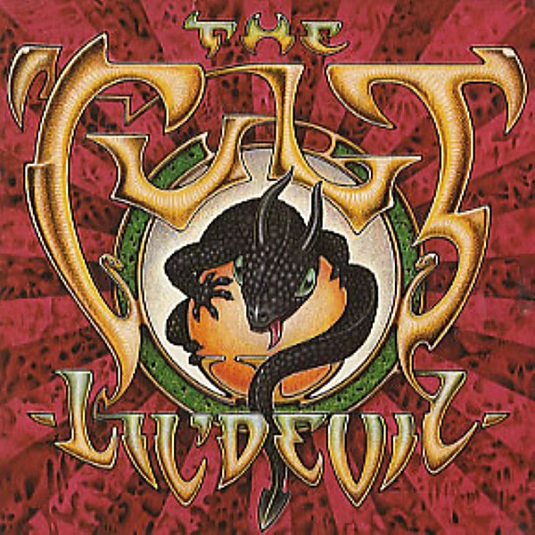

# Lil' Devil

By **The Cult**

## Album Data

- **Catalog:** Beets
- **Format:** Digital, Album
- **Album:** Lil' Devil
- **Artist:** The Cult
- **Albumartist:** The Cult
- **Genre:** Gothic Rock
- **MusicBrainz Album Artist ID:** 
- **MusicBrainz Album ID:** 
- **MusicBrainz Release Group ID:** 
- **Year:** 0000
- **Catalog #:** 
- **Label:** 
- **Total Tracks:** 00

## Album Tracks

### Track 00 - Lil' Devil

- **Artist:** The Cult
- **Format:** ALAC
- **Genre:** Hard Rock
- **Length:** 2:54
- **MusicBrainz Track ID:** 
- **Title:** Lil' Devil
- **Track:** 00
- **Year:** 0000

### Track 00 - Phoenix (Live)

- **Artist:** The Cult
- **Format:** ALAC
- **Genre:** Gothic Rock
- **Length:** 5:36
- **MusicBrainz Track ID:** 
- **Title:** Phoenix (Live)
- **Track:** 00
- **Year:** 0000

### Track 00 - She Sells Sanctuary (Live)

- **Artist:** The Cult
- **Format:** ALAC
- **Genre:** Heavy Metal
- **Length:** 5:35
- **MusicBrainz Track ID:** 
- **Title:** She Sells Sanctuary (Live)
- **Track:** 00
- **Year:** 0000

### Track 00 - Wild Thing Louie Louie (Live)

- **Artist:** The Cult
- **Format:** ALAC
- **Genre:** Gothic Rock
- **Length:** 6:44
- **MusicBrainz Track ID:** 
- **Title:** Wild Thing Louie Louie (Live)
- **Track:** 00
- **Year:** 0000

### Track 00 - Zap City

- **Artist:** The Cult
- **Format:** ALAC
- **Genre:** Hard Rock
- **Length:** 5:18
- **MusicBrainz Track ID:** 
- **Title:** Zap City
- **Track:** 00
- **Year:** 0000

