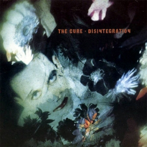

# Disintegration

By **The Cure**

## Album Data

- **Catalog:** Beets
- **Format:** Digital, Album
- **Album:** Disintegration
- **Artist:** The Cure
- **Albumartist:** The Cure
- **Genre:** Gothic Rock
- **MusicBrainz Album Artist ID:** [69ee3720-a7cb-4402-b48d-a02c366f2bcf](https://musicbrainz.org/artist/69ee3720-a7cb-4402-b48d-a02c366f2bcf)
- **MusicBrainz Album ID:** [c6d81fcf-7068-3953-849e-800d30bb0f5c](https://musicbrainz.org/release/c6d81fcf-7068-3953-849e-800d30bb0f5c)
- **MusicBrainz Release Group ID:** [494bf606-d2f7-36d0-8340-eadad8601d2b](https://musicbrainz.org/release-group/494bf606-d2f7-36d0-8340-eadad8601d2b)
- **Year:** 1989
- **Catalog #:** E2 60855
- **Label:** Elektra
- **Total Tracks:** 12

## Album Tracks

### Track 01 - Plainsong

- **Artist:** The Cure
- **Format:** AAC
- **Genre:** Gothic Rock
- **Length:** 5:15
- **MusicBrainz Track ID:** [17e8d995-61b2-4f38-a711-dcee9eb329c5](https://musicbrainz.org/recording/17e8d995-61b2-4f38-a711-dcee9eb329c5)
- **Title:** Plainsong
- **Track:** 01
- **Year:** 1989

### Track 02 - Pictures of You

- **Artist:** The Cure
- **Format:** AAC
- **Genre:** Gothic Rock
- **Length:** 7:28
- **MusicBrainz Track ID:** [aa25d281-b2bc-4555-9798-7f4413a3f243](https://musicbrainz.org/recording/aa25d281-b2bc-4555-9798-7f4413a3f243)
- **Title:** Pictures of You
- **Track:** 02
- **Year:** 1989

### Track 03 - Closedown

- **Artist:** The Cure
- **Format:** AAC
- **Genre:** Gothic Rock
- **Length:** 4:21
- **MusicBrainz Track ID:** [7e65d186-ab6a-4659-9e6e-8dca3bced6bc](https://musicbrainz.org/recording/7e65d186-ab6a-4659-9e6e-8dca3bced6bc)
- **Title:** Closedown
- **Track:** 03
- **Year:** 1989

### Track 04 - Lovesong

- **Artist:** The Cure
- **Format:** AAC
- **Genre:** Post-Punk
- **Length:** 3:30
- **MusicBrainz Track ID:** [1cb233e4-bd40-488e-b20b-1ff88cb9d27e](https://musicbrainz.org/recording/1cb233e4-bd40-488e-b20b-1ff88cb9d27e)
- **Title:** Lovesong
- **Track:** 04
- **Year:** 1989

### Track 05 - Last Dance

- **Artist:** The Cure
- **Format:** AAC
- **Genre:** Gothic Rock
- **Length:** 4:47
- **MusicBrainz Track ID:** [7a732f83-5341-4fe4-b3a2-f2b1ca153a46](https://musicbrainz.org/recording/7a732f83-5341-4fe4-b3a2-f2b1ca153a46)
- **Title:** Last Dance
- **Track:** 05
- **Year:** 1989

### Track 06 - Lullaby

- **Artist:** The Cure
- **Format:** AAC
- **Genre:** Gothic Rock
- **Length:** 4:10
- **MusicBrainz Track ID:** [372ee3d3-2dcb-45f9-a461-75a8ea214e5b](https://musicbrainz.org/recording/372ee3d3-2dcb-45f9-a461-75a8ea214e5b)
- **Title:** Lullaby
- **Track:** 06
- **Year:** 1989

### Track 07 - Fascination Street

- **Artist:** The Cure
- **Format:** AAC
- **Genre:** Gothic Rock
- **Length:** 5:16
- **MusicBrainz Track ID:** [3ab4d7b1-0f0c-4189-982b-825ad3509bde](https://musicbrainz.org/recording/3ab4d7b1-0f0c-4189-982b-825ad3509bde)
- **Title:** Fascination Street
- **Track:** 07
- **Year:** 1989

### Track 08 - Prayers for Rain

- **Artist:** The Cure
- **Format:** AAC
- **Genre:** Gothic Rock
- **Length:** 6:09
- **MusicBrainz Track ID:** [e7626cfa-c6db-4494-befb-c4ce5de4261a](https://musicbrainz.org/recording/e7626cfa-c6db-4494-befb-c4ce5de4261a)
- **Title:** Prayers for Rain
- **Track:** 08
- **Year:** 1989

### Track 09 - The Same Deep Water as You

- **Artist:** The Cure
- **Format:** AAC
- **Genre:** Gothic Rock
- **Length:** 9:21
- **MusicBrainz Track ID:** [84134d6c-2e6d-4122-8701-a166682e2173](https://musicbrainz.org/recording/84134d6c-2e6d-4122-8701-a166682e2173)
- **Title:** The Same Deep Water as You
- **Track:** 09
- **Year:** 1989

### Track 10 - Disintegration

- **Artist:** The Cure
- **Format:** AAC
- **Genre:** Gothic Rock
- **Length:** 8:23
- **MusicBrainz Track ID:** [a32db75a-7d8b-40ef-a05e-b1ac6a318b8b](https://musicbrainz.org/recording/a32db75a-7d8b-40ef-a05e-b1ac6a318b8b)
- **Title:** Disintegration
- **Track:** 10
- **Year:** 1989

### Track 11 - Homesick

- **Artist:** The Cure
- **Format:** AAC
- **Genre:** Gothic Rock
- **Length:** 7:10
- **MusicBrainz Track ID:** [2490533e-6565-4cd8-9fd6-7680010c3cd1](https://musicbrainz.org/recording/2490533e-6565-4cd8-9fd6-7680010c3cd1)
- **Title:** Homesick
- **Track:** 11
- **Year:** 1989

### Track 12 - Untitled

- **Artist:** The Cure
- **Format:** AAC
- **Genre:** Gothic Rock
- **Length:** 6:26
- **MusicBrainz Track ID:** [73b3e2b4-7073-40e5-ad2f-46423d384f72](https://musicbrainz.org/recording/73b3e2b4-7073-40e5-ad2f-46423d384f72)
- **Title:** Untitled
- **Track:** 12
- **Year:** 1989

