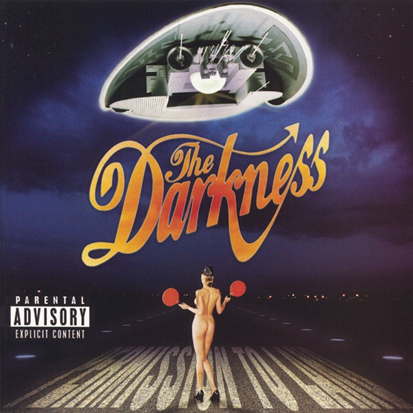

# Permission to Land

By **The Darkness**

## Album Data

- **Catalog:** Beets
- **Format:** Digital, Album
- **Album:** Permission to Land
- **Artist:** The Darkness
- **Albumartist:** The Darkness
- **Genre:** Glam Metal
- **MusicBrainz Album Artist ID:** [81df2271-03a1-46a3-bb30-cce187235312](https://musicbrainz.org/artist/81df2271-03a1-46a3-bb30-cce187235312)
- **MusicBrainz Album ID:** [d374480a-8047-3397-8857-e4c8fc7ff618](https://musicbrainz.org/release/d374480a-8047-3397-8857-e4c8fc7ff618)
- **MusicBrainz Release Group ID:** [00edead2-61f0-3122-9f23-7c741c1f39cf](https://musicbrainz.org/release-group/00edead2-61f0-3122-9f23-7c741c1f39cf)
- **Year:** 2004
- **Catalog #:** 8 2564-60817-2 1
- **Label:** Atlantic
- **Total Tracks:** 10

## Album Tracks

### Track 01 - Black Shuck

- **Artist:** The Darkness
- **Format:** MP3
- **Genre:** Hard Rock
- **Length:** 3:21
- **MusicBrainz Track ID:** [ea8b451c-e197-4b5e-8457-a5abfdcc22e9](https://musicbrainz.org/recording/ea8b451c-e197-4b5e-8457-a5abfdcc22e9)
- **Title:** Black Shuck
- **Track:** 01
- **Year:** 2004

### Track 02 - Get Your Hands Off My Woman

- **Artist:** The Darkness
- **Format:** MP3
- **Genre:** Heavy Metal
- **Length:** 2:47
- **MusicBrainz Track ID:** [bfc87be8-b5dd-492e-aba8-b1656f7e5ea7](https://musicbrainz.org/recording/bfc87be8-b5dd-492e-aba8-b1656f7e5ea7)
- **Title:** Get Your Hands Off My Woman
- **Track:** 02
- **Year:** 2004

### Track 03 - Growing on Me

- **Artist:** The Darkness
- **Format:** MP3
- **Genre:** Hard Rock
- **Length:** 3:31
- **MusicBrainz Track ID:** [13ec645c-ea21-4c4a-924d-ca82c52e43e8](https://musicbrainz.org/recording/13ec645c-ea21-4c4a-924d-ca82c52e43e8)
- **Title:** Growing on Me
- **Track:** 03
- **Year:** 2004

### Track 04 - I Believe in a Thing Called Love

- **Artist:** The Darkness
- **Format:** MP3
- **Genre:** Hard Rock
- **Length:** 3:38
- **MusicBrainz Track ID:** [2afe5070-b737-4b24-85d2-ea4cafbfbbaa](https://musicbrainz.org/recording/2afe5070-b737-4b24-85d2-ea4cafbfbbaa)
- **Title:** I Believe in a Thing Called Love
- **Track:** 04
- **Year:** 2004

### Track 05 - Love Is Only a Feeling

- **Artist:** The Darkness
- **Format:** MP3
- **Genre:** Hard Rock
- **Length:** 4:21
- **MusicBrainz Track ID:** [e674f167-0e54-4462-bd54-bd40ca8ae40f](https://musicbrainz.org/recording/e674f167-0e54-4462-bd54-bd40ca8ae40f)
- **Title:** Love Is Only a Feeling
- **Track:** 05
- **Year:** 2004

### Track 06 - Givin’ Up

- **Artist:** The Darkness
- **Format:** MP3
- **Genre:** Glam Metal
- **Length:** 3:36
- **MusicBrainz Track ID:** [2323c83d-c8ab-46ca-96a2-e0b987fd973a](https://musicbrainz.org/recording/2323c83d-c8ab-46ca-96a2-e0b987fd973a)
- **Title:** Givin’ Up
- **Track:** 06
- **Year:** 2004

### Track 07 - Stuck in a Rut

- **Artist:** The Darkness
- **Format:** MP3
- **Genre:** Heavy Metal
- **Length:** 3:19
- **MusicBrainz Track ID:** [6390bdbc-cab0-46a7-b427-a2aadf3cbf81](https://musicbrainz.org/recording/6390bdbc-cab0-46a7-b427-a2aadf3cbf81)
- **Title:** Stuck in a Rut
- **Track:** 07
- **Year:** 2004

### Track 08 - Friday Night

- **Artist:** The Darkness
- **Format:** MP3
- **Genre:** Hard Rock
- **Length:** 2:57
- **MusicBrainz Track ID:** [7e3732ea-1175-4413-823d-f967cec2cd86](https://musicbrainz.org/recording/7e3732ea-1175-4413-823d-f967cec2cd86)
- **Title:** Friday Night
- **Track:** 08
- **Year:** 2004

### Track 09 - Love on the Rocks With No Ice

- **Artist:** The Darkness
- **Format:** MP3
- **Genre:** Heavy Metal
- **Length:** 5:57
- **MusicBrainz Track ID:** [ea164f1f-04d0-4d80-9d80-987c461c24af](https://musicbrainz.org/recording/ea164f1f-04d0-4d80-9d80-987c461c24af)
- **Title:** Love on the Rocks With No Ice
- **Track:** 09
- **Year:** 2004

### Track 10 - Holding My Own

- **Artist:** The Darkness
- **Format:** MP3
- **Genre:** Heavy Metal
- **Length:** 4:56
- **MusicBrainz Track ID:** [6966d87b-7fe5-42ed-8748-1cba97a693e7](https://musicbrainz.org/recording/6966d87b-7fe5-42ed-8748-1cba97a693e7)
- **Title:** Holding My Own
- **Track:** 10
- **Year:** 2004

