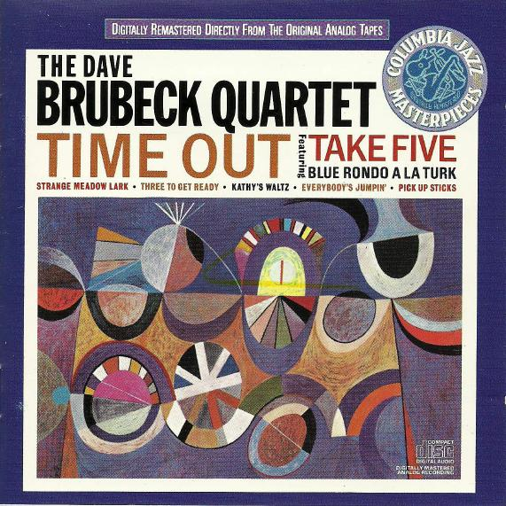

# Time Out

By **The Dave Brubeck Quartet**

## Album Data

- **Catalog:** Beets
- **Format:** Digital, Album
- **Album:** Time Out
- **Artist:** The Dave Brubeck Quartet
- **Albumartist:** The Dave Brubeck Quartet
- **Genre:** Cool Jazz
- **MusicBrainz Album Artist ID:** [7bf711e9-4e69-4e08-b6e8-c0cb5805f1e7](https://musicbrainz.org/artist/7bf711e9-4e69-4e08-b6e8-c0cb5805f1e7)
- **MusicBrainz Album ID:** [a411291d-dba6-32f0-beb5-9147605e33fe](https://musicbrainz.org/release/a411291d-dba6-32f0-beb5-9147605e33fe)
- **MusicBrainz Release Group ID:** [035a7881-3e2c-39d2-b110-fe26a4de94e5](https://musicbrainz.org/release-group/035a7881-3e2c-39d2-b110-fe26a4de94e5)
- **Year:** 1992
- **Catalog #:** CK 40585
- **Label:** Columbia
- **Total Tracks:** 07

## Album Tracks

### Track 01 - Blue Rondo a la Turk

- **Artist:** The Dave Brubeck Quartet
- **Format:** MP3
- **Genre:** Cool Jazz
- **Length:** 7:03
- **MusicBrainz Track ID:** [b5c01dd6-2952-40c4-a37e-0dc492b2d885](https://musicbrainz.org/recording/b5c01dd6-2952-40c4-a37e-0dc492b2d885)
- **Title:** Blue Rondo a la Turk
- **Track:** 01
- **Year:** 1992

### Track 02 - Strange Meadow Lark

- **Artist:** The Dave Brubeck Quartet
- **Format:** MP3
- **Genre:** Cool Jazz
- **Length:** 7:43
- **MusicBrainz Track ID:** [dd637f48-6e0f-4606-8df4-f10b55ebe1c9](https://musicbrainz.org/recording/dd637f48-6e0f-4606-8df4-f10b55ebe1c9)
- **Title:** Strange Meadow Lark
- **Track:** 02
- **Year:** 1992

### Track 03 - Take Five

- **Artist:** The Dave Brubeck Quartet
- **Format:** MP3
- **Genre:** Cool Jazz
- **Length:** 5:40
- **MusicBrainz Track ID:** [69db5ee7-2114-4dda-981d-d2aa8cba6f1f](https://musicbrainz.org/recording/69db5ee7-2114-4dda-981d-d2aa8cba6f1f)
- **Title:** Take Five
- **Track:** 03
- **Year:** 1992

### Track 04 - Three to Get Ready

- **Artist:** The Dave Brubeck Quartet
- **Format:** MP3
- **Genre:** Cool Jazz
- **Length:** 5:40
- **MusicBrainz Track ID:** [eafb5bca-4ea9-4ea2-aa4b-4963a43b07a4](https://musicbrainz.org/recording/eafb5bca-4ea9-4ea2-aa4b-4963a43b07a4)
- **Title:** Three to Get Ready
- **Track:** 04
- **Year:** 1992

### Track 05 - Kathy's Waltz

- **Artist:** The Dave Brubeck Quartet
- **Format:** MP3
- **Genre:** Cool Jazz
- **Length:** 5:05
- **MusicBrainz Track ID:** [83827cc1-9902-44c3-a96c-c761f312fef2](https://musicbrainz.org/recording/83827cc1-9902-44c3-a96c-c761f312fef2)
- **Title:** Kathy's Waltz
- **Track:** 05
- **Year:** 1992

### Track 06 - Everybody's Jumpin'

- **Artist:** The Dave Brubeck Quartet
- **Format:** MP3
- **Genre:** Cool Jazz
- **Length:** 4:36
- **MusicBrainz Track ID:** [ffdffa5d-9165-4ff3-b21b-b2980d8dcedb](https://musicbrainz.org/recording/ffdffa5d-9165-4ff3-b21b-b2980d8dcedb)
- **Title:** Everybody's Jumpin'
- **Track:** 06
- **Year:** 1992

### Track 07 - Pick Up Sticks

- **Artist:** The Dave Brubeck Quartet
- **Format:** MP3
- **Genre:** Cool Jazz
- **Length:** 4:30
- **MusicBrainz Track ID:** [79b66dc4-1b8e-4a04-947b-1b6d5d6fee4c](https://musicbrainz.org/recording/79b66dc4-1b8e-4a04-947b-1b6d5d6fee4c)
- **Title:** Pick Up Sticks
- **Track:** 07
- **Year:** 1992

## See also

- [Roon: Time Out](../../Roon/The_Dave_Brubeck_Quartet/Time_Out.md)
- [Vinyl: ](../../Vinyl/The_Dave_Brubeck_Quartet/The_Dave_Brubeck_Quartet.md)
- [Vinyl: Time Out](../../Vinyl/The_Dave_Brubeck_Quartet/Time_Out.md)
