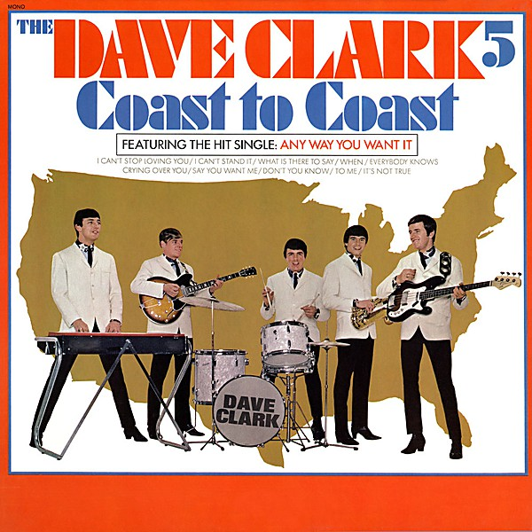

# Coast to Coast

By **The Dave Clark Five**

## Album Data

- **Catalog:** Beets
- **Format:** Digital, Album
- **Album:** Coast to Coast
- **Artist:** The Dave Clark Five
- **Albumartist:** The Dave Clark Five
- **Genre:** Rock And Roll
- **MusicBrainz Album Artist ID:** [6da6a053-618f-4f17-aea1-c8075bd8cc2d](https://musicbrainz.org/artist/6da6a053-618f-4f17-aea1-c8075bd8cc2d)
- **MusicBrainz Album ID:** [b93ea117-cb41-4860-9e6d-54c686e39381](https://musicbrainz.org/release/b93ea117-cb41-4860-9e6d-54c686e39381)
- **MusicBrainz Release Group ID:** [ab5c45c6-3b78-38d1-b2a4-f1ccb0753a09](https://musicbrainz.org/release-group/ab5c45c6-3b78-38d1-b2a4-f1ccb0753a09)
- **Year:** 1965
- **Catalog #:** BN 26185
- **Label:** Epic
- **Total Tracks:** 10

## Album Tracks

### Track 01 - Over and Over

- **Artist:** The Dave Clark Five
- **Format:** AAC
- **Genre:** Rock
- **Length:** 2:03
- **MusicBrainz Track ID:** [83254b00-6c2c-4ee1-b315-271a4d8d53a5](https://musicbrainz.org/recording/83254b00-6c2c-4ee1-b315-271a4d8d53a5)
- **Title:** Over and Over
- **Track:** 01
- **Year:** 1966

### Track 02 - Everybody Knows

- **Artist:** The Dave Clark Five
- **Format:** AAC
- **Genre:** Soft Rock
- **Length:** 1:48
- **MusicBrainz Track ID:** [947b8def-2143-4fa9-aff4-1cd78789c997](https://musicbrainz.org/recording/947b8def-2143-4fa9-aff4-1cd78789c997)
- **Title:** Everybody Knows
- **Track:** 02
- **Year:** 1966

### Track 03 - Can't You See That She's Mine

- **Artist:** The Dave Clark Five
- **Format:** AAC
- **Genre:** Glam Rock
- **Length:** 2:29
- **MusicBrainz Track ID:** [981c3ea4-7c48-4551-886b-0868478d5247](https://musicbrainz.org/recording/981c3ea4-7c48-4551-886b-0868478d5247)
- **Title:** Can't You See That She's Mine
- **Track:** 03
- **Year:** 1966

### Track 04 - Bits and Pieces

- **Artist:** The Dave Clark Five
- **Format:** AAC
- **Genre:** Rock
- **Length:** 2:03
- **MusicBrainz Track ID:** [1ea6807c-e57f-4bb4-b60f-bc44fefa2af6](https://musicbrainz.org/recording/1ea6807c-e57f-4bb4-b60f-bc44fefa2af6)
- **Title:** Bits and Pieces
- **Track:** 04
- **Year:** 1966

### Track 05 - I Like It Like That

- **Artist:** The Dave Clark Five
- **Format:** AAC
- **Genre:** Rock And Roll
- **Length:** 1:44
- **MusicBrainz Track ID:** [ae790145-5f5c-4a56-9d37-08b5ed50dd4d](https://musicbrainz.org/recording/ae790145-5f5c-4a56-9d37-08b5ed50dd4d)
- **Title:** I Like It Like That
- **Track:** 05
- **Year:** 1966

### Track 06 - Catch Us If You Can

- **Artist:** The Dave Clark Five
- **Format:** AAC
- **Genre:** Pop
- **Length:** 2:00
- **MusicBrainz Track ID:** [72660a8c-a4ea-459e-98d3-5cb802ae2509](https://musicbrainz.org/recording/72660a8c-a4ea-459e-98d3-5cb802ae2509)
- **Title:** Catch Us If You Can
- **Track:** 06
- **Year:** 1966

### Track 07 - Because

- **Artist:** The Dave Clark Five
- **Format:** AAC
- **Genre:** Rock
- **Length:** 2:31
- **MusicBrainz Track ID:** [67df5d54-7007-49f6-a14a-2088e76553a7](https://musicbrainz.org/recording/67df5d54-7007-49f6-a14a-2088e76553a7)
- **Title:** Because
- **Track:** 07
- **Year:** 1966

### Track 08 - Any Way You Want It

- **Artist:** The Dave Clark Five
- **Format:** AAC
- **Genre:** Glam Rock
- **Length:** 2:37
- **MusicBrainz Track ID:** [9a18deae-6d28-4ee9-838a-9614635fa6a3](https://musicbrainz.org/recording/9a18deae-6d28-4ee9-838a-9614635fa6a3)
- **Title:** Any Way You Want It
- **Track:** 08
- **Year:** 1966

### Track 09 - Do You Love Me

- **Artist:** The Dave Clark Five
- **Format:** AAC
- **Genre:** Rock And Roll
- **Length:** 2:33
- **MusicBrainz Track ID:** [ee9385dc-5274-4f64-8a84-02d2d1ec8b9e](https://musicbrainz.org/recording/ee9385dc-5274-4f64-8a84-02d2d1ec8b9e)
- **Title:** Do You Love Me
- **Track:** 09
- **Year:** 1966

### Track 10 - Glad All Over

- **Artist:** The Dave Clark Five
- **Format:** AAC
- **Genre:** Rock And Roll
- **Length:** 2:51
- **MusicBrainz Track ID:** [172f1636-ff69-4051-a87e-25e6a1fec131](https://musicbrainz.org/recording/172f1636-ff69-4051-a87e-25e6a1fec131)
- **Title:** Glad All Over
- **Track:** 10
- **Year:** 1966

## See also

- [The Dave Clark Five](The_Dave_Clark_Five.md)
- [The Dave Clark Five's Greatest Hits](The_Dave_Clark_Fives_Greatest_Hits.md)
- [Roon: All the Hits (2019 - Remaster)](../../Roon/The_Dave_Clark_Five/All_the_Hits_2019_-_Remaster.md)
- [Vinyl: Because / Theme Without A Name](../../Vinyl/The_Dave_Clark_Five/Because_-_Theme_Without_A_Name.md)
- [Vinyl: ](../../Vinyl/The_Dave_Clark_Five/The_Dave_Clark_Five.md)
