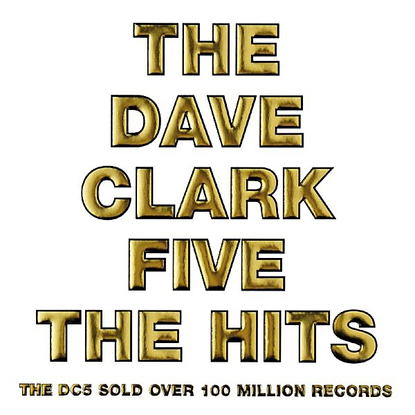

# The Dave Clark Five

By **The Dave Clark Five**

## Album Data

- **Catalog:** Beets
- **Format:** Digital, Album
- **Album:** The Dave Clark Five
- **Artist:** The Dave Clark Five
- **Albumartist:** The Dave Clark Five
- **Genre:** Rock And Roll
- **MusicBrainz Album Artist ID:** 
- **MusicBrainz Album ID:** 
- **MusicBrainz Release Group ID:** 
- **Year:** 2008
- **Catalog #:** 
- **Label:** 
- **Total Tracks:** 28

## Album Tracks

### Track 01 - Do You Love Me

- **Artist:** The Dave Clark Five
- **Format:** AAC
- **Genre:** Rock And Roll
- **Length:** 2:43
- **MusicBrainz Track ID:** 
- **Title:** Do You Love Me
- **Track:** 01
- **Year:** 2008

### Track 02 - Glad All Over

- **Artist:** The Dave Clark Five
- **Format:** AAC
- **Genre:** Rock And Roll
- **Length:** 2:42
- **MusicBrainz Track ID:** 
- **Title:** Glad All Over
- **Track:** 02
- **Year:** 2008

### Track 03 - Bits and Pieces

- **Artist:** The Dave Clark Five
- **Format:** AAC
- **Genre:** Rock
- **Length:** 1:58
- **MusicBrainz Track ID:** 
- **Title:** Bits and Pieces
- **Track:** 03
- **Year:** 2008

### Track 04 - Can't You See That She's Mine

- **Artist:** The Dave Clark Five
- **Format:** AAC
- **Genre:** Glam Rock
- **Length:** 2:21
- **MusicBrainz Track ID:** 
- **Title:** Can't You See That She's Mine
- **Track:** 04
- **Year:** 2008

### Track 05 - Everybody Knows (I Still Love You)

- **Artist:** The Dave Clark Five
- **Format:** AAC
- **Genre:** Rock And Roll
- **Length:** 1:40
- **MusicBrainz Track ID:** 
- **Title:** Everybody Knows (I Still Love You)
- **Track:** 05
- **Year:** 2008

### Track 06 - Don't Let Me Down

- **Artist:** The Dave Clark Five
- **Format:** AAC
- **Genre:** Rock And Roll
- **Length:** 1:41
- **MusicBrainz Track ID:** 
- **Title:** Don't Let Me Down
- **Track:** 06
- **Year:** 2008

### Track 07 - Any Way You Want It

- **Artist:** The Dave Clark Five
- **Format:** AAC
- **Genre:** Glam Rock
- **Length:** 2:29
- **MusicBrainz Track ID:** 
- **Title:** Any Way You Want It
- **Track:** 07
- **Year:** 2008

### Track 08 - Wild Weekend

- **Artist:** The Dave Clark Five
- **Format:** AAC
- **Genre:** Rock And Roll
- **Length:** 1:50
- **MusicBrainz Track ID:** 
- **Title:** Wild Weekend
- **Track:** 08
- **Year:** 2008

### Track 09 - Catch Us If You Can

- **Artist:** The Dave Clark Five
- **Format:** AAC
- **Genre:** Pop
- **Length:** 1:54
- **MusicBrainz Track ID:** 
- **Title:** Catch Us If You Can
- **Track:** 09
- **Year:** 2008

### Track 10 - Because

- **Artist:** The Dave Clark Five
- **Format:** AAC
- **Genre:** Rock
- **Length:** 2:22
- **MusicBrainz Track ID:** 
- **Title:** Because
- **Track:** 10
- **Year:** 2008

### Track 11 - I Like It Like That

- **Artist:** The Dave Clark Five
- **Format:** AAC
- **Genre:** Rock And Roll
- **Length:** 1:37
- **MusicBrainz Track ID:** 
- **Title:** I Like It Like That
- **Track:** 11
- **Year:** 2008

### Track 12 - Reelin' and Rockin'

- **Artist:** The Dave Clark Five
- **Format:** AAC
- **Genre:** Rock And Roll
- **Length:** 2:45
- **MusicBrainz Track ID:** 
- **Title:** Reelin' and Rockin'
- **Track:** 12
- **Year:** 2008

### Track 13 - Over and Over

- **Artist:** The Dave Clark Five
- **Format:** AAC
- **Genre:** Rock
- **Length:** 1:59
- **MusicBrainz Track ID:** 
- **Title:** Over and Over
- **Track:** 13
- **Year:** 2008

### Track 14 - Come Home

- **Artist:** The Dave Clark Five
- **Format:** AAC
- **Genre:** Pop Rock
- **Length:** 2:48
- **MusicBrainz Track ID:** 
- **Title:** Come Home
- **Track:** 14
- **Year:** 2008

### Track 15 - You Got What It Takes

- **Artist:** The Dave Clark Five
- **Format:** AAC
- **Genre:** Pop Rock
- **Length:** 2:58
- **MusicBrainz Track ID:** 
- **Title:** You Got What It Takes
- **Track:** 15
- **Year:** 2008

### Track 16 - Try to Hard

- **Artist:** The Dave Clark Five
- **Format:** AAC
- **Genre:** Pop Rock
- **Length:** 2:08
- **MusicBrainz Track ID:** 
- **Title:** Try to Hard
- **Track:** 16
- **Year:** 2008

### Track 17 - Everybody Knows

- **Artist:** The Dave Clark Five
- **Format:** AAC
- **Genre:** Soft Rock
- **Length:** 2:20
- **MusicBrainz Track ID:** 
- **Title:** Everybody Knows
- **Track:** 17
- **Year:** 2008

### Track 18 - I'll Be Yours My Love

- **Artist:** The Dave Clark Five
- **Format:** AAC
- **Genre:** Rock And Roll
- **Length:** 2:42
- **MusicBrainz Track ID:** 
- **Title:** I'll Be Yours My Love
- **Track:** 18
- **Year:** 2008

### Track 19 - Nineteen Days

- **Artist:** The Dave Clark Five
- **Format:** AAC
- **Genre:** Rock And Roll
- **Length:** 1:49
- **MusicBrainz Track ID:** 
- **Title:** Nineteen Days
- **Track:** 19
- **Year:** 2008

### Track 20 - Look Before You Leap

- **Artist:** The Dave Clark Five
- **Format:** AAC
- **Genre:** Rock And Roll
- **Length:** 2:18
- **MusicBrainz Track ID:** 
- **Title:** Look Before You Leap
- **Track:** 20
- **Year:** 2008

### Track 21 - 'Til the Right One Comes Along

- **Artist:** The Dave Clark Five
- **Format:** AAC
- **Genre:** Rock And Roll
- **Length:** 1:55
- **MusicBrainz Track ID:** 
- **Title:** 'Til the Right One Comes Along
- **Track:** 21
- **Year:** 2008

### Track 22 - All Night Long

- **Artist:** The Dave Clark Five
- **Format:** AAC
- **Genre:** Rock And Roll
- **Length:** 3:09
- **MusicBrainz Track ID:** 
- **Title:** All Night Long
- **Track:** 22
- **Year:** 2008

### Track 23 - Sha-Na-Na Hey Hey Kiss Him Goodbye

- **Artist:** The Dave Clark Five
- **Format:** AAC
- **Genre:** Pop
- **Length:** 3:17
- **MusicBrainz Track ID:** 
- **Title:** Sha-Na-Na Hey Hey Kiss Him Goodbye
- **Track:** 23
- **Year:** 2008

### Track 24 - Here Comes Summer

- **Artist:** The Dave Clark Five
- **Format:** AAC
- **Genre:** Rock And Roll
- **Length:** 2:48
- **MusicBrainz Track ID:** 
- **Title:** Here Comes Summer
- **Track:** 24
- **Year:** 2008

### Track 25 - Put a Little Love In Your Heart

- **Artist:** The Dave Clark Five
- **Format:** AAC
- **Genre:** Pop
- **Length:** 2:56
- **MusicBrainz Track ID:** 
- **Title:** Put a Little Love In Your Heart
- **Track:** 25
- **Year:** 2008

### Track 26 - Everybody Get Together

- **Artist:** The Dave Clark Five
- **Format:** AAC
- **Genre:** Rock And Roll
- **Length:** 3:14
- **MusicBrainz Track ID:** 
- **Title:** Everybody Get Together
- **Track:** 26
- **Year:** 2008

### Track 27 - Universal Love (Previously Unreleased)

- **Artist:** The Dave Clark Five
- **Format:** AAC
- **Genre:** Rock And Roll
- **Length:** 4:07
- **MusicBrainz Track ID:** 
- **Title:** Universal Love (Previously Unreleased)
- **Track:** 27
- **Year:** 2008

### Track 28 - Every American Citizen (Previously Unreleased)

- **Artist:** The Dave Clark Five
- **Format:** AAC
- **Genre:** Rock And Roll
- **Length:** 5:25
- **MusicBrainz Track ID:** 
- **Title:** Every American Citizen (Previously Unreleased)
- **Track:** 28
- **Year:** 2008

## See also

- [Coast to Coast](Coast_to_Coast.md)
- [The Dave Clark Five's Greatest Hits](The_Dave_Clark_Fives_Greatest_Hits.md)
- [Roon: All the Hits (2019 - Remaster)](../../Roon/The_Dave_Clark_Five/All_the_Hits_2019_-_Remaster.md)
- [Vinyl: Because / Theme Without A Name](../../Vinyl/The_Dave_Clark_Five/Because_-_Theme_Without_A_Name.md)
- [Vinyl: ](../../Vinyl/The_Dave_Clark_Five/The_Dave_Clark_Five.md)
