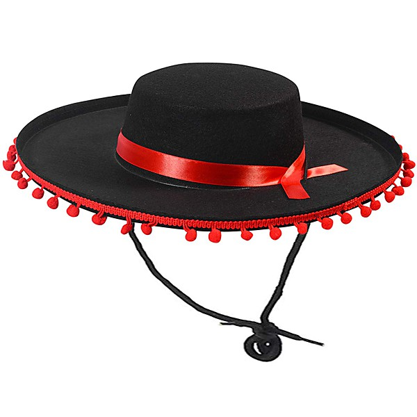

# 2009/05/14 Shoreline Amphitheater

By **The Dead**

## Album Data

- **Catalog:** Beets
- **Format:** Digital, Album
- **Album:** 2009/05/14 Shoreline Amphitheater
- **Artist:** The Dead
- **Albumartist:** The Dead
- **Genre:** Psychobilly
- **MusicBrainz Album Artist ID:** 
- **MusicBrainz Album ID:** 
- **MusicBrainz Release Group ID:** 
- **Year:** 2009
- **Catalog #:** 
- **Label:** 
- **Total Tracks:** 07

## Album Tracks

### Track 01 - Morning Dew

- **Artist:** The Dead
- **Format:** ALAC
- **Genre:** Psychobilly
- **Length:** 13:05
- **MusicBrainz Track ID:** 
- **Title:** Morning Dew
- **Track:** 01
- **Year:** 2009

### Track 02 - China Cat Sunflower

- **Artist:** The Dead
- **Format:** ALAC
- **Genre:** Psychobilly
- **Length:** 8:09
- **MusicBrainz Track ID:** 
- **Title:** China Cat Sunflower
- **Track:** 02
- **Year:** 2009

### Track 03 - I Know You Rider

- **Artist:** The Dead
- **Format:** ALAC
- **Genre:** Rock
- **Length:** 13:06
- **MusicBrainz Track ID:** 
- **Title:** I Know You Rider
- **Track:** 03
- **Year:** 2009

### Track 04 - Donor Rap

- **Artist:** The Dead
- **Format:** ALAC
- **Genre:** Psychobilly
- **Length:** 3:11
- **MusicBrainz Track ID:** 
- **Title:** Donor Rap
- **Track:** 04
- **Year:** 2009

### Track 05 - Scarlet Begonias

- **Artist:** The Dead
- **Format:** ALAC
- **Genre:** Psychobilly
- **Length:** 15:01
- **MusicBrainz Track ID:** 
- **Title:** Scarlet Begonias
- **Track:** 05
- **Year:** 2009

### Track 06 - Fire on the Mountain

- **Artist:** The Dead
- **Format:** ALAC
- **Genre:** Psychobilly
- **Length:** 10:39
- **MusicBrainz Track ID:** 
- **Title:** Fire on the Mountain
- **Track:** 06
- **Year:** 2009

### Track 07 - Deal

- **Artist:** The Dead
- **Format:** ALAC
- **Genre:** Rock
- **Length:** 10:55
- **MusicBrainz Track ID:** 
- **Title:** Deal
- **Track:** 07
- **Year:** 2009

## See also

- [5-14-2009 Shoreline Amphitheatre](5-14-2009_Shoreline_Amphitheatre.md)
- [The Dead, May 14, 2009 Shoreline - [Disc 1]](The_Dead__May_14__2009_Shoreline_-_[Disc_1].md)
