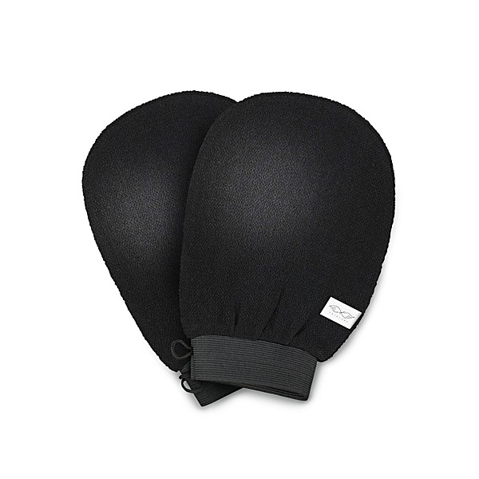

# The Dead, May 14, 2009 Shoreline - [Disc 1]

By **The Dead**

## Album Data

- **Catalog:** Beets
- **Format:** Digital, Album
- **Album:** The Dead, May 14, 2009 Shoreline - [Disc 1]
- **Artist:** The Dead
- **Albumartist:** The Dead
- **Genre:** Psychobilly
- **MusicBrainz Album Artist ID:** 
- **MusicBrainz Album ID:** 
- **MusicBrainz Release Group ID:** 
- **Year:** 2009
- **Catalog #:** 
- **Label:** 
- **Total Tracks:** 08

## Album Tracks

### Track 01 - Jack Straw

- **Artist:** The Dead
- **Format:** ALAC
- **Genre:** Rock
- **Length:** 12:11
- **MusicBrainz Track ID:** 
- **Title:** Jack Straw
- **Track:** 01
- **Year:** 2009

### Track 02 - US Blues

- **Artist:** The Dead
- **Format:** ALAC
- **Genre:** Psychobilly
- **Length:** 5:58
- **MusicBrainz Track ID:** 
- **Title:** US Blues
- **Track:** 02
- **Year:** 2009

### Track 03 - Masons Children

- **Artist:** The Dead
- **Format:** ALAC
- **Genre:** Psychobilly
- **Length:** 7:52
- **MusicBrainz Track ID:** 
- **Title:** Masons Children
- **Track:** 03
- **Year:** 2009

### Track 04 - Ship Of Fools

- **Artist:** The Dead
- **Format:** ALAC
- **Genre:** Rock
- **Length:** 6:39
- **MusicBrainz Track ID:** 
- **Title:** Ship Of Fools
- **Track:** 04
- **Year:** 2009

### Track 05 - Friend Of The Devil

- **Artist:** The Dead
- **Format:** ALAC
- **Genre:** Rock
- **Length:** 6:37
- **MusicBrainz Track ID:** 
- **Title:** Friend Of The Devil
- **Track:** 05
- **Year:** 2009

### Track 06 - Standing On The Moon>

- **Artist:** The Dead
- **Format:** ALAC
- **Genre:** Psychobilly
- **Length:** 3:51
- **MusicBrainz Track ID:** 
- **Title:** Standing On The Moon>
- **Track:** 06
- **Year:** 2009

### Track 07 - Lady WIth a Fan> Terrapin Station>

- **Artist:** The Dead
- **Format:** ALAC
- **Genre:** Psychobilly
- **Length:** 13:09
- **MusicBrainz Track ID:** 
- **Title:** Lady WIth a Fan> Terrapin Station>
- **Track:** 07
- **Year:** 2009

### Track 08 - Standing On The Moon

- **Artist:** The Dead
- **Format:** ALAC
- **Genre:** Rock
- **Length:** 5:39
- **MusicBrainz Track ID:** 
- **Title:** Standing On The Moon
- **Track:** 08
- **Year:** 2009

## See also

- [2009/05/14 Shoreline Amphitheater](2009-05-14_Shoreline_Amphitheater.md)
- [5-14-2009 Shoreline Amphitheatre](5-14-2009_Shoreline_Amphitheatre.md)
