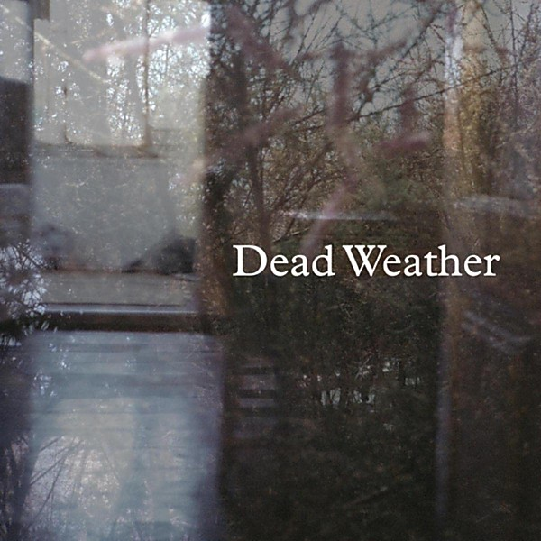

# Buzzkill(er) 45

By **The Dead Weather**

## Album Data

- **Catalog:** Beets
- **Format:** Digital, Album
- **Album:** Buzzkill(er) 45
- **Artist:** The Dead Weather
- **Albumartist:** The Dead Weather
- **Genre:** Stoner Rock
- **MusicBrainz Album Artist ID:** 
- **MusicBrainz Album ID:** 
- **MusicBrainz Release Group ID:** 
- **Year:** 2014
- **Catalog #:** 
- **Label:** 
- **Total Tracks:** 02

## Album Tracks

### Track 01 - Buzzkill(er)

- **Artist:** The Dead Weather
- **Format:** MP3
- **Genre:** Rock
- **Length:** 3:02
- **MusicBrainz Track ID:** 
- **Title:** Buzzkill(er)
- **Track:** 01
- **Year:** 2014

### Track 02 - It's Just Too Bad

- **Artist:** The Dead Weather
- **Format:** MP3
- **Genre:** Stoner Rock
- **Length:** 3:38
- **MusicBrainz Track ID:** 
- **Title:** It's Just Too Bad
- **Track:** 02
- **Year:** 2014

## See also

- [Dodge and Burn](Dodge_and_Burn.md)
- [Horehound](Horehound.md)
- [Sea of Cowards](Sea_of_Cowards.md)
- [Vinyl: Buzzkill(er) / It's Just Too Bad](../../Vinyl/The_Dead_Weather/Buzzkiller_-_Its_Just_Too_Bad.md)
- [Vinyl: ](../../Vinyl/The_Dead_Weather/The_Dead_Weather.md)
