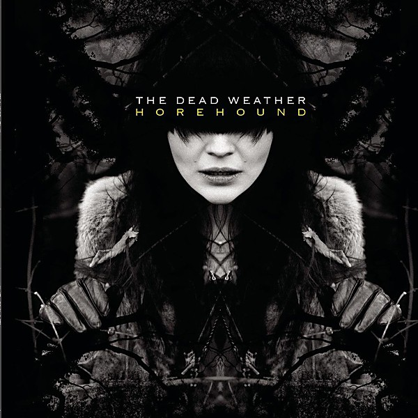

# Horehound

By **The Dead Weather**

## Album Data

- **Catalog:** Beets
- **Format:** Digital, Album
- **Album:** Horehound
- **Artist:** The Dead Weather
- **Albumartist:** The Dead Weather
- **Genre:** Garage Rock
- **MusicBrainz Album Artist ID:** [334bd887-9044-4c38-aebd-4baab851efb4](https://musicbrainz.org/artist/334bd887-9044-4c38-aebd-4baab851efb4)
- **MusicBrainz Album ID:** [1461ddb2-8e8b-40fa-a6a9-2407fc966071](https://musicbrainz.org/release/1461ddb2-8e8b-40fa-a6a9-2407fc966071)
- **MusicBrainz Release Group ID:** [b7435103-780b-4d02-902c-87e7bb6ca9c7](https://musicbrainz.org/release-group/b7435103-780b-4d02-902c-87e7bb6ca9c7)
- **Year:** 2009
- **Catalog #:** 
- **Label:** Third Man Records
- **Total Tracks:** 11

## Album Tracks

### Track 01 - Blue Blood Blues

- **Artist:** The Dead Weather
- **Format:** AAC
- **Genre:** Stoner Rock
- **Length:** 3:22
- **MusicBrainz Track ID:** [4f16eff1-0df6-4d94-89ba-e1470bc7b61f](https://musicbrainz.org/recording/4f16eff1-0df6-4d94-89ba-e1470bc7b61f)
- **Title:** Blue Blood Blues
- **Track:** 01
- **Year:** 2010

### Track 02 - Hustle and Cuss

- **Artist:** The Dead Weather
- **Format:** AAC
- **Genre:** Stoner Rock
- **Length:** 3:45
- **MusicBrainz Track ID:** [beffad8a-1350-424d-be80-a86bbf3e93ce](https://musicbrainz.org/recording/beffad8a-1350-424d-be80-a86bbf3e93ce)
- **Title:** Hustle and Cuss
- **Track:** 02
- **Year:** 2010

### Track 03 - The Difference Between Us

- **Artist:** The Dead Weather
- **Format:** AAC
- **Genre:** Stoner Rock
- **Length:** 3:37
- **MusicBrainz Track ID:** [be2c7946-cbf6-4d75-a638-168618edcbb6](https://musicbrainz.org/recording/be2c7946-cbf6-4d75-a638-168618edcbb6)
- **Title:** The Difference Between Us
- **Track:** 03
- **Year:** 2010

### Track 04 - I’m Mad

- **Artist:** The Dead Weather
- **Format:** AAC
- **Genre:** Stoner Rock
- **Length:** 3:16
- **MusicBrainz Track ID:** [3d9b5b5a-28eb-4ba8-8ff1-19e51e8cb52c](https://musicbrainz.org/recording/3d9b5b5a-28eb-4ba8-8ff1-19e51e8cb52c)
- **Title:** I’m Mad
- **Track:** 04
- **Year:** 2010

### Track 05 - Die by the Drop

- **Artist:** The Dead Weather
- **Format:** AAC
- **Genre:** Stoner Rock
- **Length:** 3:29
- **MusicBrainz Track ID:** [d5d3fa38-2c13-45dc-8f0e-d64dd0445732](https://musicbrainz.org/recording/d5d3fa38-2c13-45dc-8f0e-d64dd0445732)
- **Title:** Die by the Drop
- **Track:** 05
- **Year:** 2010

### Track 06 - I Can’t Hear You

- **Artist:** The Dead Weather
- **Format:** AAC
- **Genre:** Stoner Rock
- **Length:** 3:35
- **MusicBrainz Track ID:** [6a223970-d6a3-46d4-b7db-c0832a1f4634](https://musicbrainz.org/recording/6a223970-d6a3-46d4-b7db-c0832a1f4634)
- **Title:** I Can’t Hear You
- **Track:** 06
- **Year:** 2010

### Track 07 - Gasoline

- **Artist:** The Dead Weather
- **Format:** AAC
- **Genre:** Stoner Rock
- **Length:** 2:44
- **MusicBrainz Track ID:** [45dabf9f-9c03-4cd1-9c07-7522ad162b3c](https://musicbrainz.org/recording/45dabf9f-9c03-4cd1-9c07-7522ad162b3c)
- **Title:** Gasoline
- **Track:** 07
- **Year:** 2010

### Track 08 - No Horse

- **Artist:** The Dead Weather
- **Format:** AAC
- **Genre:** Stoner Rock
- **Length:** 2:49
- **MusicBrainz Track ID:** [c4fbc7e2-9b2d-482e-9126-807d3308a7e9](https://musicbrainz.org/recording/c4fbc7e2-9b2d-482e-9126-807d3308a7e9)
- **Title:** No Horse
- **Track:** 08
- **Year:** 2010

### Track 09 - Looking at the Invisible Man

- **Artist:** The Dead Weather
- **Format:** AAC
- **Genre:** Stoner Rock
- **Length:** 2:42
- **MusicBrainz Track ID:** [f9e88df3-15c2-4fba-be5e-5f2525165279](https://musicbrainz.org/recording/f9e88df3-15c2-4fba-be5e-5f2525165279)
- **Title:** Looking at the Invisible Man
- **Track:** 09
- **Year:** 2010

### Track 10 - Jawbreaker

- **Artist:** The Dead Weather
- **Format:** AAC
- **Genre:** Stoner Rock
- **Length:** 2:58
- **MusicBrainz Track ID:** [725805b8-9724-4ed2-9d87-776510f0e4fe](https://musicbrainz.org/recording/725805b8-9724-4ed2-9d87-776510f0e4fe)
- **Title:** Jawbreaker
- **Track:** 10
- **Year:** 2010

### Track 11 - Old Mary

- **Artist:** The Dead Weather
- **Format:** AAC
- **Genre:** Stoner Rock
- **Length:** 2:53
- **MusicBrainz Track ID:** [8136b0af-5202-42b9-b1d4-6befbc0532d5](https://musicbrainz.org/recording/8136b0af-5202-42b9-b1d4-6befbc0532d5)
- **Title:** Old Mary
- **Track:** 11
- **Year:** 2010

## See also

- [Buzzkill(er) 45](Buzzkiller_45.md)
- [Dodge and Burn](Dodge_and_Burn.md)
- [Sea of Cowards](Sea_of_Cowards.md)
- [Vinyl: Buzzkill(er) / It's Just Too Bad](../../Vinyl/The_Dead_Weather/Buzzkiller_-_Its_Just_Too_Bad.md)
- [Vinyl: ](../../Vinyl/The_Dead_Weather/The_Dead_Weather.md)
