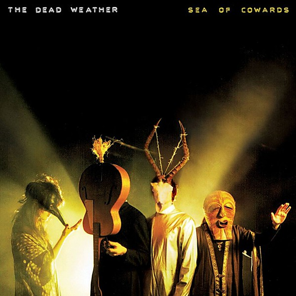

# Sea of Cowards

By **The Dead Weather**

## Album Data

- **Catalog:** Beets
- **Format:** Digital, Album
- **Album:** Sea of Cowards
- **Artist:** The Dead Weather
- **Albumartist:** The Dead Weather
- **Genre:** Stoner Rock
- **MusicBrainz Album Artist ID:** [334bd887-9044-4c38-aebd-4baab851efb4](https://musicbrainz.org/artist/334bd887-9044-4c38-aebd-4baab851efb4)
- **MusicBrainz Album ID:** [c4ef47de-505d-40a7-9ed6-2b8184d37475](https://musicbrainz.org/release/c4ef47de-505d-40a7-9ed6-2b8184d37475)
- **MusicBrainz Release Group ID:** [e62abeb3-f062-406c-9296-7d6e914869eb](https://musicbrainz.org/release-group/e62abeb3-f062-406c-9296-7d6e914869eb)
- **Year:** 2010
- **Catalog #:** 
- **Label:** 
- **Total Tracks:** 02

## Album Tracks

### Track 01 - Buzzkill(er)

- **Artist:** The Dead Weather
- **Format:** MP3
- **Genre:** Rock
- **Length:** 3:02
- **MusicBrainz Track ID:** 
- **Title:** Buzzkill(er)
- **Track:** 01
- **Year:** 2014

### Track 02 - It's Just Too Bad

- **Artist:** The Dead Weather
- **Format:** MP3
- **Genre:** Stoner Rock
- **Length:** 3:38
- **MusicBrainz Track ID:** 
- **Title:** It's Just Too Bad
- **Track:** 02
- **Year:** 2014

## See also

- [Buzzkill(er) 45](Buzzkiller_45.md)
- [Dodge and Burn](Dodge_and_Burn.md)
- [Horehound](Horehound.md)
- [Vinyl: Buzzkill(er) / It's Just Too Bad](../../Vinyl/The_Dead_Weather/Buzzkiller_-_Its_Just_Too_Bad.md)
- [Vinyl: ](../../Vinyl/The_Dead_Weather/The_Dead_Weather.md)
