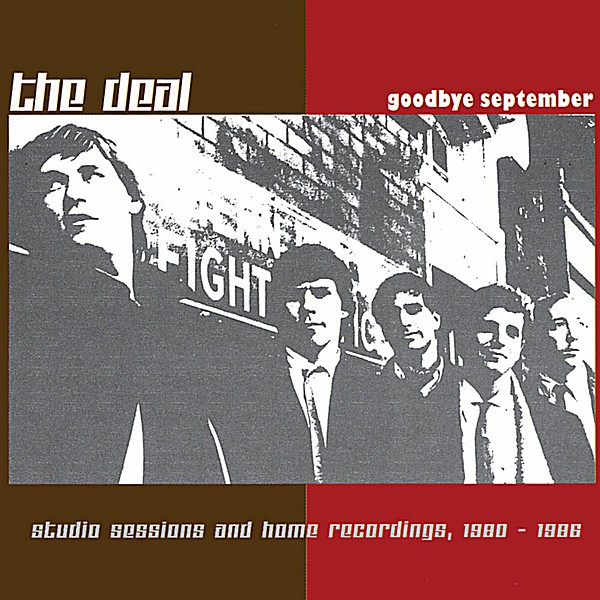

# Goodbye September

By **The Deal**

## Album Data

- **Catalog:** Beets
- **Format:** Digital, Album
- **Album:** Goodbye September
- **Artist:** The Deal
- **Albumartist:** The Deal
- **Genre:** Power Pop
- **MusicBrainz Album Artist ID:** 
- **MusicBrainz Album ID:** 
- **MusicBrainz Release Group ID:** 
- **Year:** 2003
- **Catalog #:** 
- **Label:** 
- **Total Tracks:** 14

## Album Tracks

### Track 01 - Don't Go Out

- **Artist:** The Deal
- **Format:** MP3
- **Genre:** Power Pop
- **Length:** 4:00
- **MusicBrainz Track ID:** 
- **Title:** Don't Go Out
- **Track:** 01
- **Year:** 2003

### Track 02 - Rebel Girl

- **Artist:** The Deal
- **Format:** MP3
- **Genre:** Power Pop
- **Length:** 3:27
- **MusicBrainz Track ID:** 
- **Title:** Rebel Girl
- **Track:** 02
- **Year:** 2003

### Track 03 - DC-10s

- **Artist:** The Deal
- **Format:** MP3
- **Genre:** Power Pop
- **Length:** 6:18
- **MusicBrainz Track ID:** 
- **Title:** DC-10s
- **Track:** 03
- **Year:** 2003

### Track 04 - Maybe I'll Just Keep You Hanging On

- **Artist:** The Deal
- **Format:** MP3
- **Genre:** Power Pop
- **Length:** 4:49
- **MusicBrainz Track ID:** 
- **Title:** Maybe I'll Just Keep You Hanging On
- **Track:** 04
- **Year:** 2003

### Track 05 - Hopi

- **Artist:** The Deal
- **Format:** MP3
- **Genre:** Power Pop
- **Length:** 3:42
- **MusicBrainz Track ID:** 
- **Title:** Hopi
- **Track:** 05
- **Year:** 2003

### Track 06 - Pass Away

- **Artist:** The Deal
- **Format:** MP3
- **Genre:** Power Pop
- **Length:** 3:27
- **MusicBrainz Track ID:** 
- **Title:** Pass Away
- **Track:** 06
- **Year:** 2003

### Track 07 - Marianne

- **Artist:** The Deal
- **Format:** MP3
- **Genre:** Power Pop
- **Length:** 1:58
- **MusicBrainz Track ID:** 
- **Title:** Marianne
- **Track:** 07
- **Year:** 2003

### Track 08 - Picture A Lady

- **Artist:** The Deal
- **Format:** MP3
- **Genre:** Power Pop
- **Length:** 2:47
- **MusicBrainz Track ID:** 
- **Title:** Picture A Lady
- **Track:** 08
- **Year:** 2003

### Track 09 - Time Won't Come Back

- **Artist:** The Deal
- **Format:** MP3
- **Genre:** Power Pop
- **Length:** 3:51
- **MusicBrainz Track ID:** 
- **Title:** Time Won't Come Back
- **Track:** 09
- **Year:** 2003

### Track 10 - Strangers In Disguise

- **Artist:** The Deal
- **Format:** MP3
- **Genre:** Power Pop
- **Length:** 2:50
- **MusicBrainz Track ID:** 
- **Title:** Strangers In Disguise
- **Track:** 10
- **Year:** 2003

### Track 11 - Lighting Candles In The Rain

- **Artist:** The Deal
- **Format:** MP3
- **Genre:** Power Pop
- **Length:** 3:26
- **MusicBrainz Track ID:** 
- **Title:** Lighting Candles In The Rain
- **Track:** 11
- **Year:** 2003

### Track 12 - 5

- **Artist:** The Deal
- **Format:** MP3
- **Genre:** Power Pop
- **Length:** 4:07
- **MusicBrainz Track ID:** 
- **Title:** 5
- **Track:** 12
- **Year:** 2003

### Track 13 - Cinnamon Square

- **Artist:** The Deal
- **Format:** MP3
- **Genre:** Power Pop
- **Length:** 4:30
- **MusicBrainz Track ID:** 
- **Title:** Cinnamon Square
- **Track:** 13
- **Year:** 2003

### Track 14 - Untitled

- **Artist:** The Deal
- **Format:** MP3
- **Genre:** Power Pop
- **Length:** 3:08
- **MusicBrainz Track ID:** 
- **Title:** Untitled
- **Track:** 14
- **Year:** 2003

