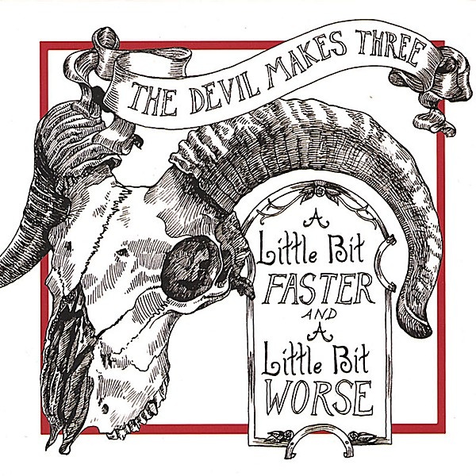

# A Little Bit Faster and a Little Bit Worse

By **The Devil Makes Three**

## Album Data

- **Catalog:** Beets
- **Format:** Digital, Album
- **Album:** A Little Bit Faster and a Little Bit Worse
- **Artist:** The Devil Makes Three
- **Albumartist:** The Devil Makes Three
- **Genre:** Bluegrass
- **MusicBrainz Album Artist ID:** [66e5bc0f-7cc6-4e44-937b-4a92466f3c37](https://musicbrainz.org/artist/66e5bc0f-7cc6-4e44-937b-4a92466f3c37)
- **MusicBrainz Album ID:** [dd097856-86d6-4674-a349-538b49b3f48b](https://musicbrainz.org/release/dd097856-86d6-4674-a349-538b49b3f48b)
- **MusicBrainz Release Group ID:** [b6a5dcb5-55ae-30d6-8795-1a8e3efe9240](https://musicbrainz.org/release-group/b6a5dcb5-55ae-30d6-8795-1a8e3efe9240)
- **Year:** 2007
- **Catalog #:** NW 6282
- **Label:** New West Records
- **Total Tracks:** 10

## Album Tracks

### Track 01 - Stranger

- **Artist:** The Devil Makes Three
- **Format:** ALAC
- **Genre:** Indie Rock
- **Length:** 3:28
- **MusicBrainz Track ID:** [e33b06c4-39aa-427e-9a1d-ff81e37f40e7](https://musicbrainz.org/recording/e33b06c4-39aa-427e-9a1d-ff81e37f40e7)
- **Title:** Stranger
- **Track:** 01
- **Year:** 2013

### Track 02 - Worse or Better

- **Artist:** The Devil Makes Three
- **Format:** ALAC
- **Genre:** Bluegrass
- **Length:** 2:58
- **MusicBrainz Track ID:** [413ae8be-6df1-470b-84c0-b1fd31ab99bc](https://musicbrainz.org/recording/413ae8be-6df1-470b-84c0-b1fd31ab99bc)
- **Title:** Worse or Better
- **Track:** 02
- **Year:** 2013

### Track 03 - Forty Days

- **Artist:** The Devil Makes Three
- **Format:** ALAC
- **Genre:** Bluegrass
- **Length:** 3:37
- **MusicBrainz Track ID:** [bd940378-b06c-4747-a583-fdba850fe386](https://musicbrainz.org/recording/bd940378-b06c-4747-a583-fdba850fe386)
- **Title:** Forty Days
- **Track:** 03
- **Year:** 2013

### Track 04 - A Moment’s Rest

- **Artist:** The Devil Makes Three
- **Format:** ALAC
- **Genre:** Bluegrass
- **Length:** 3:59
- **MusicBrainz Track ID:** [5bd0d531-de53-4e88-b8f4-973849303acb](https://musicbrainz.org/recording/5bd0d531-de53-4e88-b8f4-973849303acb)
- **Title:** A Moment’s Rest
- **Track:** 04
- **Year:** 2013

### Track 05 - Dead Body Moving

- **Artist:** The Devil Makes Three
- **Format:** ALAC
- **Genre:** Bluegrass
- **Length:** 3:34
- **MusicBrainz Track ID:** [d9309dc6-576c-4d63-82d5-bf33ff6f836e](https://musicbrainz.org/recording/d9309dc6-576c-4d63-82d5-bf33ff6f836e)
- **Title:** Dead Body Moving
- **Track:** 05
- **Year:** 2013

### Track 06 - Hallelu

- **Artist:** The Devil Makes Three
- **Format:** ALAC
- **Genre:** Bluegrass
- **Length:** 2:35
- **MusicBrainz Track ID:** [b3064c7f-6fbf-410c-a351-e113a580cb12](https://musicbrainz.org/recording/b3064c7f-6fbf-410c-a351-e113a580cb12)
- **Title:** Hallelu
- **Track:** 06
- **Year:** 2013

### Track 07 - Hand Back Down

- **Artist:** The Devil Makes Three
- **Format:** ALAC
- **Genre:** Bluegrass
- **Length:** 3:26
- **MusicBrainz Track ID:** [83df4c83-720c-4972-a3c8-8013e304411a](https://musicbrainz.org/recording/83df4c83-720c-4972-a3c8-8013e304411a)
- **Title:** Hand Back Down
- **Track:** 07
- **Year:** 2013

### Track 08 - Spinning Like a Top

- **Artist:** The Devil Makes Three
- **Format:** ALAC
- **Genre:** Bluegrass
- **Length:** 2:46
- **MusicBrainz Track ID:** [61751db0-2b32-4f84-b0a6-c5c6e1bfc823](https://musicbrainz.org/recording/61751db0-2b32-4f84-b0a6-c5c6e1bfc823)
- **Title:** Spinning Like a Top
- **Track:** 08
- **Year:** 2013

### Track 09 - Mr. Midnight

- **Artist:** The Devil Makes Three
- **Format:** ALAC
- **Genre:** Bluegrass
- **Length:** 3:34
- **MusicBrainz Track ID:** [ad242a57-5ebb-4771-9437-915d9fdee169](https://musicbrainz.org/recording/ad242a57-5ebb-4771-9437-915d9fdee169)
- **Title:** Mr. Midnight
- **Track:** 09
- **Year:** 2013

### Track 10 - Goodbye Old Friend

- **Artist:** The Devil Makes Three
- **Format:** ALAC
- **Genre:** Bluegrass
- **Length:** 4:12
- **MusicBrainz Track ID:** [673062d3-7a5c-4dfc-a049-9dce7e468e5b](https://musicbrainz.org/recording/673062d3-7a5c-4dfc-a049-9dce7e468e5b)
- **Title:** Goodbye Old Friend
- **Track:** 10
- **Year:** 2013

## See also

- [I’m a Stranger Here](I’m_a_Stranger_Here.md)
- [Longjohns, Boots, and a Belt](Longjohns__Boots__and_a_Belt.md)
- [The Devil Makes Three](The_Devil_Makes_Three.md)
- [CD: I'm A Stranger Here](../../CD/The_Devil_Makes_Three/Im_A_Stranger_Here.md)
- [CD: ](../../CD/The_Devil_Makes_Three/The_Devil_Makes_Three.md)
- [Roon: A Little Bit Faster And A Little Bit Worse](../../Roon/The_Devil_Makes_Three/A_Little_Bit_Faster_And_A_Little_Bit_Worse.md)
- [Roon: Chains Are Broken](../../Roon/The_Devil_Makes_Three/Chains_Are_Broken.md)
- [Roon: Do Wrong Right](../../Roon/The_Devil_Makes_Three/Do_Wrong_Right.md)
- [Roon: I'm a Stranger Here (Deluxe Edition)](../../Roon/The_Devil_Makes_Three/Im_a_Stranger_Here_Deluxe_Edition.md)
- [Roon: Longjohns, Boots and a Belt](../../Roon/The_Devil_Makes_Three/Longjohns__Boots_and_a_Belt.md)
- [Roon: Redemption & Ruin](../../Roon/The_Devil_Makes_Three/Redemption_and_Ruin.md)
- [Roon: The Devil Makes Three](../../Roon/The_Devil_Makes_Three/The_Devil_Makes_Three.md)
- [Vinyl: ](../../Vinyl/The_Devil_Makes_Three/The_Devil_Makes_Three_index.md)
- [Vinyl: The Devil Makes Three](../../Vinyl/The_Devil_Makes_Three/The_Devil_Makes_Three.md)
