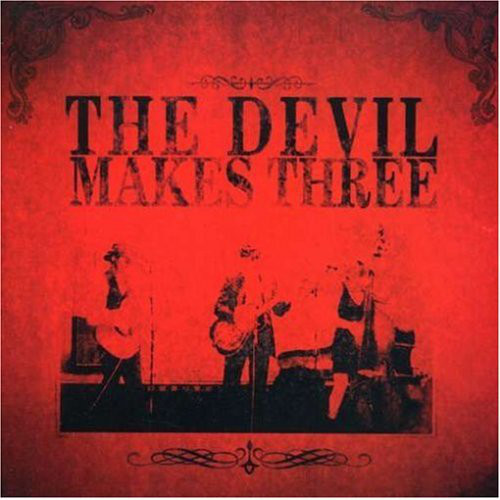

# The Devil Makes Three

By **The Devil Makes Three**

## Album Data

- **Catalog:** Beets
- **Format:** Digital, Album
- **Album:** The Devil Makes Three
- **Artist:** The Devil Makes Three
- **Albumartist:** The Devil Makes Three
- **Genre:** Bluegrass
- **MusicBrainz Album Artist ID:** [66e5bc0f-7cc6-4e44-937b-4a92466f3c37](https://musicbrainz.org/artist/66e5bc0f-7cc6-4e44-937b-4a92466f3c37)
- **MusicBrainz Album ID:** [f1c3e5f7-7cd1-4d97-827e-d0870597871a](https://musicbrainz.org/release/f1c3e5f7-7cd1-4d97-827e-d0870597871a)
- **MusicBrainz Release Group ID:** [005c7f24-0bc6-313e-99ea-08dcf38f969d](https://musicbrainz.org/release-group/005c7f24-0bc6-313e-99ea-08dcf38f969d)
- **Year:** 2007
- **Catalog #:** M2-36321
- **Label:** Milan
- **Total Tracks:** 14

## Album Tracks

### Track 01 - The Plank

- **Artist:** The Devil Makes Three
- **Format:** ALAC
- **Genre:** Bluegrass
- **Length:** 2:24
- **MusicBrainz Track ID:** [9b6ef429-f303-4057-b247-de626ad33e8f](https://musicbrainz.org/recording/9b6ef429-f303-4057-b247-de626ad33e8f)
- **Title:** The Plank
- **Track:** 01
- **Year:** 2007

### Track 02 - Graveyard

- **Artist:** The Devil Makes Three
- **Format:** ALAC
- **Genre:** Bluegrass
- **Length:** 3:26
- **MusicBrainz Track ID:** [981240b3-f30c-44de-a2de-92d644625ced](https://musicbrainz.org/recording/981240b3-f30c-44de-a2de-92d644625ced)
- **Title:** Graveyard
- **Track:** 02
- **Year:** 2007

### Track 03 - Beneath the Piano

- **Artist:** The Devil Makes Three
- **Format:** ALAC
- **Genre:** Folk Rock
- **Length:** 2:33
- **MusicBrainz Track ID:** [654481e9-81d4-44cf-bac0-5f7854a47592](https://musicbrainz.org/recording/654481e9-81d4-44cf-bac0-5f7854a47592)
- **Title:** Beneath the Piano
- **Track:** 03
- **Year:** 2007

### Track 04 - Ten Feet Tall

- **Artist:** The Devil Makes Three
- **Format:** ALAC
- **Genre:** Indie Rock
- **Length:** 2:45
- **MusicBrainz Track ID:** [d308dcd5-32b2-4150-b64c-56f2039df76d](https://musicbrainz.org/recording/d308dcd5-32b2-4150-b64c-56f2039df76d)
- **Title:** Ten Feet Tall
- **Track:** 04
- **Year:** 2007

### Track 05 - Shades

- **Artist:** The Devil Makes Three
- **Format:** ALAC
- **Genre:** Americana
- **Length:** 3:53
- **MusicBrainz Track ID:** [bfabc456-0177-4aac-bb0f-bd8b9cd7dc9b](https://musicbrainz.org/recording/bfabc456-0177-4aac-bb0f-bd8b9cd7dc9b)
- **Title:** Shades
- **Track:** 05
- **Year:** 2007

### Track 06 - Old Number Seven

- **Artist:** The Devil Makes Three
- **Format:** ALAC
- **Genre:** Rockabilly
- **Length:** 3:20
- **MusicBrainz Track ID:** [30a59407-871a-425b-ac1b-750ab1e1991c](https://musicbrainz.org/recording/30a59407-871a-425b-ac1b-750ab1e1991c)
- **Title:** Old Number Seven
- **Track:** 06
- **Year:** 2007

### Track 07 - Chained to the Couch

- **Artist:** The Devil Makes Three
- **Format:** ALAC
- **Genre:** Bluegrass
- **Length:** 3:31
- **MusicBrainz Track ID:** [f5f024cd-467e-47d9-b88a-1bb05ad7cea4](https://musicbrainz.org/recording/f5f024cd-467e-47d9-b88a-1bb05ad7cea4)
- **Title:** Chained to the Couch
- **Track:** 07
- **Year:** 2007

### Track 08 - To the Hilt

- **Artist:** The Devil Makes Three
- **Format:** ALAC
- **Genre:** Bluegrass
- **Length:** 2:45
- **MusicBrainz Track ID:** [0ead48be-bb05-4f3c-99dc-b3cff65c50a2](https://musicbrainz.org/recording/0ead48be-bb05-4f3c-99dc-b3cff65c50a2)
- **Title:** To the Hilt
- **Track:** 08
- **Year:** 2007

### Track 09 - The Bullet

- **Artist:** The Devil Makes Three
- **Format:** ALAC
- **Genre:** Bluegrass
- **Length:** 2:50
- **MusicBrainz Track ID:** [a7f7de94-f3ea-417c-b6ca-023951aa45c2](https://musicbrainz.org/recording/a7f7de94-f3ea-417c-b6ca-023951aa45c2)
- **Title:** The Bullet
- **Track:** 09
- **Year:** 2007

### Track 10 - For My Family

- **Artist:** The Devil Makes Three
- **Format:** ALAC
- **Genre:** Americana
- **Length:** 3:20
- **MusicBrainz Track ID:** [d60d6855-3b2e-4aeb-88f7-0cc35393ba5b](https://musicbrainz.org/recording/d60d6855-3b2e-4aeb-88f7-0cc35393ba5b)
- **Title:** For My Family
- **Track:** 10
- **Year:** 2007

### Track 11 - Nobody’s Dirty Business

- **Artist:** The Devil Makes Three
- **Format:** MP3
- **Genre:** Bluegrass
- **Length:** 3:16
- **MusicBrainz Track ID:** [31ef6832-7385-42cf-b84d-8409e6fcf5b8](https://musicbrainz.org/recording/31ef6832-7385-42cf-b84d-8409e6fcf5b8)
- **Title:** Nobody’s Dirty Business
- **Track:** 11
- **Year:** 2007

### Track 12 - Dynamite

- **Artist:** The Devil Makes Three
- **Format:** MP3
- **Genre:** Bluegrass
- **Length:** 3:45
- **MusicBrainz Track ID:** [b06a1b58-e91f-4974-88c7-629e2f7820f3](https://musicbrainz.org/recording/b06a1b58-e91f-4974-88c7-629e2f7820f3)
- **Title:** Dynamite
- **Track:** 12
- **Year:** 2007

### Track 13 - Fun Has Just Begun

- **Artist:** The Devil Makes Three
- **Format:** MP3
- **Genre:** Bluegrass
- **Length:** 2:52
- **MusicBrainz Track ID:** [50d09a63-65ec-4542-b2e4-2500bbd0fa39](https://musicbrainz.org/recording/50d09a63-65ec-4542-b2e4-2500bbd0fa39)
- **Title:** Fun Has Just Begun
- **Track:** 13
- **Year:** 2007

### Track 14 - Oceans Cold

- **Artist:** The Devil Makes Three
- **Format:** MP3
- **Genre:** Bluegrass
- **Length:** 2:23
- **MusicBrainz Track ID:** [2a32e1b8-1312-416a-879c-691d5657578f](https://musicbrainz.org/recording/2a32e1b8-1312-416a-879c-691d5657578f)
- **Title:** Oceans Cold
- **Track:** 14
- **Year:** 2007

## See also

- [A Little Bit Faster and a Little Bit Worse](A_Little_Bit_Faster_and_a_Little_Bit_Worse.md)
- [I’m a Stranger Here](I’m_a_Stranger_Here.md)
- [Longjohns, Boots, and a Belt](Longjohns__Boots__and_a_Belt.md)
- [CD: I'm A Stranger Here](../../CD/The_Devil_Makes_Three/Im_A_Stranger_Here.md)
- [CD: ](../../CD/The_Devil_Makes_Three/The_Devil_Makes_Three.md)
- [Roon: A Little Bit Faster And A Little Bit Worse](../../Roon/The_Devil_Makes_Three/A_Little_Bit_Faster_And_A_Little_Bit_Worse.md)
- [Roon: Chains Are Broken](../../Roon/The_Devil_Makes_Three/Chains_Are_Broken.md)
- [Roon: Do Wrong Right](../../Roon/The_Devil_Makes_Three/Do_Wrong_Right.md)
- [Roon: I'm a Stranger Here (Deluxe Edition)](../../Roon/The_Devil_Makes_Three/Im_a_Stranger_Here_Deluxe_Edition.md)
- [Roon: Longjohns, Boots and a Belt](../../Roon/The_Devil_Makes_Three/Longjohns__Boots_and_a_Belt.md)
- [Roon: Redemption & Ruin](../../Roon/The_Devil_Makes_Three/Redemption_and_Ruin.md)
- [Roon: The Devil Makes Three](../../Roon/The_Devil_Makes_Three/The_Devil_Makes_Three.md)
- [Vinyl: ](../../Vinyl/The_Devil_Makes_Three/The_Devil_Makes_Three_index.md)
- [Vinyl: The Devil Makes Three](../../Vinyl/The_Devil_Makes_Three/The_Devil_Makes_Three.md)
