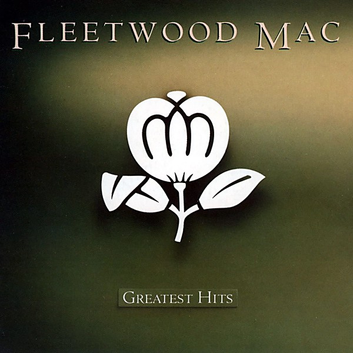

# 50's Original Hits Volume Thre

By **The Diamonds**

## Album Data

- **Catalog:** Beets
- **Format:** Digital, Album
- **Album:** 50's Original Hits Volume Thre
- **Artist:** The Diamonds
- **Albumartist:** The Diamonds
- **Genre:** Rock And Roll
- **MusicBrainz Album Artist ID:** 
- **MusicBrainz Album ID:** 
- **MusicBrainz Release Group ID:** 
- **Year:** 0000
- **Catalog #:** 
- **Label:** 
- **Total Tracks:** 00

## Album Tracks

### Track 00 - Little Darlin'

- **Artist:** The Diamonds
- **Format:** AAC
- **Genre:** Rock And Roll
- **Length:** 2:06
- **MusicBrainz Track ID:** 
- **Title:** Little Darlin'
- **Track:** 00
- **Year:** 0000

