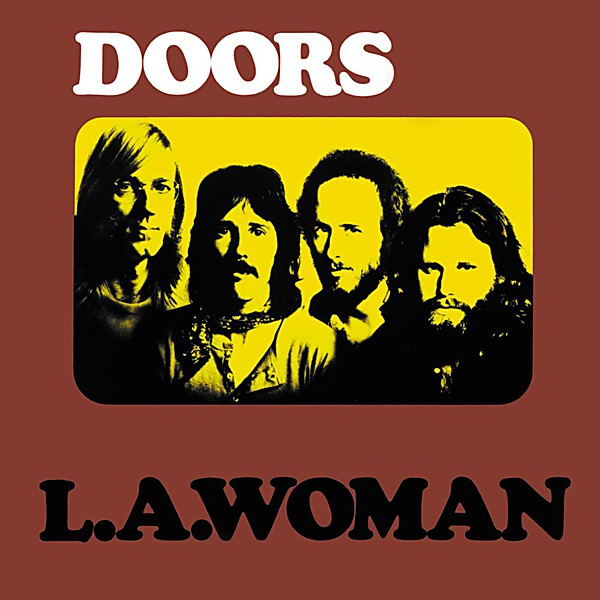

# L.A. Woman

By **The Doors**

## Album Data

- **Catalog:** Beets
- **Format:** Digital, Album
- **Album:** L.A. Woman
- **Artist:** The Doors
- **Albumartist:** The Doors
- **Genre:** Acid Rock
- **MusicBrainz Album Artist ID:** [9efff43b-3b29-4082-824e-bc82f646f93d](https://musicbrainz.org/artist/9efff43b-3b29-4082-824e-bc82f646f93d)
- **MusicBrainz Album ID:** [b163168d-6789-3be6-818b-f93c6e004ced](https://musicbrainz.org/release/b163168d-6789-3be6-818b-f93c6e004ced)
- **MusicBrainz Release Group ID:** [7be633bd-d1f6-3d89-8939-803ae0ed0de8](https://musicbrainz.org/release-group/7be633bd-d1f6-3d89-8939-803ae0ed0de8)
- **Year:** 1993
- **Catalog #:** 081227934491
- **Label:** Elektra
- **Total Tracks:** 02

## Album Tracks

### Track 01 - Light My Fire

- **Artist:** The Doors
- **Format:** MP3
- **Genre:** Psychedelic Rock
- **Length:** 2:56
- **MusicBrainz Track ID:** [c7ad5d68-4d21-4a14-9797-be05da398052](https://musicbrainz.org/recording/c7ad5d68-4d21-4a14-9797-be05da398052)
- **Title:** Light My Fire
- **Track:** 01
- **Year:** 2017

### Track 02 - The Crystal Ship

- **Artist:** The Doors
- **Format:** MP3
- **Genre:** Acid Rock
- **Length:** 2:35
- **MusicBrainz Track ID:** [59fdc91b-91a5-4dde-a059-c989e5b629d1](https://musicbrainz.org/recording/59fdc91b-91a5-4dde-a059-c989e5b629d1)
- **Title:** The Crystal Ship
- **Track:** 02
- **Year:** 2017

## See also

- [Light My Fire](Light_My_Fire.md)
- [Morrison Hotel](Morrison_Hotel.md)
- [Strange Days](Strange_Days.md)
- [The Doors](The_Doors.md)
- [The Soft Parade](The_Soft_Parade.md)
- [Weird Scenes Inside the Gold Mine](Weird_Scenes_Inside_the_Gold_Mine.md)
- [Roon: L.A. Woman](../../Roon/The_Doors/LA_Woman.md)
- [Roon: Light My Fire](../../Roon/The_Doors/Light_My_Fire.md)
- [Roon: The Soft Parade (50th Anniversary Deluxe Edition)](../../Roon/The_Doors/The_Soft_Parade_50th_Anniversary_Deluxe_Edition.md)
- [Vinyl: "Alive, She Cried"](../../Vinyl/The_Doors/Alive__She_Cried.md)
- [Vinyl: "Hello, I Love You, Won't You Tell Me Your Name?"](../../Vinyl/The_Doors/Hello__I_Love_You__Wont_You_Tell_Me_Your_Name.md)
- [Vinyl: L.A. Woman](../../Vinyl/The_Doors/LA_Woman.md)
- [Vinyl: Live At The Hollywood Bowl](../../Vinyl/The_Doors/Live_At_The_Hollywood_Bowl.md)
- [Vinyl: Love Me Two Times](../../Vinyl/The_Doors/Love_Me_Two_Times.md)
- [Vinyl: Strange Days](../../Vinyl/The_Doors/Strange_Days.md)
- [Vinyl: ](../../Vinyl/The_Doors/The_Doors_index.md)
- [Vinyl: The Doors](../../Vinyl/The_Doors/The_Doors.md)
- [Vinyl: The Soft Parade](../../Vinyl/The_Doors/The_Soft_Parade.md)
