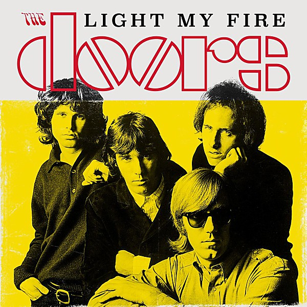

# Light My Fire

By **The Doors**

## Album Data

- **Catalog:** Beets
- **Format:** Digital, Album
- **Album:** Light My Fire
- **Artist:** The Doors
- **Albumartist:** The Doors
- **Genre:** Rock
- **MusicBrainz Album Artist ID:** [9efff43b-3b29-4082-824e-bc82f646f93d](https://musicbrainz.org/artist/9efff43b-3b29-4082-824e-bc82f646f93d)
- **MusicBrainz Album ID:** [51843083-7871-4735-853d-fe7e403a9f0d](https://musicbrainz.org/release/51843083-7871-4735-853d-fe7e403a9f0d)
- **MusicBrainz Release Group ID:** [ca8ec68a-2893-30da-9baa-81ad0a4578e7](https://musicbrainz.org/release-group/ca8ec68a-2893-30da-9baa-81ad0a4578e7)
- **Year:** 2017
- **Catalog #:** 75007-2
- **Label:** Elektra Entertainment
- **Total Tracks:** 11

## Album Tracks

### Track 01 - Roadhouse Blues

- **Artist:** The Doors
- **Format:** MP3
- **Genre:** Psychedelic Rock
- **Length:** 4:03
- **MusicBrainz Track ID:** [bbe7328d-e03f-4a3f-98ea-320789302ed3](https://musicbrainz.org/recording/bbe7328d-e03f-4a3f-98ea-320789302ed3)
- **Title:** Roadhouse Blues
- **Track:** 01
- **Year:** 1999

### Track 02 - Waiting for the Sun

- **Artist:** The Doors
- **Format:** MP3
- **Genre:** Psychedelic Rock
- **Length:** 3:58
- **MusicBrainz Track ID:** [3d48b6f1-1af2-4c5c-aa27-10e79bd9c440](https://musicbrainz.org/recording/3d48b6f1-1af2-4c5c-aa27-10e79bd9c440)
- **Title:** Waiting for the Sun
- **Track:** 02
- **Year:** 1999

### Track 03 - You Make Me Real

- **Artist:** The Doors
- **Format:** MP3
- **Genre:** Acid Rock
- **Length:** 2:51
- **MusicBrainz Track ID:** [d84c7645-2d0c-48f4-b8a0-455103ec7438](https://musicbrainz.org/recording/d84c7645-2d0c-48f4-b8a0-455103ec7438)
- **Title:** You Make Me Real
- **Track:** 03
- **Year:** 1999

### Track 04 - Peace Frog

- **Artist:** The Doors
- **Format:** MP3
- **Genre:** Psychedelic Rock
- **Length:** 2:58
- **MusicBrainz Track ID:** [28b702dd-7e58-4230-adaf-18088d910a18](https://musicbrainz.org/recording/28b702dd-7e58-4230-adaf-18088d910a18)
- **Title:** Peace Frog
- **Track:** 04
- **Year:** 1999

### Track 05 - Blue Sunday

- **Artist:** The Doors
- **Format:** MP3
- **Genre:** Psychedelic Rock
- **Length:** 2:11
- **MusicBrainz Track ID:** [141fd5a4-56da-4f37-8193-154e0608e8b8](https://musicbrainz.org/recording/141fd5a4-56da-4f37-8193-154e0608e8b8)
- **Title:** Blue Sunday
- **Track:** 05
- **Year:** 1999

### Track 06 - Ship of Fools

- **Artist:** The Doors
- **Format:** MP3
- **Genre:** Psychedelic Rock
- **Length:** 3:08
- **MusicBrainz Track ID:** [e47fef83-bde1-4916-9129-a15d3a064737](https://musicbrainz.org/recording/e47fef83-bde1-4916-9129-a15d3a064737)
- **Title:** Ship of Fools
- **Track:** 06
- **Year:** 1999

### Track 07 - Land Ho!

- **Artist:** The Doors
- **Format:** MP3
- **Genre:** Psychedelic Rock
- **Length:** 4:08
- **MusicBrainz Track ID:** [0d96766c-9e8d-49ff-a3da-489ad2906603](https://musicbrainz.org/recording/0d96766c-9e8d-49ff-a3da-489ad2906603)
- **Title:** Land Ho!
- **Track:** 07
- **Year:** 1999

### Track 08 - The Spy

- **Artist:** The Doors
- **Format:** MP3
- **Genre:** Acid Rock
- **Length:** 4:05
- **MusicBrainz Track ID:** [c9bd147b-2961-432e-8c06-a885c9dc684b](https://musicbrainz.org/recording/c9bd147b-2961-432e-8c06-a885c9dc684b)
- **Title:** The Spy
- **Track:** 08
- **Year:** 1999

### Track 09 - Queen of the Highway

- **Artist:** The Doors
- **Format:** MP3
- **Genre:** Psychedelic Rock
- **Length:** 2:48
- **MusicBrainz Track ID:** [65201b4d-0f84-4b83-98be-c4eb9b291429](https://musicbrainz.org/recording/65201b4d-0f84-4b83-98be-c4eb9b291429)
- **Title:** Queen of the Highway
- **Track:** 09
- **Year:** 1999

### Track 10 - Indian Summer

- **Artist:** The Doors
- **Format:** MP3
- **Genre:** Acid Rock
- **Length:** 2:33
- **MusicBrainz Track ID:** [a6233412-21ce-47a4-9236-3a90b0d3d0e8](https://musicbrainz.org/recording/a6233412-21ce-47a4-9236-3a90b0d3d0e8)
- **Title:** Indian Summer
- **Track:** 10
- **Year:** 1999

### Track 11 - Maggie M’Gill

- **Artist:** The Doors
- **Format:** MP3
- **Genre:** Acid Rock
- **Length:** 4:22
- **MusicBrainz Track ID:** [b788f23f-a0d0-47fd-b49f-06470281b932](https://musicbrainz.org/recording/b788f23f-a0d0-47fd-b49f-06470281b932)
- **Title:** Maggie M’Gill
- **Track:** 11
- **Year:** 1999

## See also

- [L.A. Woman](LA_Woman.md)
- [Morrison Hotel](Morrison_Hotel.md)
- [Strange Days](Strange_Days.md)
- [The Doors](The_Doors.md)
- [The Soft Parade](The_Soft_Parade.md)
- [Weird Scenes Inside the Gold Mine](Weird_Scenes_Inside_the_Gold_Mine.md)
- [Roon: L.A. Woman](../../Roon/The_Doors/LA_Woman.md)
- [Roon: Light My Fire](../../Roon/The_Doors/Light_My_Fire.md)
- [Roon: The Soft Parade (50th Anniversary Deluxe Edition)](../../Roon/The_Doors/The_Soft_Parade_50th_Anniversary_Deluxe_Edition.md)
- [Vinyl: "Alive, She Cried"](../../Vinyl/The_Doors/Alive__She_Cried.md)
- [Vinyl: "Hello, I Love You, Won't You Tell Me Your Name?"](../../Vinyl/The_Doors/Hello__I_Love_You__Wont_You_Tell_Me_Your_Name.md)
- [Vinyl: L.A. Woman](../../Vinyl/The_Doors/LA_Woman.md)
- [Vinyl: Live At The Hollywood Bowl](../../Vinyl/The_Doors/Live_At_The_Hollywood_Bowl.md)
- [Vinyl: Love Me Two Times](../../Vinyl/The_Doors/Love_Me_Two_Times.md)
- [Vinyl: Strange Days](../../Vinyl/The_Doors/Strange_Days.md)
- [Vinyl: ](../../Vinyl/The_Doors/The_Doors_index.md)
- [Vinyl: The Doors](../../Vinyl/The_Doors/The_Doors.md)
- [Vinyl: The Soft Parade](../../Vinyl/The_Doors/The_Soft_Parade.md)
