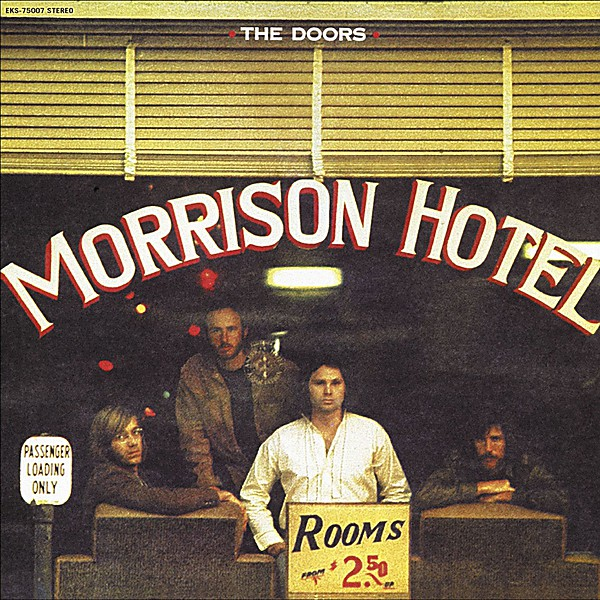

# Morrison Hotel

By **The Doors**

## Album Data

- **Catalog:** Beets
- **Format:** Digital, Album
- **Album:** Morrison Hotel
- **Artist:** The Doors
- **Albumartist:** The Doors
- **Genre:** Acid Rock
- **MusicBrainz Album Artist ID:** [9efff43b-3b29-4082-824e-bc82f646f93d](https://musicbrainz.org/artist/9efff43b-3b29-4082-824e-bc82f646f93d)
- **MusicBrainz Album ID:** [3ebb21ee-2cf6-49a5-8ebe-043f008d8cb0](https://musicbrainz.org/release/3ebb21ee-2cf6-49a5-8ebe-043f008d8cb0)
- **MusicBrainz Release Group ID:** [deee6f92-2662-3095-8aea-6892b10b8265](https://musicbrainz.org/release-group/deee6f92-2662-3095-8aea-6892b10b8265)
- **Year:** 1999
- **Catalog #:** EKS 74014
- **Label:** Elektra
- **Total Tracks:** 10

## Album Tracks

### Track 01 - Strange Days

- **Artist:** The Doors
- **Format:** MP3
- **Genre:** Psychedelic Rock
- **Length:** 3:06
- **MusicBrainz Track ID:** [2bec9276-6da1-4a13-8839-149b009a57ff](https://musicbrainz.org/recording/2bec9276-6da1-4a13-8839-149b009a57ff)
- **Title:** Strange Days
- **Track:** 01
- **Year:** 1967

### Track 02 - You’re Lost Little Girl

- **Artist:** The Doors
- **Format:** MP3
- **Genre:** Acid Rock
- **Length:** 3:00
- **MusicBrainz Track ID:** [7b7848b0-f5e1-40e4-a7cc-942adbb242c1](https://musicbrainz.org/recording/7b7848b0-f5e1-40e4-a7cc-942adbb242c1)
- **Title:** You’re Lost Little Girl
- **Track:** 02
- **Year:** 1967

### Track 03 - Love Me Two Times

- **Artist:** The Doors
- **Format:** MP3
- **Genre:** Psychedelic Rock
- **Length:** 3:15
- **MusicBrainz Track ID:** [1cb18dc9-6d27-4ffb-b2bd-13c58c865286](https://musicbrainz.org/recording/1cb18dc9-6d27-4ffb-b2bd-13c58c865286)
- **Title:** Love Me Two Times
- **Track:** 03
- **Year:** 1967

### Track 04 - Unhappy Girl

- **Artist:** The Doors
- **Format:** MP3
- **Genre:** Acid Rock
- **Length:** 1:55
- **MusicBrainz Track ID:** [a2ddbbbd-46dc-46c3-bbcc-d15e6fbbba62](https://musicbrainz.org/recording/a2ddbbbd-46dc-46c3-bbcc-d15e6fbbba62)
- **Title:** Unhappy Girl
- **Track:** 04
- **Year:** 1967

### Track 05 - Horse Latitudes

- **Artist:** The Doors
- **Format:** MP3
- **Genre:** Acid Rock
- **Length:** 1:35
- **MusicBrainz Track ID:** [a62f6682-068f-4ffe-9ad8-17e77f35eca1](https://musicbrainz.org/recording/a62f6682-068f-4ffe-9ad8-17e77f35eca1)
- **Title:** Horse Latitudes
- **Track:** 05
- **Year:** 1967

### Track 06 - Moonlight Drive

- **Artist:** The Doors
- **Format:** MP3
- **Genre:** Acid Rock
- **Length:** 3:01
- **MusicBrainz Track ID:** [e02cb5c9-44b6-4bcb-9dfa-3a8f05139207](https://musicbrainz.org/recording/e02cb5c9-44b6-4bcb-9dfa-3a8f05139207)
- **Title:** Moonlight Drive
- **Track:** 06
- **Year:** 1967

### Track 07 - People Are Strange

- **Artist:** The Doors
- **Format:** MP3
- **Genre:** Psychedelic Rock
- **Length:** 2:09
- **MusicBrainz Track ID:** [6939a732-bc36-4ee8-82d2-16e7d5e8e262](https://musicbrainz.org/recording/6939a732-bc36-4ee8-82d2-16e7d5e8e262)
- **Title:** People Are Strange
- **Track:** 07
- **Year:** 1967

### Track 08 - My Eyes Have Seen You

- **Artist:** The Doors
- **Format:** MP3
- **Genre:** Acid Rock
- **Length:** 2:26
- **MusicBrainz Track ID:** [a306af54-f7fe-4e1e-b5f8-06cb5b24a571](https://musicbrainz.org/recording/a306af54-f7fe-4e1e-b5f8-06cb5b24a571)
- **Title:** My Eyes Have Seen You
- **Track:** 08
- **Year:** 1967

### Track 09 - I Can’t See Your Face in My Mind

- **Artist:** The Doors
- **Format:** MP3
- **Genre:** Acid Rock
- **Length:** 3:23
- **MusicBrainz Track ID:** [fbd55575-91f0-4b33-9cd0-fedb979dcb2a](https://musicbrainz.org/recording/fbd55575-91f0-4b33-9cd0-fedb979dcb2a)
- **Title:** I Can’t See Your Face in My Mind
- **Track:** 09
- **Year:** 1967

## See also

- [L.A. Woman](LA_Woman.md)
- [Light My Fire](Light_My_Fire.md)
- [Strange Days](Strange_Days.md)
- [The Doors](The_Doors.md)
- [The Soft Parade](The_Soft_Parade.md)
- [Weird Scenes Inside the Gold Mine](Weird_Scenes_Inside_the_Gold_Mine.md)
- [Roon: L.A. Woman](../../Roon/The_Doors/LA_Woman.md)
- [Roon: Light My Fire](../../Roon/The_Doors/Light_My_Fire.md)
- [Roon: The Soft Parade (50th Anniversary Deluxe Edition)](../../Roon/The_Doors/The_Soft_Parade_50th_Anniversary_Deluxe_Edition.md)
- [Vinyl: "Alive, She Cried"](../../Vinyl/The_Doors/Alive__She_Cried.md)
- [Vinyl: "Hello, I Love You, Won't You Tell Me Your Name?"](../../Vinyl/The_Doors/Hello__I_Love_You__Wont_You_Tell_Me_Your_Name.md)
- [Vinyl: L.A. Woman](../../Vinyl/The_Doors/LA_Woman.md)
- [Vinyl: Live At The Hollywood Bowl](../../Vinyl/The_Doors/Live_At_The_Hollywood_Bowl.md)
- [Vinyl: Love Me Two Times](../../Vinyl/The_Doors/Love_Me_Two_Times.md)
- [Vinyl: Strange Days](../../Vinyl/The_Doors/Strange_Days.md)
- [Vinyl: ](../../Vinyl/The_Doors/The_Doors_index.md)
- [Vinyl: The Doors](../../Vinyl/The_Doors/The_Doors.md)
- [Vinyl: The Soft Parade](../../Vinyl/The_Doors/The_Soft_Parade.md)
