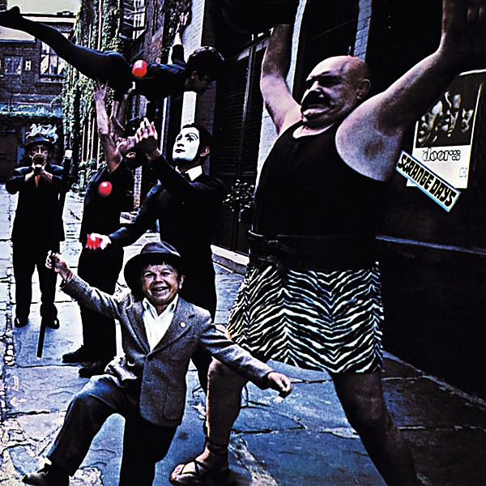

# Strange Days

By **The Doors**

## Album Data

- **Catalog:** Beets
- **Format:** Digital, Album
- **Album:** Strange Days
- **Artist:** The Doors
- **Albumartist:** The Doors
- **Genre:** Acid Rock
- **MusicBrainz Album Artist ID:** [9efff43b-3b29-4082-824e-bc82f646f93d](https://musicbrainz.org/artist/9efff43b-3b29-4082-824e-bc82f646f93d)
- **MusicBrainz Album ID:** [c8a31b83-ce83-4b58-9df7-416a8645946f](https://musicbrainz.org/release/c8a31b83-ce83-4b58-9df7-416a8645946f)
- **MusicBrainz Release Group ID:** [9b1acd78-3d19-37bb-8ca0-5816d44da439](https://musicbrainz.org/release-group/9b1acd78-3d19-37bb-8ca0-5816d44da439)
- **Year:** 1967
- **Catalog #:** EW835
- **Label:** Elektra
- **Total Tracks:** 11

## Album Tracks

### Track 01 - Break On Through (to the Other Side)

- **Artist:** The Doors
- **Format:** MP3
- **Genre:** Psychedelic Rock
- **Length:** 2:26
- **MusicBrainz Track ID:** [4a78578f-67e2-442c-af89-3fe0a32decd2](https://musicbrainz.org/recording/4a78578f-67e2-442c-af89-3fe0a32decd2)
- **Title:** Break On Through (to the Other Side)
- **Track:** 01
- **Year:** 1999

### Track 02 - Soul Kitchen

- **Artist:** The Doors
- **Format:** MP3
- **Genre:** Acid Rock
- **Length:** 3:33
- **MusicBrainz Track ID:** [447e7b86-8ec4-4463-ad12-ee48973c47f0](https://musicbrainz.org/recording/447e7b86-8ec4-4463-ad12-ee48973c47f0)
- **Title:** Soul Kitchen
- **Track:** 02
- **Year:** 1999

### Track 03 - The Crystal Ship

- **Artist:** The Doors
- **Format:** MP3
- **Genre:** Acid Rock
- **Length:** 2:21
- **MusicBrainz Track ID:** [59fdc91b-91a5-4dde-a059-c989e5b629d1](https://musicbrainz.org/recording/59fdc91b-91a5-4dde-a059-c989e5b629d1)
- **Title:** The Crystal Ship
- **Track:** 03
- **Year:** 1999

### Track 04 - Twentieth Century Fox

- **Artist:** The Doors
- **Format:** MP3
- **Genre:** Acid Rock
- **Length:** 2:31
- **MusicBrainz Track ID:** [14b94165-0b8d-4b2e-b454-eff60a16bcf2](https://musicbrainz.org/recording/14b94165-0b8d-4b2e-b454-eff60a16bcf2)
- **Title:** Twentieth Century Fox
- **Track:** 04
- **Year:** 1999

### Track 05 - Alabama Song (Whisky Bar)

- **Artist:** The Doors
- **Format:** MP3
- **Genre:** Acid Rock
- **Length:** 3:17
- **MusicBrainz Track ID:** [a9d5e6ed-0300-4284-85fc-a5c4e246e670](https://musicbrainz.org/recording/a9d5e6ed-0300-4284-85fc-a5c4e246e670)
- **Title:** Alabama Song (Whisky Bar)
- **Track:** 05
- **Year:** 1999

### Track 06 - Light My Fire

- **Artist:** The Doors
- **Format:** MP3
- **Genre:** Psychedelic Rock
- **Length:** 7:06
- **MusicBrainz Track ID:** [7a933538-2fb2-4d43-9fac-030840935409](https://musicbrainz.org/recording/7a933538-2fb2-4d43-9fac-030840935409)
- **Title:** Light My Fire
- **Track:** 06
- **Year:** 1999

### Track 07 - Back Door Man

- **Artist:** The Doors
- **Format:** MP3
- **Genre:** Acid Rock
- **Length:** 3:31
- **MusicBrainz Track ID:** [0a18933a-44d0-4af7-a836-735c0720f037](https://musicbrainz.org/recording/0a18933a-44d0-4af7-a836-735c0720f037)
- **Title:** Back Door Man
- **Track:** 07
- **Year:** 1999

### Track 08 - I Looked at You

- **Artist:** The Doors
- **Format:** MP3
- **Genre:** Acid Rock
- **Length:** 2:20
- **MusicBrainz Track ID:** [e6f3d5de-f286-4998-ac87-53e64d4ec1f3](https://musicbrainz.org/recording/e6f3d5de-f286-4998-ac87-53e64d4ec1f3)
- **Title:** I Looked at You
- **Track:** 08
- **Year:** 1999

### Track 09 - End of the Night

- **Artist:** The Doors
- **Format:** MP3
- **Genre:** Acid Rock
- **Length:** 2:50
- **MusicBrainz Track ID:** [79a2a1a8-f8f6-4a8d-ba40-1b0924590222](https://musicbrainz.org/recording/79a2a1a8-f8f6-4a8d-ba40-1b0924590222)
- **Title:** End of the Night
- **Track:** 09
- **Year:** 1999

### Track 10 - Take It as It Comes

- **Artist:** The Doors
- **Format:** MP3
- **Genre:** Acid Rock
- **Length:** 2:14
- **MusicBrainz Track ID:** [e36920e0-0fba-475f-a4f8-db92f92e3d7f](https://musicbrainz.org/recording/e36920e0-0fba-475f-a4f8-db92f92e3d7f)
- **Title:** Take It as It Comes
- **Track:** 10
- **Year:** 1999

### Track 11 - The End

- **Artist:** The Doors
- **Format:** MP3
- **Genre:** Acid Rock
- **Length:** 11:35
- **MusicBrainz Track ID:** [3992db19-ca19-4258-8326-21006d80b3d1](https://musicbrainz.org/recording/3992db19-ca19-4258-8326-21006d80b3d1)
- **Title:** The End
- **Track:** 11
- **Year:** 1999

## See also

- [L.A. Woman](LA_Woman.md)
- [Light My Fire](Light_My_Fire.md)
- [Morrison Hotel](Morrison_Hotel.md)
- [The Doors](The_Doors.md)
- [The Soft Parade](The_Soft_Parade.md)
- [Weird Scenes Inside the Gold Mine](Weird_Scenes_Inside_the_Gold_Mine.md)
- [Roon: L.A. Woman](../../Roon/The_Doors/LA_Woman.md)
- [Roon: Light My Fire](../../Roon/The_Doors/Light_My_Fire.md)
- [Roon: The Soft Parade (50th Anniversary Deluxe Edition)](../../Roon/The_Doors/The_Soft_Parade_50th_Anniversary_Deluxe_Edition.md)
- [Vinyl: "Alive, She Cried"](../../Vinyl/The_Doors/Alive__She_Cried.md)
- [Vinyl: "Hello, I Love You, Won't You Tell Me Your Name?"](../../Vinyl/The_Doors/Hello__I_Love_You__Wont_You_Tell_Me_Your_Name.md)
- [Vinyl: L.A. Woman](../../Vinyl/The_Doors/LA_Woman.md)
- [Vinyl: Live At The Hollywood Bowl](../../Vinyl/The_Doors/Live_At_The_Hollywood_Bowl.md)
- [Vinyl: Love Me Two Times](../../Vinyl/The_Doors/Love_Me_Two_Times.md)
- [Vinyl: Strange Days](../../Vinyl/The_Doors/Strange_Days.md)
- [Vinyl: ](../../Vinyl/The_Doors/The_Doors_index.md)
- [Vinyl: The Doors](../../Vinyl/The_Doors/The_Doors.md)
- [Vinyl: The Soft Parade](../../Vinyl/The_Doors/The_Soft_Parade.md)
