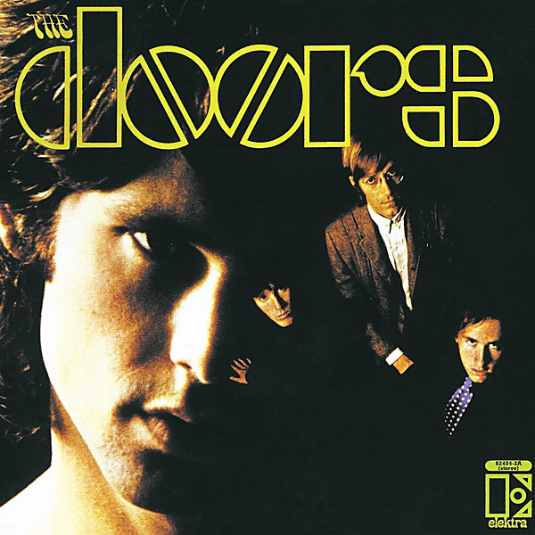

# The Doors

By **The Doors**

## Album Data

- **Catalog:** Beets
- **Format:** Digital, Album
- **Album:** The Doors
- **Artist:** The Doors
- **Albumartist:** The Doors
- **Genre:** Acid Rock
- **MusicBrainz Album Artist ID:** [9efff43b-3b29-4082-824e-bc82f646f93d](https://musicbrainz.org/artist/9efff43b-3b29-4082-824e-bc82f646f93d)
- **MusicBrainz Album ID:** [7b9d6e03-8f92-3003-95a4-56683f94dc1d](https://musicbrainz.org/release/7b9d6e03-8f92-3003-95a4-56683f94dc1d)
- **MusicBrainz Release Group ID:** [8ebffd15-06c3-3b88-a761-ec18c5513287](https://musicbrainz.org/release-group/8ebffd15-06c3-3b88-a761-ec18c5513287)
- **Year:** 1999
- **Catalog #:** 
- **Label:** Atlantic
- **Total Tracks:** 15

## Album Tracks

### Track 01 - Tell All the People

- **Artist:** The Doors
- **Format:** ALAC
- **Genre:** Acid Rock
- **Length:** 3:21
- **MusicBrainz Track ID:** [1304584f-05df-4c4e-ac0e-a3a8174d0976](https://musicbrainz.org/recording/1304584f-05df-4c4e-ac0e-a3a8174d0976)
- **Title:** Tell All the People
- **Track:** 01
- **Year:** 2007

### Track 02 - Touch Me

- **Artist:** The Doors
- **Format:** ALAC
- **Genre:** Psychedelic Rock
- **Length:** 3:12
- **MusicBrainz Track ID:** [1dd1f86c-2120-45f3-ac9f-3c87257fe414](https://musicbrainz.org/recording/1dd1f86c-2120-45f3-ac9f-3c87257fe414)
- **Title:** Touch Me
- **Track:** 02
- **Year:** 2007

### Track 03 - Shaman’s Blues

- **Artist:** The Doors
- **Format:** ALAC
- **Genre:** Acid Rock
- **Length:** 4:50
- **MusicBrainz Track ID:** [62a838be-e032-4e57-9434-ce19e9ca893d](https://musicbrainz.org/recording/62a838be-e032-4e57-9434-ce19e9ca893d)
- **Title:** Shaman’s Blues
- **Track:** 03
- **Year:** 2007

### Track 04 - Do It

- **Artist:** The Doors
- **Format:** ALAC
- **Genre:** Acid Rock
- **Length:** 3:10
- **MusicBrainz Track ID:** [a85e536f-24ec-43f2-823e-7761aca5bdc6](https://musicbrainz.org/recording/a85e536f-24ec-43f2-823e-7761aca5bdc6)
- **Title:** Do It
- **Track:** 04
- **Year:** 2007

### Track 05 - Easy Ride

- **Artist:** The Doors
- **Format:** ALAC
- **Genre:** Acid Rock
- **Length:** 2:40
- **MusicBrainz Track ID:** [9bf5cac7-cac7-4417-a447-97011bc8598c](https://musicbrainz.org/recording/9bf5cac7-cac7-4417-a447-97011bc8598c)
- **Title:** Easy Ride
- **Track:** 05
- **Year:** 2007

### Track 06 - Wild Child

- **Artist:** The Doors
- **Format:** ALAC
- **Genre:** Acid Rock
- **Length:** 2:38
- **MusicBrainz Track ID:** [508bd4b0-da4b-480b-9055-2aaf2128eb64](https://musicbrainz.org/recording/508bd4b0-da4b-480b-9055-2aaf2128eb64)
- **Title:** Wild Child
- **Track:** 06
- **Year:** 2007

### Track 07 - Runnin’ Blue

- **Artist:** The Doors
- **Format:** ALAC
- **Genre:** Psychedelic Rock
- **Length:** 2:29
- **MusicBrainz Track ID:** [3ae8133e-1555-4427-b815-8f51accc65a6](https://musicbrainz.org/recording/3ae8133e-1555-4427-b815-8f51accc65a6)
- **Title:** Runnin’ Blue
- **Track:** 07
- **Year:** 2007

### Track 08 - Wishful Sinful

- **Artist:** The Doors
- **Format:** ALAC
- **Genre:** Acid Rock
- **Length:** 3:00
- **MusicBrainz Track ID:** [ef0fd1c4-a0b0-4863-9501-b04409db9b79](https://musicbrainz.org/recording/ef0fd1c4-a0b0-4863-9501-b04409db9b79)
- **Title:** Wishful Sinful
- **Track:** 08
- **Year:** 2007

### Track 09 - The Soft Parade

- **Artist:** The Doors
- **Format:** ALAC
- **Genre:** Acid Rock
- **Length:** 9:41
- **MusicBrainz Track ID:** [e6702405-57f0-4c69-83d4-5136aacb7719](https://musicbrainz.org/recording/e6702405-57f0-4c69-83d4-5136aacb7719)
- **Title:** The Soft Parade
- **Track:** 09
- **Year:** 2007

### Track 10 - Who Scared You

- **Artist:** The Doors
- **Format:** ALAC
- **Genre:** Psychedelic Rock
- **Length:** 3:58
- **MusicBrainz Track ID:** [1ad63514-84af-44ae-94ef-79458f58124a](https://musicbrainz.org/recording/1ad63514-84af-44ae-94ef-79458f58124a)
- **Title:** Who Scared You
- **Track:** 10
- **Year:** 2007

### Track 11 - Whiskey, Mystics and Men (version 1)

- **Artist:** The Doors
- **Format:** ALAC
- **Genre:** Hard Rock
- **Length:** 2:28
- **MusicBrainz Track ID:** [a24463d4-547e-4e5c-99e9-a30ceeceba77](https://musicbrainz.org/recording/a24463d4-547e-4e5c-99e9-a30ceeceba77)
- **Title:** Whiskey, Mystics and Men (version 1)
- **Track:** 11
- **Year:** 2007

### Track 12 - Whiskey, Mystics and Men (version 2)

- **Artist:** The Doors
- **Format:** ALAC
- **Genre:** Rock
- **Length:** 3:04
- **MusicBrainz Track ID:** [e830fd7f-b2f8-4411-af4b-a258d62243e5](https://musicbrainz.org/recording/e830fd7f-b2f8-4411-af4b-a258d62243e5)
- **Title:** Whiskey, Mystics and Men (version 2)
- **Track:** 12
- **Year:** 2007

### Track 13 - Push Push

- **Artist:** The Doors
- **Format:** ALAC
- **Genre:** Psychedelic Rock
- **Length:** 6:05
- **MusicBrainz Track ID:** [2a4b086a-ab37-4a3f-9507-39a4e1839081](https://musicbrainz.org/recording/2a4b086a-ab37-4a3f-9507-39a4e1839081)
- **Title:** Push Push
- **Track:** 13
- **Year:** 2007

### Track 14 - Touch Me (dialogue)

- **Artist:** The Doors
- **Format:** ALAC
- **Genre:** Acid Rock
- **Length:** 0:28
- **MusicBrainz Track ID:** [d143e1ab-cff3-460b-ac29-38317e8cd298](https://musicbrainz.org/recording/d143e1ab-cff3-460b-ac29-38317e8cd298)
- **Title:** Touch Me (dialogue)
- **Track:** 14
- **Year:** 2007

### Track 15 - Touch Me (take 3)

- **Artist:** The Doors
- **Format:** ALAC
- **Genre:** Rock
- **Length:** 3:40
- **MusicBrainz Track ID:** [e032825b-9b55-4f96-8b15-a4d6f2a7615c](https://musicbrainz.org/recording/e032825b-9b55-4f96-8b15-a4d6f2a7615c)
- **Title:** Touch Me (take 3)
- **Track:** 15
- **Year:** 2007

## See also

- [L.A. Woman](LA_Woman.md)
- [Light My Fire](Light_My_Fire.md)
- [Morrison Hotel](Morrison_Hotel.md)
- [Strange Days](Strange_Days.md)
- [The Soft Parade](The_Soft_Parade.md)
- [Weird Scenes Inside the Gold Mine](Weird_Scenes_Inside_the_Gold_Mine.md)
- [Roon: L.A. Woman](../../Roon/The_Doors/LA_Woman.md)
- [Roon: Light My Fire](../../Roon/The_Doors/Light_My_Fire.md)
- [Roon: The Soft Parade (50th Anniversary Deluxe Edition)](../../Roon/The_Doors/The_Soft_Parade_50th_Anniversary_Deluxe_Edition.md)
- [Vinyl: "Alive, She Cried"](../../Vinyl/The_Doors/Alive__She_Cried.md)
- [Vinyl: "Hello, I Love You, Won't You Tell Me Your Name?"](../../Vinyl/The_Doors/Hello__I_Love_You__Wont_You_Tell_Me_Your_Name.md)
- [Vinyl: L.A. Woman](../../Vinyl/The_Doors/LA_Woman.md)
- [Vinyl: Live At The Hollywood Bowl](../../Vinyl/The_Doors/Live_At_The_Hollywood_Bowl.md)
- [Vinyl: Love Me Two Times](../../Vinyl/The_Doors/Love_Me_Two_Times.md)
- [Vinyl: Strange Days](../../Vinyl/The_Doors/Strange_Days.md)
- [Vinyl: ](../../Vinyl/The_Doors/The_Doors_index.md)
- [Vinyl: The Doors](../../Vinyl/The_Doors/The_Doors.md)
- [Vinyl: The Soft Parade](../../Vinyl/The_Doors/The_Soft_Parade.md)
