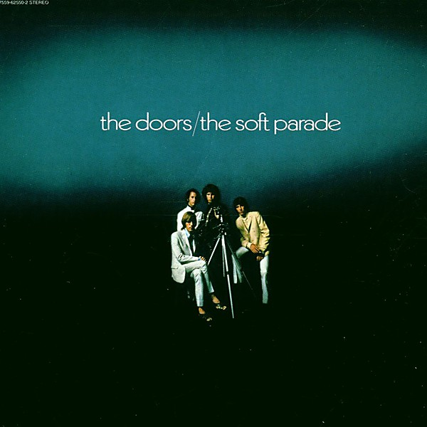

# The Soft Parade

By **The Doors**

## Album Data

- **Catalog:** Beets
- **Format:** Digital, Album
- **Album:** The Soft Parade
- **Artist:** The Doors
- **Albumartist:** The Doors
- **Genre:** Acid Rock
- **MusicBrainz Album Artist ID:** [9efff43b-3b29-4082-824e-bc82f646f93d](https://musicbrainz.org/artist/9efff43b-3b29-4082-824e-bc82f646f93d)
- **MusicBrainz Album ID:** [1d1ae974-d1d1-451f-8fbb-a4fb0b2e8b47](https://musicbrainz.org/release/1d1ae974-d1d1-451f-8fbb-a4fb0b2e8b47)
- **MusicBrainz Release Group ID:** [cf90c9a0-4831-3d30-a545-ed77308e807b](https://musicbrainz.org/release-group/cf90c9a0-4831-3d30-a545-ed77308e807b)
- **Year:** 2007
- **Catalog #:** 8122-79603-4
- **Label:** Elektra
- **Total Tracks:** 22

## Album Tracks

### Track 01 - Break On Through

- **Artist:** The Doors
- **Format:** AAC
- **Genre:** Psychedelic Rock
- **Length:** 2:30
- **MusicBrainz Track ID:** [768217d5-f223-4942-9283-8b3e67e62e94](https://musicbrainz.org/recording/768217d5-f223-4942-9283-8b3e67e62e94)
- **Title:** Break On Through
- **Track:** 01
- **Year:** 2014

### Track 02 - Strange Days

- **Artist:** The Doors
- **Format:** AAC
- **Genre:** Psychedelic Rock
- **Length:** 3:11
- **MusicBrainz Track ID:** [2bec9276-6da1-4a13-8839-149b009a57ff](https://musicbrainz.org/recording/2bec9276-6da1-4a13-8839-149b009a57ff)
- **Title:** Strange Days
- **Track:** 02
- **Year:** 2014

### Track 03 - Shaman’s Blues

- **Artist:** The Doors
- **Format:** AAC
- **Genre:** Psychedelic Rock
- **Length:** 4:53
- **MusicBrainz Track ID:** [55253277-26fb-4d34-ab5f-686be6365d0b](https://musicbrainz.org/recording/55253277-26fb-4d34-ab5f-686be6365d0b)
- **Title:** Shaman’s Blues
- **Track:** 03
- **Year:** 2014

### Track 04 - Love Street

- **Artist:** The Doors
- **Format:** AAC
- **Genre:** Psychedelic Rock
- **Length:** 2:54
- **MusicBrainz Track ID:** [bb2c3c9c-a818-44c2-a500-a7394adc2806](https://musicbrainz.org/recording/bb2c3c9c-a818-44c2-a500-a7394adc2806)
- **Title:** Love Street
- **Track:** 04
- **Year:** 2014

### Track 05 - Peace Frog/Blue Sunday

- **Artist:** The Doors
- **Format:** AAC
- **Genre:** Psychedelic Rock
- **Length:** 5:07
- **MusicBrainz Track ID:** [7bf3c07c-8b39-4ccc-94f6-03ebc70e0901](https://musicbrainz.org/recording/7bf3c07c-8b39-4ccc-94f6-03ebc70e0901)
- **Title:** Peace Frog/Blue Sunday
- **Track:** 05
- **Year:** 2014

### Track 06 - The WASP (Texas Radio and the Big Beat)

- **Artist:** The Doors
- **Format:** AAC
- **Genre:** Acid Rock
- **Length:** 4:18
- **MusicBrainz Track ID:** [67009b9b-6981-4a9e-9899-eeed9494f6ca](https://musicbrainz.org/recording/67009b9b-6981-4a9e-9899-eeed9494f6ca)
- **Title:** The WASP (Texas Radio and the Big Beat)
- **Track:** 06
- **Year:** 2014

### Track 07 - End of the Night

- **Artist:** The Doors
- **Format:** AAC
- **Genre:** Acid Rock
- **Length:** 3:00
- **MusicBrainz Track ID:** [79a2a1a8-f8f6-4a8d-ba40-1b0924590222](https://musicbrainz.org/recording/79a2a1a8-f8f6-4a8d-ba40-1b0924590222)
- **Title:** End of the Night
- **Track:** 07
- **Year:** 2014

### Track 08 - Love Her Madly

- **Artist:** The Doors
- **Format:** AAC
- **Genre:** Psychedelic Rock
- **Length:** 3:21
- **MusicBrainz Track ID:** [9eb2e378-1d9c-43c7-b108-8003f9756c7f](https://musicbrainz.org/recording/9eb2e378-1d9c-43c7-b108-8003f9756c7f)
- **Title:** Love Her Madly
- **Track:** 08
- **Year:** 2014

### Track 09 - Spanish Caravan

- **Artist:** The Doors
- **Format:** AAC
- **Genre:** Acid Rock
- **Length:** 3:03
- **MusicBrainz Track ID:** [32df1485-7232-4447-8352-01033adb213a](https://musicbrainz.org/recording/32df1485-7232-4447-8352-01033adb213a)
- **Title:** Spanish Caravan
- **Track:** 09
- **Year:** 2014

### Track 10 - Ship of Fools

- **Artist:** The Doors
- **Format:** AAC
- **Genre:** Psychedelic Rock
- **Length:** 3:11
- **MusicBrainz Track ID:** [e47fef83-bde1-4916-9129-a15d3a064737](https://musicbrainz.org/recording/e47fef83-bde1-4916-9129-a15d3a064737)
- **Title:** Ship of Fools
- **Track:** 10
- **Year:** 2014

### Track 11 - The Spy

- **Artist:** The Doors
- **Format:** AAC
- **Genre:** Acid Rock
- **Length:** 4:21
- **MusicBrainz Track ID:** [c9bd147b-2961-432e-8c06-a885c9dc684b](https://musicbrainz.org/recording/c9bd147b-2961-432e-8c06-a885c9dc684b)
- **Title:** The Spy
- **Track:** 11
- **Year:** 2014

### Track 12 - The End

- **Artist:** The Doors
- **Format:** AAC
- **Genre:** Acid Rock
- **Length:** 11:59
- **MusicBrainz Track ID:** [1423fcd8-31f1-4ced-9c75-082af4ba45c1](https://musicbrainz.org/recording/1423fcd8-31f1-4ced-9c75-082af4ba45c1)
- **Title:** The End
- **Track:** 12
- **Year:** 2014

### Track 13 - Take It as It Comes

- **Artist:** The Doors
- **Format:** AAC
- **Genre:** Acid Rock
- **Length:** 2:18
- **MusicBrainz Track ID:** [e36920e0-0fba-475f-a4f8-db92f92e3d7f](https://musicbrainz.org/recording/e36920e0-0fba-475f-a4f8-db92f92e3d7f)
- **Title:** Take It as It Comes
- **Track:** 13
- **Year:** 2014

### Track 14 - Runnin’ Blue

- **Artist:** The Doors
- **Format:** AAC
- **Genre:** Psychedelic Rock
- **Length:** 2:29
- **MusicBrainz Track ID:** [8cdb0945-ad21-4dd0-8655-59d4a10c8987](https://musicbrainz.org/recording/8cdb0945-ad21-4dd0-8655-59d4a10c8987)
- **Title:** Runnin’ Blue
- **Track:** 14
- **Year:** 2014

### Track 15 - L.A. Woman

- **Artist:** The Doors
- **Format:** AAC
- **Genre:** Psychedelic Rock
- **Length:** 8:00
- **MusicBrainz Track ID:** [0e744e3a-4fe4-4172-a2e2-f8de9e7bf3a8](https://musicbrainz.org/recording/0e744e3a-4fe4-4172-a2e2-f8de9e7bf3a8)
- **Title:** L.A. Woman
- **Track:** 15
- **Year:** 2014

### Track 16 - Five to One

- **Artist:** The Doors
- **Format:** AAC
- **Genre:** Psychedelic Rock
- **Length:** 4:33
- **MusicBrainz Track ID:** [b510ee25-bace-4a27-9428-eea58ac14053](https://musicbrainz.org/recording/b510ee25-bace-4a27-9428-eea58ac14053)
- **Title:** Five to One
- **Track:** 16
- **Year:** 2014

### Track 17 - Who Scared You

- **Artist:** The Doors
- **Format:** AAC
- **Genre:** Psychedelic Rock
- **Length:** 3:58
- **MusicBrainz Track ID:** [395511f0-3cba-43d8-9e46-e3d3223a4502](https://musicbrainz.org/recording/395511f0-3cba-43d8-9e46-e3d3223a4502)
- **Title:** Who Scared You
- **Track:** 17
- **Year:** 2014

### Track 18 - (You Need Meat) Don't Go No Further

- **Artist:** The Doors
- **Format:** AAC
- **Genre:** Psychedelic Rock
- **Length:** 3:44
- **MusicBrainz Track ID:** [8a02fe1d-b09b-490d-a641-7213fc130d57](https://musicbrainz.org/recording/8a02fe1d-b09b-490d-a641-7213fc130d57)
- **Title:** (You Need Meat) Don't Go No Further
- **Track:** 18
- **Year:** 2014

### Track 19 - Riders on the Storm

- **Artist:** The Doors
- **Format:** AAC
- **Genre:** Psychedelic Rock
- **Length:** 7:20
- **MusicBrainz Track ID:** [96734374-9968-40e2-ae97-a7632793dd82](https://musicbrainz.org/recording/96734374-9968-40e2-ae97-a7632793dd82)
- **Title:** Riders on the Storm
- **Track:** 19
- **Year:** 2014

### Track 20 - Maggie M’Gill

- **Artist:** The Doors
- **Format:** AAC
- **Genre:** Psychedelic Rock
- **Length:** 4:31
- **MusicBrainz Track ID:** [b788f23f-a0d0-47fd-b49f-06470281b932](https://musicbrainz.org/recording/b788f23f-a0d0-47fd-b49f-06470281b932)
- **Title:** Maggie M’Gill
- **Track:** 20
- **Year:** 2014

### Track 21 - Horse Latitudes

- **Artist:** The Doors
- **Format:** AAC
- **Genre:** Acid Rock
- **Length:** 1:37
- **MusicBrainz Track ID:** [a62f6682-068f-4ffe-9ad8-17e77f35eca1](https://musicbrainz.org/recording/a62f6682-068f-4ffe-9ad8-17e77f35eca1)
- **Title:** Horse Latitudes
- **Track:** 21
- **Year:** 2014

### Track 22 - When the Music’s Over

- **Artist:** The Doors
- **Format:** AAC
- **Genre:** Psychedelic Rock
- **Length:** 11:14
- **MusicBrainz Track ID:** [dc30db9c-2e9c-47f9-be8f-8609fb912a16](https://musicbrainz.org/recording/dc30db9c-2e9c-47f9-be8f-8609fb912a16)
- **Title:** When the Music’s Over
- **Track:** 22
- **Year:** 2014

## See also

- [L.A. Woman](LA_Woman.md)
- [Light My Fire](Light_My_Fire.md)
- [Morrison Hotel](Morrison_Hotel.md)
- [Strange Days](Strange_Days.md)
- [The Doors](The_Doors.md)
- [Weird Scenes Inside the Gold Mine](Weird_Scenes_Inside_the_Gold_Mine.md)
- [Roon: L.A. Woman](../../Roon/The_Doors/LA_Woman.md)
- [Roon: Light My Fire](../../Roon/The_Doors/Light_My_Fire.md)
- [Roon: The Soft Parade (50th Anniversary Deluxe Edition)](../../Roon/The_Doors/The_Soft_Parade_50th_Anniversary_Deluxe_Edition.md)
- [Vinyl: "Alive, She Cried"](../../Vinyl/The_Doors/Alive__She_Cried.md)
- [Vinyl: "Hello, I Love You, Won't You Tell Me Your Name?"](../../Vinyl/The_Doors/Hello__I_Love_You__Wont_You_Tell_Me_Your_Name.md)
- [Vinyl: L.A. Woman](../../Vinyl/The_Doors/LA_Woman.md)
- [Vinyl: Live At The Hollywood Bowl](../../Vinyl/The_Doors/Live_At_The_Hollywood_Bowl.md)
- [Vinyl: Love Me Two Times](../../Vinyl/The_Doors/Love_Me_Two_Times.md)
- [Vinyl: Strange Days](../../Vinyl/The_Doors/Strange_Days.md)
- [Vinyl: ](../../Vinyl/The_Doors/The_Doors_index.md)
- [Vinyl: The Doors](../../Vinyl/The_Doors/The_Doors.md)
- [Vinyl: The Soft Parade](../../Vinyl/The_Doors/The_Soft_Parade.md)
