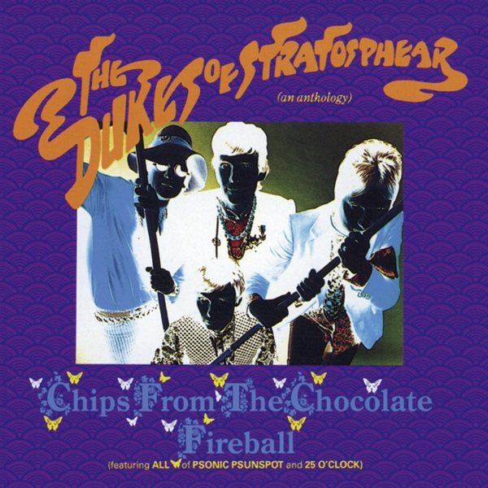

# Chips From the Chocolate Fireball (An Anthology)

By **The Dukes of Stratosphear**

## Album Data

- **Catalog:** Beets
- **Format:** Digital, Album
- **Album:** Chips From the Chocolate Fireball (An Anthology)
- **Artist:** The Dukes Of Stratosphear
- **Albumartist:** The Dukes of Stratosphear
- **Genre:** Neo-Psychedelia
- **MusicBrainz Album Artist ID:** [2d1107b1-0d07-44bb-b12d-75c56342bc00](https://musicbrainz.org/artist/2d1107b1-0d07-44bb-b12d-75c56342bc00)
- **MusicBrainz Album ID:** [b971f6b8-4b0b-4f52-9d5b-4311efa64500](https://musicbrainz.org/release/b971f6b8-4b0b-4f52-9d5b-4311efa64500)
- **MusicBrainz Release Group ID:** [4142c6c7-e14c-3be2-81b6-30ca172b0e9c](https://musicbrainz.org/release-group/4142c6c7-e14c-3be2-81b6-30ca172b0e9c)
- **Year:** 1987
- **Catalog #:** 9 24169-2
- **Label:** Geffen Records
- **Total Tracks:** 16

## Album Tracks

### Track 01 - 25 O’Clock

- **Artist:** The Dukes of Stratosphear
- **Format:** ALAC
- **Genre:** Neo-Psychedelia
- **Length:** 5:02
- **MusicBrainz Track ID:** [6eb25d4e-6098-4431-bfb5-bfc462c0e3d9](https://musicbrainz.org/recording/6eb25d4e-6098-4431-bfb5-bfc462c0e3d9)
- **Title:** 25 O’Clock
- **Track:** 01
- **Year:** 1987

### Track 02 - Bike Ride to the Moon

- **Artist:** The Dukes of Stratosphear
- **Format:** ALAC
- **Genre:** Indie Pop
- **Length:** 2:23
- **MusicBrainz Track ID:** [c35ca16a-c1b4-4879-8137-ba1514044734](https://musicbrainz.org/recording/c35ca16a-c1b4-4879-8137-ba1514044734)
- **Title:** Bike Ride to the Moon
- **Track:** 02
- **Year:** 1987

### Track 03 - My Love Explodes

- **Artist:** The Dukes of Stratosphear
- **Format:** ALAC
- **Genre:** Psychedelic Rock
- **Length:** 3:49
- **MusicBrainz Track ID:** [3e6f039b-17d0-4606-ae9c-8eea8ef185c7](https://musicbrainz.org/recording/3e6f039b-17d0-4606-ae9c-8eea8ef185c7)
- **Title:** My Love Explodes
- **Track:** 03
- **Year:** 1987

### Track 04 - What in the World??…

- **Artist:** The Dukes of Stratosphear
- **Format:** ALAC
- **Genre:** Neo-Psychedelia
- **Length:** 5:00
- **MusicBrainz Track ID:** [92d2d800-098e-493f-8225-abaccb4ba84b](https://musicbrainz.org/recording/92d2d800-098e-493f-8225-abaccb4ba84b)
- **Title:** What in the World??…
- **Track:** 04
- **Year:** 1987

### Track 05 - Your Gold Dress

- **Artist:** The Dukes of Stratosphear
- **Format:** ALAC
- **Genre:** Neo-Psychedelia
- **Length:** 4:41
- **MusicBrainz Track ID:** [ec900fd4-86ef-4e1e-ab7b-6c51ff01da69](https://musicbrainz.org/recording/ec900fd4-86ef-4e1e-ab7b-6c51ff01da69)
- **Title:** Your Gold Dress
- **Track:** 05
- **Year:** 1987

### Track 06 - The Mole From the Ministry

- **Artist:** The Dukes of Stratosphear
- **Format:** ALAC
- **Genre:** Indie Pop
- **Length:** 5:48
- **MusicBrainz Track ID:** [92c4a879-ee48-416d-8ade-ce7fca65a6ba](https://musicbrainz.org/recording/92c4a879-ee48-416d-8ade-ce7fca65a6ba)
- **Title:** The Mole From the Ministry
- **Track:** 06
- **Year:** 1987

### Track 07 - Vanishing Girl

- **Artist:** The Dukes of Stratosphear
- **Format:** ALAC
- **Genre:** Indie Pop
- **Length:** 3:00
- **MusicBrainz Track ID:** [ad886359-1388-4402-aa19-5f563e69d788](https://musicbrainz.org/recording/ad886359-1388-4402-aa19-5f563e69d788)
- **Title:** Vanishing Girl
- **Track:** 07
- **Year:** 1987

### Track 08 - Have You Seen Jackie?

- **Artist:** The Dukes of Stratosphear
- **Format:** ALAC
- **Genre:** Indie Pop
- **Length:** 3:21
- **MusicBrainz Track ID:** [b6e039fb-ad88-44f2-85ec-264031bd4b9e](https://musicbrainz.org/recording/b6e039fb-ad88-44f2-85ec-264031bd4b9e)
- **Title:** Have You Seen Jackie?
- **Track:** 08
- **Year:** 1987

### Track 09 - Little Lighthouse

- **Artist:** The Dukes of Stratosphear
- **Format:** ALAC
- **Genre:** Indie Pop
- **Length:** 4:30
- **MusicBrainz Track ID:** [68fbb124-8f45-4b1e-8395-924576b0d8c9](https://musicbrainz.org/recording/68fbb124-8f45-4b1e-8395-924576b0d8c9)
- **Title:** Little Lighthouse
- **Track:** 09
- **Year:** 1987

### Track 10 - You’re a Good Man Albert Brown (Curse You Red Barrel)

- **Artist:** The Dukes of Stratosphear
- **Format:** ALAC
- **Genre:** Neo-Psychedelia
- **Length:** 3:38
- **MusicBrainz Track ID:** [a427a64e-1d45-4f5b-a896-d5643e39e20e](https://musicbrainz.org/recording/a427a64e-1d45-4f5b-a896-d5643e39e20e)
- **Title:** You’re a Good Man Albert Brown (Curse You Red Barrel)
- **Track:** 10
- **Year:** 1987

### Track 11 - Collideascope

- **Artist:** The Dukes of Stratosphear
- **Format:** ALAC
- **Genre:** Britpop
- **Length:** 3:23
- **MusicBrainz Track ID:** [0b1a0e10-bd08-43f9-b319-ed1ee85b0fa4](https://musicbrainz.org/recording/0b1a0e10-bd08-43f9-b319-ed1ee85b0fa4)
- **Title:** Collideascope
- **Track:** 11
- **Year:** 1987

### Track 12 - You’re My Drug

- **Artist:** The Dukes of Stratosphear
- **Format:** ALAC
- **Genre:** Neo-Psychedelia
- **Length:** 3:18
- **MusicBrainz Track ID:** [d7753cd9-b1af-4cae-b9ed-3dfe9db75d5e](https://musicbrainz.org/recording/d7753cd9-b1af-4cae-b9ed-3dfe9db75d5e)
- **Title:** You’re My Drug
- **Track:** 12
- **Year:** 1987

### Track 13 - Shiny Cage

- **Artist:** The Dukes of Stratosphear
- **Format:** ALAC
- **Genre:** Psychedelic Rock
- **Length:** 3:17
- **MusicBrainz Track ID:** [688af3c0-0f00-41c5-86a2-dce417784974](https://musicbrainz.org/recording/688af3c0-0f00-41c5-86a2-dce417784974)
- **Title:** Shiny Cage
- **Track:** 13
- **Year:** 1987

### Track 14 - Brainiac’s Daughter

- **Artist:** The Dukes of Stratosphear
- **Format:** ALAC
- **Genre:** Neo-Psychedelia
- **Length:** 3:59
- **MusicBrainz Track ID:** [d1d87c35-ca93-4643-b957-4cb706d6bcfb](https://musicbrainz.org/recording/d1d87c35-ca93-4643-b957-4cb706d6bcfb)
- **Title:** Brainiac’s Daughter
- **Track:** 14
- **Year:** 1987

### Track 15 - The Affiliated

- **Artist:** The Dukes of Stratosphear
- **Format:** ALAC
- **Genre:** Indie Pop
- **Length:** 2:30
- **MusicBrainz Track ID:** [b20df7d6-1c52-4a80-a22a-60d8b67f6872](https://musicbrainz.org/recording/b20df7d6-1c52-4a80-a22a-60d8b67f6872)
- **Title:** The Affiliated
- **Track:** 15
- **Year:** 1987

### Track 16 - Pale and Precious

- **Artist:** The Dukes of Stratosphear
- **Format:** ALAC
- **Genre:** Psychedelic Rock
- **Length:** 4:54
- **MusicBrainz Track ID:** [66bedc05-88d8-4a98-bb24-97d465236b4e](https://musicbrainz.org/recording/66bedc05-88d8-4a98-bb24-97d465236b4e)
- **Title:** Pale and Precious
- **Track:** 16
- **Year:** 1987

## See also

- [Vinyl: Psonic Psunspot](../../Vinyl/The_Dukes_Of_Stratosphear/Psonic_Psunspot.md)
- [Vinyl: ](../../Vinyl/The_Dukes_Of_Stratosphear/The_Dukes_Of_Stratosphear.md)
- [Vinyl: The Mole From The Ministry](../../Vinyl/The_Dukes_Of_Stratosphear/The_Mole_From_The_Ministry.md)
