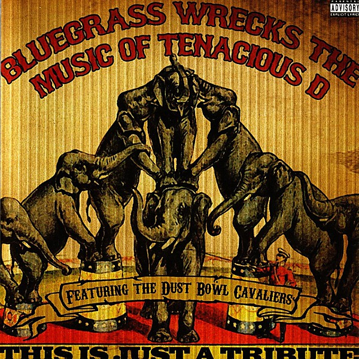

# Bluegrass Wrecks the Music of Tenacious D

By **The Dust Bowl Cavaliers**

## Album Data

- **Catalog:** Beets
- **Format:** Digital, Album
- **Album:** Bluegrass Wrecks the Music of Tenacious D
- **Artist:** The Dust Bowl Cavaliers
- **Albumartist:** The Dust Bowl Cavaliers
- **Genre:** Bluegrass
- **MusicBrainz Album Artist ID:** [7a5b2407-0f74-45d0-99eb-f7c27812ba9b](https://musicbrainz.org/artist/7a5b2407-0f74-45d0-99eb-f7c27812ba9b)
- **MusicBrainz Album ID:** [ae6e18da-33fb-4dee-8924-cb9a7cd07366](https://musicbrainz.org/release/ae6e18da-33fb-4dee-8924-cb9a7cd07366)
- **MusicBrainz Release Group ID:** [62ce02e7-bc8f-3ac4-afec-422830ea4904](https://musicbrainz.org/release-group/62ce02e7-bc8f-3ac4-afec-422830ea4904)
- **Year:** 2006
- **Catalog #:** CD 9423
- **Label:** CMH Records
- **Total Tracks:** 11

## Album Tracks

### Track 01 - The History of Tenacious D

- **Artist:** The Dust Bowl Cavaliers
- **Format:** ALAC
- **Genre:** Bluegrass
- **Length:** 2:45
- **MusicBrainz Track ID:** [7672cfaf-9854-4025-a18c-d5703d838f25](https://musicbrainz.org/recording/7672cfaf-9854-4025-a18c-d5703d838f25)
- **Title:** The History of Tenacious D
- **Track:** 01
- **Year:** 2006

### Track 02 - Fuck Her Gently

- **Artist:** The Dust Bowl Cavaliers
- **Format:** ALAC
- **Genre:** Bluegrass
- **Length:** 3:48
- **MusicBrainz Track ID:** [83343438-759f-4dc2-94a1-0dff8487ff81](https://musicbrainz.org/recording/83343438-759f-4dc2-94a1-0dff8487ff81)
- **Title:** Fuck Her Gently
- **Track:** 02
- **Year:** 2006

### Track 03 - Kielbasa

- **Artist:** The Dust Bowl Cavaliers
- **Format:** ALAC
- **Genre:** Bluegrass
- **Length:** 4:23
- **MusicBrainz Track ID:** [4592588a-5fc6-4f6a-b00c-07254487528a](https://musicbrainz.org/recording/4592588a-5fc6-4f6a-b00c-07254487528a)
- **Title:** Kielbasa
- **Track:** 03
- **Year:** 2006

### Track 04 - Double Team

- **Artist:** The Dust Bowl Cavaliers
- **Format:** ALAC
- **Genre:** Bluegrass
- **Length:** 3:18
- **MusicBrainz Track ID:** [7ac030f4-399a-44da-87b0-40909eae90b0](https://musicbrainz.org/recording/7ac030f4-399a-44da-87b0-40909eae90b0)
- **Title:** Double Team
- **Track:** 04
- **Year:** 2006

### Track 05 - Karate

- **Artist:** The Dust Bowl Cavaliers
- **Format:** ALAC
- **Genre:** Bluegrass
- **Length:** 3:29
- **MusicBrainz Track ID:** [580c06b0-efb2-4567-87e8-b0cb2894529f](https://musicbrainz.org/recording/580c06b0-efb2-4567-87e8-b0cb2894529f)
- **Title:** Karate
- **Track:** 05
- **Year:** 2006

### Track 06 - Kyle Quit the Band

- **Artist:** The Dust Bowl Cavaliers
- **Format:** ALAC
- **Genre:** Bluegrass
- **Length:** 3:06
- **MusicBrainz Track ID:** [b8ba97f7-ad8c-43e8-bc0d-ce7a6e159228](https://musicbrainz.org/recording/b8ba97f7-ad8c-43e8-bc0d-ce7a6e159228)
- **Title:** Kyle Quit the Band
- **Track:** 06
- **Year:** 2006

### Track 07 - Wonderboy

- **Artist:** The Dust Bowl Cavaliers
- **Format:** ALAC
- **Genre:** Bluegrass
- **Length:** 3:12
- **MusicBrainz Track ID:** [e2e8bb44-cd92-4d4c-9ebc-8f37fb71f0a6](https://musicbrainz.org/recording/e2e8bb44-cd92-4d4c-9ebc-8f37fb71f0a6)
- **Title:** Wonderboy
- **Track:** 07
- **Year:** 2006

### Track 08 - Explosivo

- **Artist:** The Dust Bowl Cavaliers
- **Format:** ALAC
- **Genre:** Bluegrass
- **Length:** 3:22
- **MusicBrainz Track ID:** [6124532f-6ca0-412d-8f41-cbb000feeb32](https://musicbrainz.org/recording/6124532f-6ca0-412d-8f41-cbb000feeb32)
- **Title:** Explosivo
- **Track:** 08
- **Year:** 2006

### Track 09 - Jesus Ranch

- **Artist:** The Dust Bowl Cavaliers
- **Format:** ALAC
- **Genre:** Bluegrass
- **Length:** 3:48
- **MusicBrainz Track ID:** [b1a79492-5994-45d5-8e10-0d3a8157b4d5](https://musicbrainz.org/recording/b1a79492-5994-45d5-8e10-0d3a8157b4d5)
- **Title:** Jesus Ranch
- **Track:** 09
- **Year:** 2006

### Track 10 - Sasquatch

- **Artist:** The Dust Bowl Cavaliers
- **Format:** ALAC
- **Genre:** Bluegrass
- **Length:** 3:10
- **MusicBrainz Track ID:** [b9d09289-d476-4812-9870-05ff08654c51](https://musicbrainz.org/recording/b9d09289-d476-4812-9870-05ff08654c51)
- **Title:** Sasquatch
- **Track:** 10
- **Year:** 2006

### Track 11 - Tribute

- **Artist:** The Dust Bowl Cavaliers
- **Format:** ALAC
- **Genre:** Bluegrass
- **Length:** 3:46
- **MusicBrainz Track ID:** [f4f2a7b9-3d7f-4d41-b8b4-913c489e93d7](https://musicbrainz.org/recording/f4f2a7b9-3d7f-4d41-b8b4-913c489e93d7)
- **Title:** Tribute
- **Track:** 11
- **Year:** 2006

