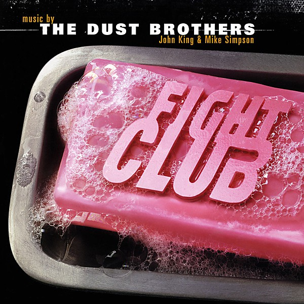

# Fight Club Original Score

By **The Dust Brothers**

## Album Data

- **Catalog:** Beets
- **Format:** Digital, Album
- **Album:** Fight Club Original Score
- **Artist:** The Dust Brothers
- **Albumartist:** The Dust Brothers
- **Genre:** Electronica
- **MusicBrainz Album Artist ID:** 
- **MusicBrainz Album ID:** 
- **MusicBrainz Release Group ID:** 
- **Year:** 1999
- **Catalog #:** 
- **Label:** 
- **Total Tracks:** 00

## Album Tracks

### Track 00 - Who is Tyler Durden?

- **Artist:** The Dust Brothers
- **Format:** AAC
- **Genre:** Big Beat
- **Length:** 5:03
- **MusicBrainz Track ID:** 
- **Title:** Who is Tyler Durden?
- **Track:** 00
- **Year:** 1999

