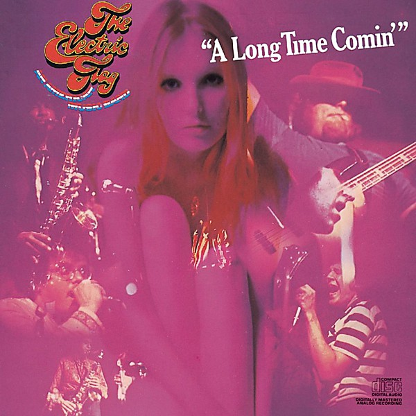

# A Long Time Comin'

By **The Electric Flag**

## Album Data

- **Catalog:** Beets
- **Format:** Digital, Album
- **Album:** A Long Time Comin'
- **Artist:** The Electric Flag
- **Albumartist:** The Electric Flag
- **Genre:** Soul
- **MusicBrainz Album Artist ID:** [7704eca6-6746-429d-86da-c5e13dd32209](https://musicbrainz.org/artist/7704eca6-6746-429d-86da-c5e13dd32209)
- **MusicBrainz Album ID:** [32290489-5e06-4369-84f2-49e3d1182029](https://musicbrainz.org/release/32290489-5e06-4369-84f2-49e3d1182029)
- **MusicBrainz Release Group ID:** [e85df0c5-28d9-34f6-a343-fdce5241e64a](https://musicbrainz.org/release-group/e85df0c5-28d9-34f6-a343-fdce5241e64a)
- **Year:** 2008
- **Catalog #:** 
- **Label:** 
- **Total Tracks:** 00

## Album Tracks

### Track 01 - Spotlight

- **Artist:** The Electric Flag
- **Format:** MP3
- **Genre:** Soul
- **Length:** 3:47
- **MusicBrainz Track ID:** 
- **Title:** Spotlight
- **Track:** 01
- **Year:** 2017

### Track 02 - I Was Robbed Last Night

- **Artist:** The Electric Flag
- **Format:** MP3
- **Genre:** Blues
- **Length:** 4:43
- **MusicBrainz Track ID:** 
- **Title:** I Was Robbed Last Night
- **Track:** 02
- **Year:** 2017

### Track 03 - I Found Out

- **Artist:** The Electric Flag
- **Format:** MP3
- **Genre:** Blues
- **Length:** 3:12
- **MusicBrainz Track ID:** 
- **Title:** I Found Out
- **Track:** 03
- **Year:** 2017

### Track 04 - Never Be Lonely Again

- **Artist:** The Electric Flag
- **Format:** MP3
- **Genre:** Blues
- **Length:** 3:36
- **MusicBrainz Track ID:** 
- **Title:** Never Be Lonely Again
- **Track:** 04
- **Year:** 2017

### Track 05 - Losing Game

- **Artist:** The Electric Flag
- **Format:** MP3
- **Genre:** Rock
- **Length:** 3:19
- **MusicBrainz Track ID:** 
- **Title:** Losing Game
- **Track:** 05
- **Year:** 2017

### Track 06 - My Baby Wants to Test Me

- **Artist:** The Electric Flag
- **Format:** MP3
- **Genre:** Soul
- **Length:** 8:23
- **MusicBrainz Track ID:** 
- **Title:** My Baby Wants to Test Me
- **Track:** 06
- **Year:** 2017

### Track 07 - I Should Have Left Her

- **Artist:** The Electric Flag
- **Format:** MP3
- **Genre:** Soul
- **Length:** 4:13
- **MusicBrainz Track ID:** 
- **Title:** I Should Have Left Her
- **Track:** 07
- **Year:** 2017

### Track 08 - You Don't Realize

- **Artist:** The Electric Flag
- **Format:** MP3
- **Genre:** Soul
- **Length:** 5:15
- **MusicBrainz Track ID:** 
- **Title:** You Don't Realize
- **Track:** 08
- **Year:** 2017

### Track 09 - Groovin' is Easy

- **Artist:** The Electric Flag
- **Format:** MP3
- **Genre:** Rock
- **Length:** 4:27
- **MusicBrainz Track ID:** 
- **Title:** Groovin' is Easy
- **Track:** 09
- **Year:** 2017

### Track 10 - Soul Searchin'

- **Artist:** The Electric Flag
- **Format:** MP3
- **Genre:** Rock
- **Length:** 8:18
- **MusicBrainz Track ID:** 
- **Title:** Soul Searchin'
- **Track:** 10
- **Year:** 2017

### Track 11 - Tuning

- **Artist:** The Electric Flag
- **Format:** MP3
- **Genre:** Soul
- **Length:** 2:13
- **MusicBrainz Track ID:** 
- **Title:** Tuning
- **Track:** 11
- **Year:** 2017

### Track 12 - Milk Cow Blues

- **Artist:** The Electric Flag
- **Format:** MP3
- **Genre:** Soul
- **Length:** 3:41
- **MusicBrainz Track ID:** 
- **Title:** Milk Cow Blues
- **Track:** 12
- **Year:** 2017

### Track 13 - Tuning

- **Artist:** The Electric Flag
- **Format:** MP3
- **Genre:** Soul
- **Length:** 0:45
- **MusicBrainz Track ID:** 
- **Title:** Tuning
- **Track:** 13
- **Year:** 2017

### Track 14 - Groovin' Is Easy

- **Artist:** The Electric Flag
- **Format:** MP3
- **Genre:** Rock
- **Length:** 4:28
- **MusicBrainz Track ID:** 
- **Title:** Groovin' Is Easy
- **Track:** 14
- **Year:** 2017

### Track 15 - I'd Rather Drink Muddy Water

- **Artist:** The Electric Flag
- **Format:** MP3
- **Genre:** Soul
- **Length:** 8:05
- **MusicBrainz Track ID:** 
- **Title:** I'd Rather Drink Muddy Water
- **Track:** 15
- **Year:** 2017

### Track 16 - Hey Joe

- **Artist:** The Electric Flag
- **Format:** MP3
- **Genre:** Soul
- **Length:** 5:16
- **MusicBrainz Track ID:** 
- **Title:** Hey Joe
- **Track:** 16
- **Year:** 2017

### Track 17 - I've Been Loving You Too Long

- **Artist:** The Electric Flag
- **Format:** MP3
- **Genre:** Soul
- **Length:** 6:34
- **MusicBrainz Track ID:** 
- **Title:** I've Been Loving You Too Long
- **Track:** 17
- **Year:** 2017

## See also

- [Live From California 1967-1968](Live_From_California_1967-1968.md)
- [Vinyl: Live From California 1967-1968](../../Vinyl/The_Electric_Flag/Live_From_California_1967-1968.md)
- [Vinyl: ](../../Vinyl/The_Electric_Flag/The_Electric_Flag.md)
