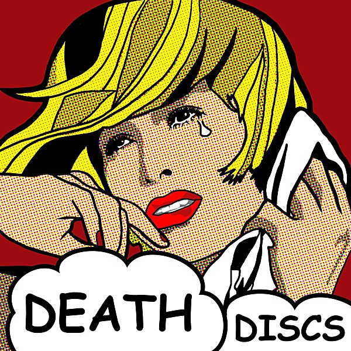

# Brothers in Rhythm Disc 1

By **The Everly Brothers**

## Album Data

- **Catalog:** Beets
- **Format:** Digital, Album
- **Album:** Brothers in Rhythm Disc 1
- **Artist:** The Everly Brothers
- **Albumartist:** The Everly Brothers
- **Genre:** Rockabilly
- **MusicBrainz Album Artist ID:** 
- **MusicBrainz Album ID:** 
- **MusicBrainz Release Group ID:** 
- **Year:** 1998
- **Catalog #:** 
- **Label:** 
- **Total Tracks:** 00

## Album Tracks

### Track 01 - Bye Bye Love

- **Artist:** The Everly Brothers
- **Format:** AAC
- **Genre:** Rockabilly
- **Length:** 2:22
- **MusicBrainz Track ID:** 
- **Title:** Bye Bye Love
- **Track:** 01
- **Year:** 1998

## See also

- [Bye Bye Love](Bye_Bye_Love.md)
- [The Very Best of The Everly Brothers](The_Very_Best_of_The_Everly_Brothers.md)
- [Roon: Hey Doll Baby](../../Roon/The_Everly_Brothers/Hey_Doll_Baby.md)
