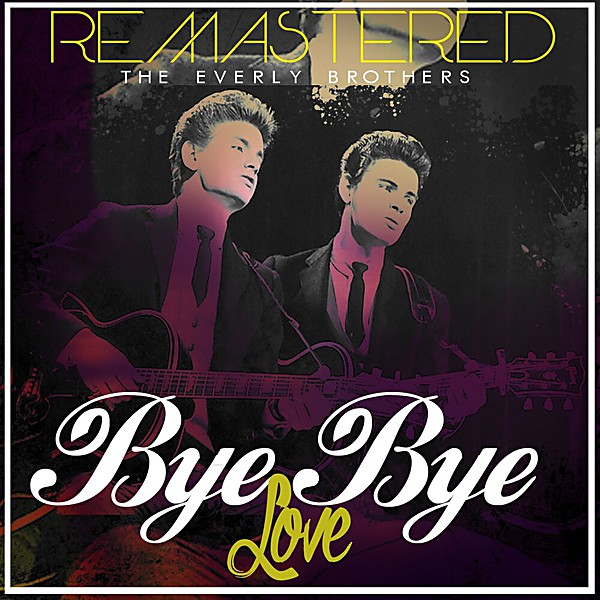

# Bye Bye Love

By **The Everly Brothers**

## Album Data

- **Catalog:** Beets
- **Format:** Digital, Album
- **Album:** Bye Bye Love
- **Artist:** The Everly Brothers
- **Albumartist:** The Everly Brothers
- **Genre:** Rockabilly
- **MusicBrainz Album Artist ID:** [091ec508-877f-4e3c-92a3-10903bbbc7ad](https://musicbrainz.org/artist/091ec508-877f-4e3c-92a3-10903bbbc7ad)
- **MusicBrainz Album ID:** [23176bc6-ae94-44ed-81d1-abcf8b226d43](https://musicbrainz.org/release/23176bc6-ae94-44ed-81d1-abcf8b226d43)
- **MusicBrainz Release Group ID:** [e370ee95-7cbe-37ac-b354-3795779b20e1](https://musicbrainz.org/release-group/e370ee95-7cbe-37ac-b354-3795779b20e1)
- **Year:** 1987
- **Catalog #:** 1554-2
- **Label:** Warner Bros. Records
- **Total Tracks:** 12

## Album Tracks

### Track 01 - Bye Bye Love

- **Artist:** The Everly Brothers
- **Format:** ALAC
- **Genre:** Rockabilly
- **Length:** 2:18
- **MusicBrainz Track ID:** [764db607-e988-4ae4-8a62-e56af3c5ca86](https://musicbrainz.org/recording/764db607-e988-4ae4-8a62-e56af3c5ca86)
- **Title:** Bye Bye Love
- **Track:** 01
- **Year:** 1990

### Track 02 - (’Til) I Kissed You

- **Artist:** The Everly Brothers
- **Format:** ALAC
- **Genre:** Close Harmony
- **Length:** 2:24
- **MusicBrainz Track ID:** [a7b9601f-06bb-45f4-bacf-d8a2eb99b20e](https://musicbrainz.org/recording/a7b9601f-06bb-45f4-bacf-d8a2eb99b20e)
- **Title:** (’Til) I Kissed You
- **Track:** 02
- **Year:** 1990

### Track 03 - Wake Up Little Susie

- **Artist:** The Everly Brothers
- **Format:** ALAC
- **Genre:** Rockabilly
- **Length:** 2:04
- **MusicBrainz Track ID:** [ffdb6e39-1584-4085-9691-796856caf086](https://musicbrainz.org/recording/ffdb6e39-1584-4085-9691-796856caf086)
- **Title:** Wake Up Little Susie
- **Track:** 03
- **Year:** 1990

### Track 04 - Crying in the Rain

- **Artist:** The Everly Brothers
- **Format:** ALAC
- **Genre:** Pop
- **Length:** 2:02
- **MusicBrainz Track ID:** [832d3b48-76bd-4e39-b078-b9842e3d02ab](https://musicbrainz.org/recording/832d3b48-76bd-4e39-b078-b9842e3d02ab)
- **Title:** Crying in the Rain
- **Track:** 04
- **Year:** 1990

### Track 05 - Walk Right Back

- **Artist:** The Everly Brothers
- **Format:** ALAC
- **Genre:** Close Harmony
- **Length:** 2:20
- **MusicBrainz Track ID:** [a6cc5526-9339-4e20-b13f-0401fbfd910b](https://musicbrainz.org/recording/a6cc5526-9339-4e20-b13f-0401fbfd910b)
- **Title:** Walk Right Back
- **Track:** 05
- **Year:** 1990

### Track 06 - Cathy’s Clown

- **Artist:** The Everly Brothers
- **Format:** ALAC
- **Genre:** Close Harmony
- **Length:** 2:26
- **MusicBrainz Track ID:** [46b14fdd-ea64-48ba-a6c2-330378f98207](https://musicbrainz.org/recording/46b14fdd-ea64-48ba-a6c2-330378f98207)
- **Title:** Cathy’s Clown
- **Track:** 06
- **Year:** 1990

### Track 07 - Bird Dog

- **Artist:** The Everly Brothers
- **Format:** ALAC
- **Genre:** Rockabilly
- **Length:** 2:18
- **MusicBrainz Track ID:** [71b6a58d-a6dd-4f26-a8f3-3abba02e8164](https://musicbrainz.org/recording/71b6a58d-a6dd-4f26-a8f3-3abba02e8164)
- **Title:** Bird Dog
- **Track:** 07
- **Year:** 1990

### Track 08 - All I Have to Do Is Dream

- **Artist:** The Everly Brothers
- **Format:** ALAC
- **Genre:** Pop
- **Length:** 2:24
- **MusicBrainz Track ID:** [3235f40e-cafb-4d1c-a8c0-37370fcffc7e](https://musicbrainz.org/recording/3235f40e-cafb-4d1c-a8c0-37370fcffc7e)
- **Title:** All I Have to Do Is Dream
- **Track:** 08
- **Year:** 1990

### Track 09 - Devoted to You

- **Artist:** The Everly Brothers
- **Format:** ALAC
- **Genre:** Rock
- **Length:** 2:25
- **MusicBrainz Track ID:** [fbe3f3bf-b732-42b5-9ec9-cc252770a90f](https://musicbrainz.org/recording/fbe3f3bf-b732-42b5-9ec9-cc252770a90f)
- **Title:** Devoted to You
- **Track:** 09
- **Year:** 1990

### Track 10 - Lucille

- **Artist:** The Everly Brothers
- **Format:** ALAC
- **Genre:** Rock And Roll
- **Length:** 2:34
- **MusicBrainz Track ID:** [c2211bcf-ead2-4af6-898e-34b1b5d844f8](https://musicbrainz.org/recording/c2211bcf-ead2-4af6-898e-34b1b5d844f8)
- **Title:** Lucille
- **Track:** 10
- **Year:** 1990

### Track 11 - So Sad (to Watch Good Love Go Bad)

- **Artist:** The Everly Brothers
- **Format:** ALAC
- **Genre:** Rockabilly
- **Length:** 2:36
- **MusicBrainz Track ID:** [ef280185-2487-490b-b48b-9e32c78671d2](https://musicbrainz.org/recording/ef280185-2487-490b-b48b-9e32c78671d2)
- **Title:** So Sad (to Watch Good Love Go Bad)
- **Track:** 11
- **Year:** 1990

### Track 12 - Ebony Eyes

- **Artist:** The Everly Brothers
- **Format:** ALAC
- **Genre:** Rockabilly
- **Length:** 3:04
- **MusicBrainz Track ID:** [01f7b79f-5f10-46cc-8662-f1a81f3b7624](https://musicbrainz.org/recording/01f7b79f-5f10-46cc-8662-f1a81f3b7624)
- **Title:** Ebony Eyes
- **Track:** 12
- **Year:** 1990

## See also

- [Brothers in Rhythm Disc 1](Brothers_in_Rhythm_Disc_1.md)
- [The Very Best of The Everly Brothers](The_Very_Best_of_The_Everly_Brothers.md)
- [Roon: Hey Doll Baby](../../Roon/The_Everly_Brothers/Hey_Doll_Baby.md)
