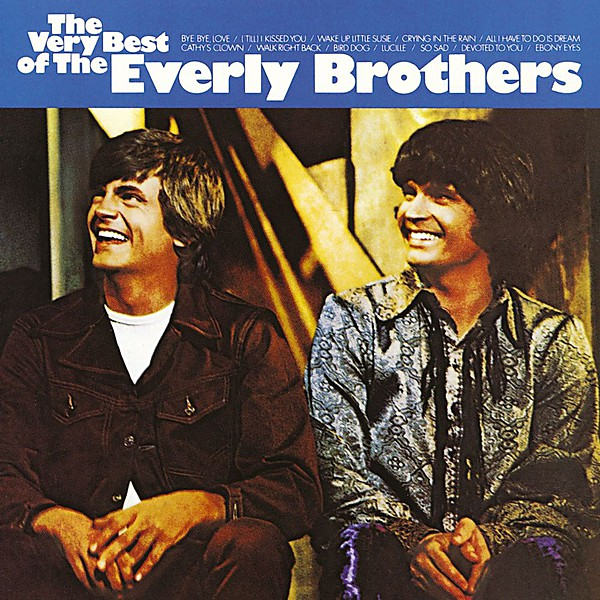

# The Very Best of The Everly Brothers

By **The Everly Brothers**

## Album Data

- **Catalog:** Beets
- **Format:** Digital, Album
- **Album:** The Very Best of The Everly Brothers
- **Artist:** The Everly Brothers
- **Albumartist:** The Everly Brothers
- **Genre:** Close Harmony
- **MusicBrainz Album Artist ID:** [091ec508-877f-4e3c-92a3-10903bbbc7ad](https://musicbrainz.org/artist/091ec508-877f-4e3c-92a3-10903bbbc7ad)
- **MusicBrainz Album ID:** [1be9e0c4-103d-4d0d-bd9e-6b1b6b653589](https://musicbrainz.org/release/1be9e0c4-103d-4d0d-bd9e-6b1b6b653589)
- **MusicBrainz Release Group ID:** [185cf089-ee9b-398c-a6fd-0da334c5b202](https://musicbrainz.org/release-group/185cf089-ee9b-398c-a6fd-0da334c5b202)
- **Year:** 1990
- **Catalog #:** 
- **Label:** 
- **Total Tracks:** 00

## Album Tracks

### Track 01 - Bye Bye Love

- **Artist:** The Everly Brothers
- **Format:** AAC
- **Genre:** Rockabilly
- **Length:** 2:22
- **MusicBrainz Track ID:** 
- **Title:** Bye Bye Love
- **Track:** 01
- **Year:** 1998

## See also

- [Brothers in Rhythm Disc 1](Brothers_in_Rhythm_Disc_1.md)
- [Bye Bye Love](Bye_Bye_Love.md)
- [Roon: Hey Doll Baby](../../Roon/The_Everly_Brothers/Hey_Doll_Baby.md)
