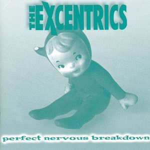

# Perfect Nervous Breakdown

By **The Excentrics**

## Album Data

- **Catalog:** Beets
- **Format:** Digital, Album
- **Album:** Perfect Nervous Breakdown
- **Artist:** The Excentrics
- **Albumartist:** The Excentrics
- **Genre:** Unknown
- **MusicBrainz Album Artist ID:** [2bd7f42f-fbc7-49d3-b7c5-0c0fcb923625](https://musicbrainz.org/artist/2bd7f42f-fbc7-49d3-b7c5-0c0fcb923625)
- **MusicBrainz Album ID:** [41897e73-ffcc-481c-b16f-5d939bb13738](https://musicbrainz.org/release/41897e73-ffcc-481c-b16f-5d939bb13738)
- **MusicBrainz Release Group ID:** [2c16bb8e-c2a2-3d71-9ab3-933df273690b](https://musicbrainz.org/release-group/2c16bb8e-c2a2-3d71-9ab3-933df273690b)
- **Year:** 1999
- **Catalog #:** 
- **Label:** 
- **Total Tracks:** 13

## Album Tracks

### Track 01 - Losin' Me

- **Artist:** The Excentrics
- **Format:** ALAC
- **Genre:** Power Pop
- **Length:** 3:30
- **MusicBrainz Track ID:** 
- **Title:** Losin' Me
- **Track:** 01
- **Year:** 1993

### Track 02 - Seen No Sun

- **Artist:** The Excentrics
- **Format:** ALAC
- **Genre:** Power Pop
- **Length:** 3:24
- **MusicBrainz Track ID:** 
- **Title:** Seen No Sun
- **Track:** 02
- **Year:** 1993

### Track 03 - The House

- **Artist:** The Excentrics
- **Format:** ALAC
- **Genre:** Power Pop
- **Length:** 4:39
- **MusicBrainz Track ID:** 
- **Title:** The House
- **Track:** 03
- **Year:** 1993

### Track 04 - Touch

- **Artist:** The Excentrics
- **Format:** ALAC
- **Genre:** Power Pop
- **Length:** 4:52
- **MusicBrainz Track ID:** 
- **Title:** Touch
- **Track:** 04
- **Year:** 1993

### Track 05 - So This Is Goodnight

- **Artist:** The Excentrics
- **Format:** ALAC
- **Genre:** Power Pop
- **Length:** 3:28
- **MusicBrainz Track ID:** 
- **Title:** So This Is Goodnight
- **Track:** 05
- **Year:** 1993

### Track 06 - Once I Remember

- **Artist:** The Excentrics
- **Format:** ALAC
- **Genre:** Power Pop
- **Length:** 4:23
- **MusicBrainz Track ID:** 
- **Title:** Once I Remember
- **Track:** 06
- **Year:** 1993

### Track 07 - Hangin' By A String

- **Artist:** The Excentrics
- **Format:** ALAC
- **Genre:** Power Pop
- **Length:** 5:07
- **MusicBrainz Track ID:** 
- **Title:** Hangin' By A String
- **Track:** 07
- **Year:** 1993

### Track 08 - Rose Colored Glasses

- **Artist:** The Excentrics
- **Format:** ALAC
- **Genre:** Power Pop
- **Length:** 4:15
- **MusicBrainz Track ID:** 
- **Title:** Rose Colored Glasses
- **Track:** 08
- **Year:** 1993

### Track 09 - Keep It Like This

- **Artist:** The Excentrics
- **Format:** ALAC
- **Genre:** Power Pop
- **Length:** 4:40
- **MusicBrainz Track ID:** 
- **Title:** Keep It Like This
- **Track:** 09
- **Year:** 1993

### Track 10 - Never Thought I Would

- **Artist:** The Excentrics
- **Format:** ALAC
- **Genre:** Power Pop
- **Length:** 4:31
- **MusicBrainz Track ID:** 
- **Title:** Never Thought I Would
- **Track:** 10
- **Year:** 1993

### Track 11 - Six And Seven Seas

- **Artist:** The Excentrics
- **Format:** ALAC
- **Genre:** Power Pop
- **Length:** 2:52
- **MusicBrainz Track ID:** 
- **Title:** Six And Seven Seas
- **Track:** 11
- **Year:** 1993

### Track 12 - Wheelbarrow

- **Artist:** The Excentrics
- **Format:** ALAC
- **Genre:** Power Pop
- **Length:** 2:23
- **MusicBrainz Track ID:** 
- **Title:** Wheelbarrow
- **Track:** 12
- **Year:** 1993

### Track 13 - Don't Watch The World

- **Artist:** The Excentrics
- **Format:** ALAC
- **Genre:** Power Pop
- **Length:** 4:37
- **MusicBrainz Track ID:** 
- **Title:** Don't Watch The World
- **Track:** 13
- **Year:** 1993

## See also

- [Why The Long Face?](Why_The_Long_Face.md)
- [CD: Perfect Nervous Breakdown](../../CD/The_Excentrics/Perfect_Nervous_Breakdown.md)
- [CD: ](../../CD/The_Excentrics/The_Excentrics.md)
- [CD: Why The Long Face](../../CD/The_Excentrics/Why_The_Long_Face.md)
